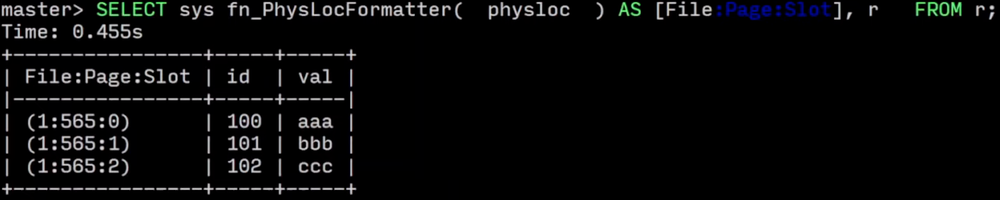

- ## System design goal
	- Allow the DBMS to manage databases that exceed the amount of memory available
- ## Disk-oriented DBMS
	- Overview
		- In memory, here is a buffer pool to mapping data from the disk
			- in lecture 6
		- Disk keeps the content as well as the database files.
			- in lecture 5
		- A execution engine will insert data and query data from memory buffer pool.
			- in lecture 12-13
	- Why not use the OS
		- DBMS use `mmap` to store contents of a file into a address space of a app
		- 可行，但不好用
			- Transaction Safety
				- 操作系统中持有有脏数据，可能随时被刷回，而你可能并不希望刷回其中一部分仍然在事务中的数据
			- I/O Stalls
				- 你不知道哪些数据页已经在操作系统中了，可能你想要访问一个页，但需要操作系统不停地换出页面之后才能得到，而在此之前，你已经完全停止工作了
			- Error Handling
				- 难以验证页面数据的正确性，如果数据、页面出错，可能会得到一个 SIGBUP，DBMS 必须严格的处理所有这些错误
			- Performane Issues
				- 系统内构建的数据结构可能不是你所需的数据库的最优实现，那么可能就会成为性能瓶颈
		- TODO  to know why mmap is a bad idea from some blogs
			- Are you sure you want to use mmap in your database management system?
		- DBMS always wants to control everything
- ## File Storage
	- High performance is always to use a properietary filesystems/file format, not use general format.
	- Storage manager
		- 负责管理数据库文件
			- 跟踪谁在读写文件，读写什么位置等信息
	- Page
		- 一个固定大小的数据块
			- contains tuples, meta=data, indexes, log records
			- most system do not mix page types
				- some system require a page to be self-contained，要求能够自解释
		- 每个页面都有自己的 id
			- DBMS 会通过 id 来映射他们各自在物理上的位置
		- 在不同的层级上有不同的大小
			- 硬件上大约 4KB
				- 数据块能够被保证 failasafe 写入的最大大小
			- 操作系统大约 4KB
			- 数据库大概 512B-16KB
				- SQL Server 8KB
				- Mysql 16KB
				- SQList, DB2, Oracle 4KB
		- ### Page Storage Architecture
			- 不同的数据库系统会使用不同的文件管理方法
				- #### Heap file organization
				  collapsed:: true
					- unordered collection of pages, stored in random order, must support iterating over all pages
					- if only single file, it's easy to find pages.
						- 
					- if has multi files (提升并行度，分散存储)
						- 
						- meta-data 来跟踪哪个 page 存在什么地方，以及还有多少空闲的空间
							- {:height 282, :width 224}
				- TODO Tree file organization
				- TODO Sequential / Sorted file Organization
				- TODO Hashing File Organization
			- Page header
			  collapsed:: true
				- Page Size
				- Checksum
				- DBMS Version
				- Transaction visibility
				- Compression Information
				- {:height 259, :width 276}
			- Page Layout
				- Tuple-oriented
				  collapsed:: true
					- How to store tuples in a page?
					- Slotted pages
						- {:height 899, :width 648}
						- Slot array maps slots to the tuples starting position offsets.
						- Slot array use fix length to express a address.
						- The tuple can be variable length.
						- A record is `page_id` + `offset/slot`, as well as `ROWID`/`CTID`
							- in postgreSQL, 6 bytes
								- 
								- 如果删除 0, 2 在插入，会变成 0, 4，在经过一次碎片整理之后，才会消除空洞
							- SQLite, 8 bytes、
								- 
							- MSSQL
								- 
						- 缺点
							- 碎片
							- 多一次 disk io
							- 随机读写困难，如果更新 20 个 tuples on 20 pages，需要访问 20 个 page 来更新
							- 如果文件系统是不可修改的，例如 HDFS，则不能支持，对于分布式场景下存储的选择是有限制的
					- Tuple
						- Tuple header
							- Each tuple is prefixed with a header contains meta-data
								- for NULL values
								- Visibility info for concurrency control
								- 
						- Tuple data
							- Some system support `denormalize`，a kind of pre join.
								- 
								- Reduce the amount of i/o for common workload patterns
								- May make updates more expensive
								- Already used for lots of NoSQL DB
								- You can enable when define the table schema
				- Log-oriented, Log-Structured Storage
					- High level overview
						- 这类 DBMS 中提供了两种方法来操作一个 tuples
							- PUT
							- DELETE
						- 每个操作都要带上 tuple 的 id
							- put 需要携带 id 的 value
							- delete 需要携带 id
							- {:height 390, :width 418}
						- 当 page 写满之后，就会刷到磁盘中，然后清空 memory page。写到磁盘上的部分是不可变的。
						- Compaction
							- 为了避免持续的增长，DBMS 会逐渐合并这些 page，只保留最后的状态
							- 合并完成的 page 可以被删除
							- 合并完的 tuples 可以按 id 排序，以提升未来查询的速度
								- Sorted String Table (SSTale)
							- Normal Compaction
								- {:height 422, :width 511}
							- Level compaction
								- 
							- Condition
								- 许多条件可以触发，时间、空闲、大小、手动等等
						- 缺点
							- 写放大
							- Compation
- Relational Databases
- Storage
- Execution
- Concurrency Control
- Recovery
- Distributed Databases
- Potpourri