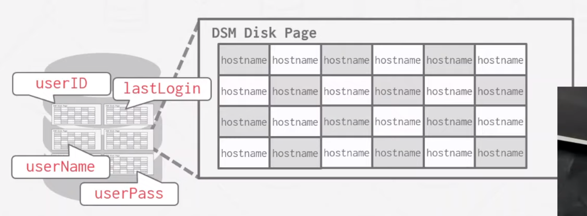

- Database Workloads
	- OLTP - Online Transaction Processing
		- Row Store
	- OLAP - Online Analytical Processing
		- Column Store
	- Hybrid Transaction + Analytical Processing
	- 
- Not all a tuple's attributes together stored in a single page, as they may have different workloads
	- {:height 431, :width 713}
	- Sometimes, we need column read/write (DSM)
		- 
		- 列查询更快，访问的 page 更少
		- 相同域的数值类型和值域相近，容易压缩，就像年龄，差不多在 0-120 岁
- Column Tuple Identification
	- Fixed-Length Offsets
		- Each value is the same length for an attribute.
	- Embedded tuple ids
		- Each value is stored with its tuple id in a column.
- Decomposition storage model (DSM)
	- 优点
		- 减少 IO 的浪费，只需要访问所需的数据列
		- 更容易处理 query，也更容易压缩
	- 缺点
		- 由于元组分割/缝合，点查询、插入、更新和删除速度较慢
- 真实世界的数据特点
	- 数据往往具有高度的倾斜的分布
	- 数据集往往在同一个 tuple 中的各个字段是具备高度关联性的
- Database Compression
	- Goal1: 必须生成相同长度的值
		- 使用容易的偏移计算来获取对应的列
		- 如果必须变长，可以存储长度相同的指针，然后指向变长的值存在的位置
	- Goal2: 在 query 执行的过程中，可以先进行查找，再解压缩
	- Goal3: 必须无损
		- 有损不能被数据库层接受，只能在应用层上可以
	- Mysql InnoDB Compression
		- Each compressed pages have different size, 1, 2, 4, 8 KB
		- When load page to memory buffer pool, will keep it compressed
		- Update don't need to know previous values, just append to the mod log to the buffer pool page
		- When query happened, just get it from mod log
		- When the mod is full, apply the change and write it back out
		- 这样可以不用先解压再查询或者更新
			- TODO 那么 compressed data 里包含了什么额外信息呢？
- 在不解压时查询压缩的数据的方法
	- 对查询条件进行压缩来匹配也是一种方法
		- 
- 压缩粒度
	- Block Level
		- 压缩表中同在一个块中  tuples
	- Tuple Level
		- 每个 tuple 单独压缩
	- Attribute Level
		- 一个 tuple 的每个属性或者一组属性单独压缩
	- Column Level
		- 一列或者多列压缩在一起
- Columnar compression
	- RUN-LENGTH encoding
	  id:: 64c0ca5c-df61-4301-aa00-6e1fefe11ec7
		- 
		- 只适合高度分类的数据
			- 如果排序后会更惊人的压缩
				- 
	- Bit-Packing Encoding
		- 
		- 
			- 有时需要一个 overflow page 来存储这些超长的值
	- BITMAP Encoding
		- 
	- DELTA Encoding
		- {:height 297, :width 692}
	- INCREMENTAL Encoding
		- 如果是相近的前缀，可以使用如下方法
			- 
	- DICTIONRY Compression
		- 
	- ORDER-PRESERVING Encoding
		- 
		- 适合 OLAP，OLTP 不断更新会破坏已经编码的值
		- 对于 distinct 会更优雅，只需要在查询时查看 dictionary 中的 value 而不需要扫描所有的数据
		- 字典中可以存储更多的信息，例如每个字段的引用量等