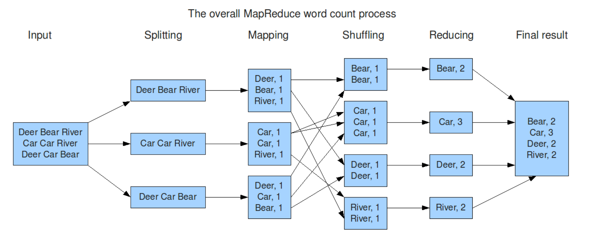

tags:: Example, WordCount, MapReduce

- Graph
  id:: 6425a352-7bfd-4b83-bc9c-a65c6b0f2856
	- 
- AscII
	- Input text: `This is an example of word count using MapReduce. This is another example.`
	- Splitting:
		- Machine 1: “This is an example of word count”
			- Machine 2: “using MapReduce. This is another example.”
	- Mapping:
		- Machine 1:
			- ```
			  <This, 1>
			  <is, 1>
			  <an, 1>
			  <example, 1>
			  <of, 1>
			  <word, 1>
			  <count, 1>
			  ```
		- Machine 2:
			- ```
			  <using, 1>
			  <MapReduce, 1>
			  <This, 1>
			  <is, 1>
			  <another, 1>
			  <example, 1>
			  ```
	- Shuffling:
		- Machine 3:
			- ```
			  <This, 1>
			  <This, 1>
			  <is, 1>
			  <is, 1>
			  ```
		- Machine 4:
			- ```
			  <an, 1>
			  <example, 1>
			  <example, 1>
			  <of, 1>
			  ```
		- Machine 5:
			- ```
			  <word, 1>
			  <count, 1>
			  <using, 1>
			  <MapReduce, 1>
			  <another, 1>
			  ```
	- Reducing:
		- Machine 3:
			- ```
			  <This, 2>
			  <is, 2>
			  ```
		- Machine 4:
			- ```
			  <an, 1>
			  <example, 2>
			  <of, 1>
			  ```
		- Machine 5:
			- ```
			  <word, 1>
			  <count, 1>
			  <using, 1>
			  <MapReduce, 1>
			  <another, 1>
			  ```
	- Combining:
		- Output file:
			- ```
			  This 2 
			  is 2
			  an 1
			  example 2
			  of 1
			  word 1
			  count 1
			  using 1
			  MapReduce 1
			  another 1
			  ```
	-