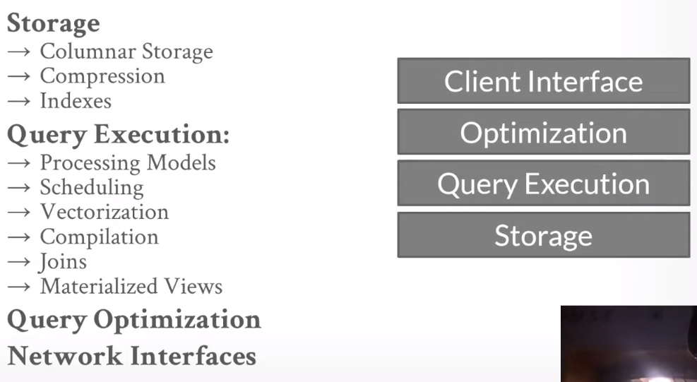
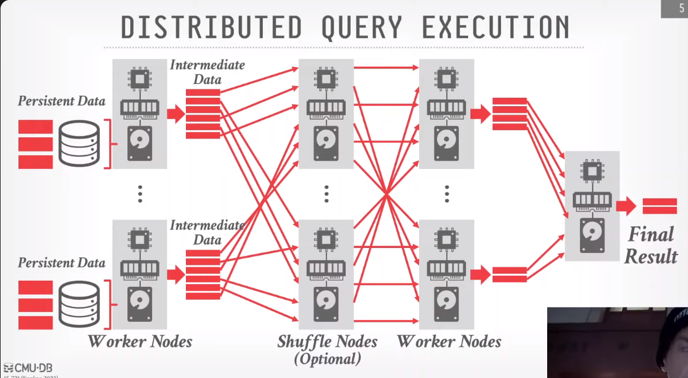
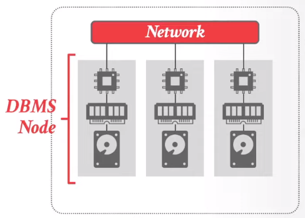
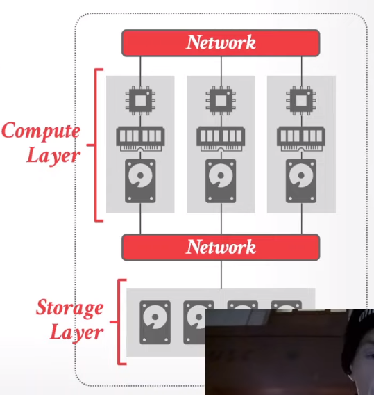

tags:: [[15-721]]

- Course Outline
	- 
- Distributed query execution
	- OLAP 查询在分布式数据库上执行和单点的 DBMS 是类似的
	- 像一个 DAG 一样执行各个操作
		- Table Scan
		- Join
		- Aggregation
		- Sorting
	- 执行的宏观过程
		- 将 Query 发送给一些节点，每个节点收到其中一些输入和指定的运算，得到运算结果
		- 这些结果视作中间结果，然后根据执行计划来决定下一个操作，也许是发送给某个节点，也许是 shuffle
		- 执行 DAG 下一个步骤
		- 聚合结果
		- 
- 持久数据与中间数据
	- Persistent Data
		- Source of records for the data bases
		- data files, immutable but can support updates by rewriting
	- Intermediate Data
		- Short-lived artifacts produced by query operators during execution and consumed by other operators
		- has little to no correlation to amount of persistent data that it reads or the execution time
- 分布式系统架构
	- 本质是如何节点间如何协作移动数据、定位数据、扫描数据，和权衡
	- Two approaches
		- push query to data
			- 把 Query 发送去数据所在的节点
			- 在发送之前尽可能的对数据进行过滤和预处理
			  id:: 64d35b58-bd38-4717-80ba-96cffef5f119
		- pull data to query
			- 把数据拿到执行 Query 的节点上
			- 当存储的节点上没有计算资源时是必要的
- Shared Nothing System
  id:: 64d35b4c-f005-4d18-ae5e-3f37a9cae706
	- Each instance has it's own CPU, memory, locally-attached disk.
		- 
	- 单个节点无法直接访问其他节点的数据，必须通过通信的方式来访问
	- 数据被分区在多个机器上
	- 特点
		- 性能更好，节点之间传输的数据更少
		- 存储和计算不分离，无法轻松的增加更多的容量
			- 一旦增加一个新的节点，则意味着有许多 rebalance 的事情需要处理
- Shared Disk
	- 与 ((64d35b4c-f005-4d18-ae5e-3f37a9cae706)) 不同的是，一群节点尽管有自己的磁盘，但磁盘更多充当一个缓存的作用，持久化的数据都存放在一个共享的Storage Layer
		- 
	- 每个节点自己看起来在访问一个逻辑上的磁盘，但实际上是访问一个共享的存储
	- 特点
		- 可以单独缩扩容，计算或者是存储
		- 但需要从 storage 层来拉取本地缓存不存在的数据
		- storage 层可能需要支持过滤能力来减少传输的数据