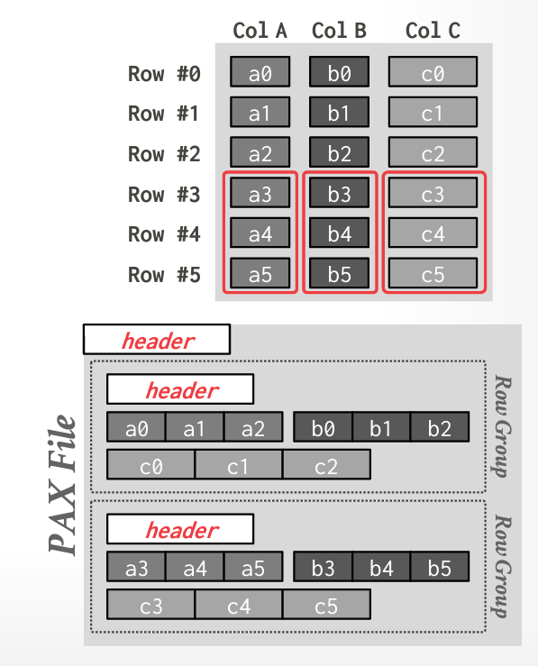
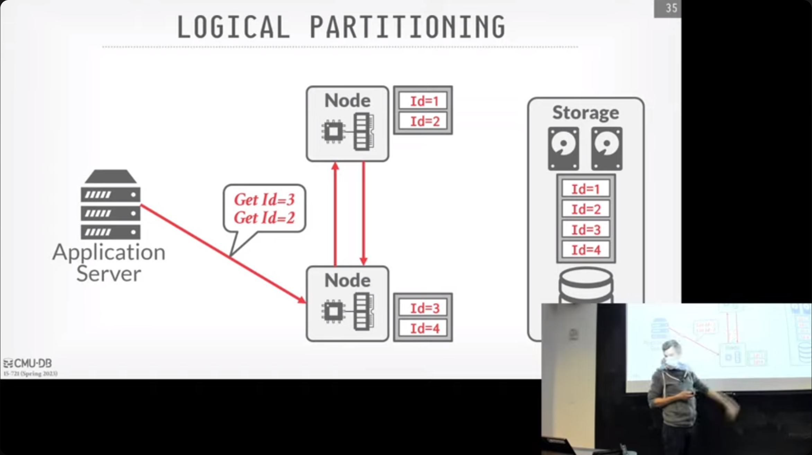

tags:: [[CMU 15-721]]

- Storage models
	- DBMS 如何在磁盘和内存中组织和管理数据
	- Choice:
		- N-ary Storage Model
		  logseq.order-list-type:: number
		  alias:: NSM
			- 大量访问，但每次访问只访问很少的数据
			- Most database page size are multiple of 4KB hardware pages
				- keep things in small pages for updating
				- 
			- 优点
				- 插入、更新和删除非常快
				- 适用于 OLTP 场景
				- 可以使用 index-oriented physical storage for clustering
			- 缺点
				- 如果要访问大量的数据，就需要加载大量的 page，效率会非常低
				- 难以压缩
				- 本地性不够好，列分散在各个地方
		- Decomposition Storage Model
		  logseq.order-list-type:: number
			- 列式存储
			- 
			- 每个属性一个文件
				- 文件中会包含一个 header 和 null 位图
				- 所有的字段都是相同的长度，如果不是相同长度，需要压缩成相同的长度
			- Tuple Identification
				- Fixed-Length Offsets
				  logseq.order-list-type:: number
					- {:height 252, :width 269}
				- Embedded Tuple Ids
				  logseq.order-list-type:: number
					- {:height 219, :width 279}
			- 可变长度数据存储
				- 字典压缩来转换为固定长度
			- 优点
				- 减少了 IO 的浪费，只读需要的数据
				- 提升了 locality 和缓存数据的重用
				- 更好的数据压缩
			- 缺点
				- point query 比较慢，插入、更新和删除比较慢，因为需要拆分到各个 column 中去操作
					- 其实也可以将一些经常一起使用的 column 放在一起 (Column Family/Group)
		- Hybrid Storage Model
		  logseq.order-list-type:: number
			- {:height 597, :width 424}
				- Global header 会包含 row groups 的目录
				- Each row group 有一个 meta-data header 关于内部的数据结构
			- Row group 中的数据离的很近，因此这些 row 和 column 都具备较好的 locality
				- Parquet 中 Row groups 默认 128MB，Pages 默认 1MB
					- 2010年左右设计的大小，更大会更快一些
- Transparent Huge Pages
	- Too keep more pages into the memory, linux can create large pages
		- 当发现一些页的物理位置是相近的，可以把他们合成一个大页，从而在 TLB 中仍然只使用一个位置 （从虚拟地址到物理地址），避免受到 cpu cache 的限制
		- 但缺点是，如果内核线程在访问这个 TLB slot 时，会有更大的虚拟空间被锁定
	- 对于DBMS，通常都需要你关闭它，来避免不可预期的停顿
		- 数据库会自己管理来绕开 OS 这些操作
	- Google 有一些内存分配器可以感知到这个 huge page，来获得了更好的性能，但仍然在研究中
		- Huge Pages are a Good Idea
- Data Representation
	- use data specified by IEEE-754, which can be support by CPU directly
- Hybrid Storage Model
	- 刚更新的数据往往在短期时间内会再次被更新、访问
	- 随着时间变化，这些数据变成冷数据，将不再被更新
	- 可以将新数据存放在 OLTP 中，然后，逐渐将数据迁移到 OLAP 中
		- Fractured Mirrors
		  logseq.order-list-type:: number
			- Stored a second copy of the database in a DSM layout
				- Updates to NSM at first, then to DSM mirror
		- Delta Store
		  logseq.order-list-type:: number
			- Background thread migrates updates from delta store and applies them to DSM data
				- Batch large chunks and write them out as a PAX file
			- A record only exists in one of the two
				- {:height 197, :width 562}
- 分区
	- 水平分区
		- Hashing
		- Ranges
		- Predicates
	- 逻辑分区
		- {:height 384, :width 648}
			- 一些中间件会帮助你找到 id 分区之后应该去往哪里，如果需要跨多个机器来获取，就会访问多个机器来得到结果
	- 物理分区
		- 访问数据存在的物理节点
- 其他
	- 尽管 join 是开销最大的操作，但因为线代数据库系统已经非常快了，因此不值得再做反范式的转换（冗余）
- 论文
	- Micro partitioning