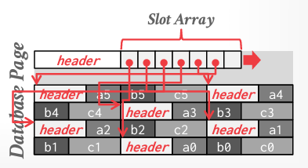
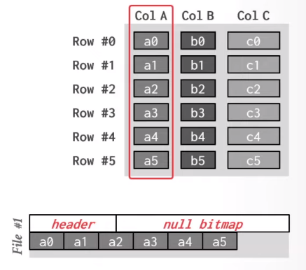
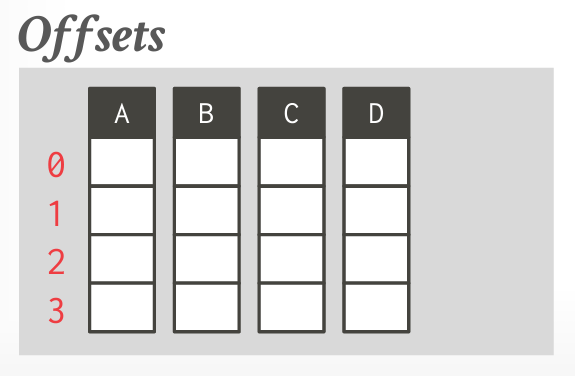
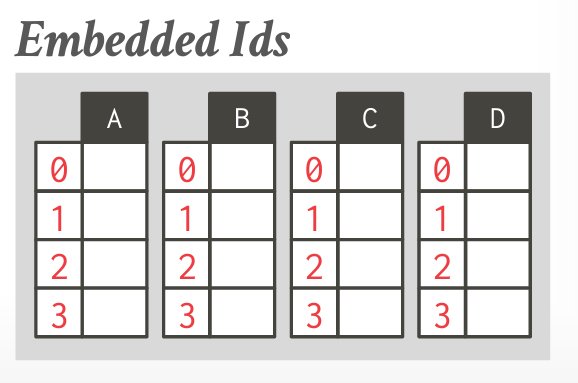

tags:: [[CMU 15-721]]

- Storage models
	- DBMS 如何在磁盘和内存中组织和管理数据
	- Choice:
		- N-ary Storage Model
		  logseq.order-list-type:: number
		  alias:: NSM
			- 大量访问，但每次访问只访问很少的数据
			- Most database page size are multiple of 4KB hardware pages
				- keep things in small pages for updating
				- 
			- 优点
				- 插入、更新和删除非常快
				- 适用于 OLTP 场景
				- 可以使用 index-oriented physical storage for clustering
			- 缺点
				- 如果要访问大量的数据，就需要加载大量的 page，效率会非常低
				- 难以压缩
				- 本地性不够好，列分散在各个地方
		- Decomposition Storage Model
		  logseq.order-list-type:: number
			- 列式存储
			- 
			- 每个属性一个文件
				- 文件中会包含一个 header 和 null 位图
				- 所有的字段都是相同的长度，如果不是相同长度，需要压缩成相同的长度
			- Tuple Identification
				- Fixed-Length Offsets
				  logseq.order-list-type:: number
					- {:height 252, :width 269}
				- Embedded Tuple Ids
				  logseq.order-list-type:: number
					- {:height 219, :width 279}
			- 可变长度数据存储
				- 字典压缩来转换为固定长度
			- 优点
				- 减少了 IO 的浪费，只读需要的数据
				- 提升了 locality 和缓存数据的重用
				- 更好的数据压缩
			- 缺点
				- point query 比较慢，插入、更新和删除比较慢，因为需要拆分到各个 column 中去操作
			- 其他
				- 其实也可以将一些经常一起使用的 column
		- Hybrid Storage Model
		  logseq.order-list-type:: number