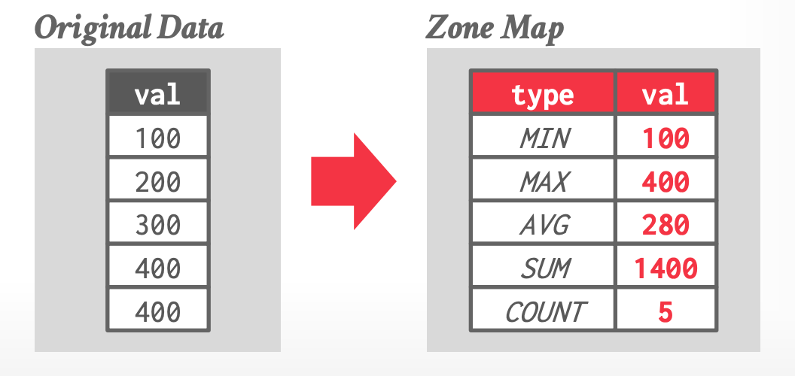
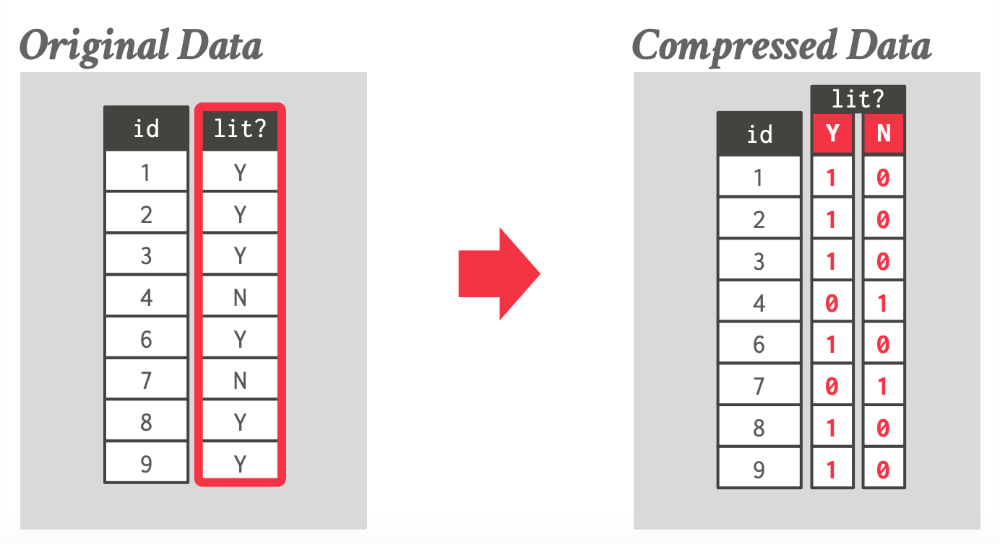

tags:: [[CMU 15-721]]

- 和 OLTP 相比，OLAP 的查询会有许多不同
	- 很少单点查询，大多扫描数据
	- 几乎不会更新数据
- 对顺序扫描的优化方法
	- Data Prefetching
	- Task Parallelization / Multi-threading
	- Clustering / Sorting
	- Late Materialization
	- Materialized Views / Result Caching
	- Data Skipping
	  id:: 64d7aa48-fea6-41fd-ab6f-e1f44888dbf3
	- Data Parallelization / Vectorization
	- Code Specialization / Compilation
- ((64d7aa48-fea6-41fd-ab6f-e1f44888dbf3))
	- Approximate Queries
		- 例如在一个子集上执行来获得近似的结果
			- 对于对结果不需要太精确的场景下是可行的，比如想要获得网站的访问量
	- Data Pruning
		- 通过一些数据结构、算法过滤来跳过对某些数据的访问
		- 需要权衡范围/效率，手动/自动
- 对数据的考量
	- Predicate Selectivity
		- 多少记录会满足 Query 的要求
	- Skewness
		- 是否有重复的数据，还是都是 unique 的数据
	- Clustering / Sorting
		- 是否数据对于 Query 是有序的
- Zone Maps
	- 预计算后的聚合的数据
	- 放在页头中，快速的来判定是否要访问块中的数据
		- {:height 368, :width 702}
	- 场景
		- 在目标属性的位置和值有关系的情况下
	- Trade-off
		- 如果 scope 太大，那这个信息就没有意义，因为很难跳过
		- 如果 scope 太小，就意味着需要多次访问 header 来达成相同范围的查找，会损失效率
- BitMap Indexes
	- 对 unique value 提供一个 bitmap 来记录它们所在的位置
	- 对于每个 unique value，建立一个向量，来表示在这个 tuple 的位置上是
	- 