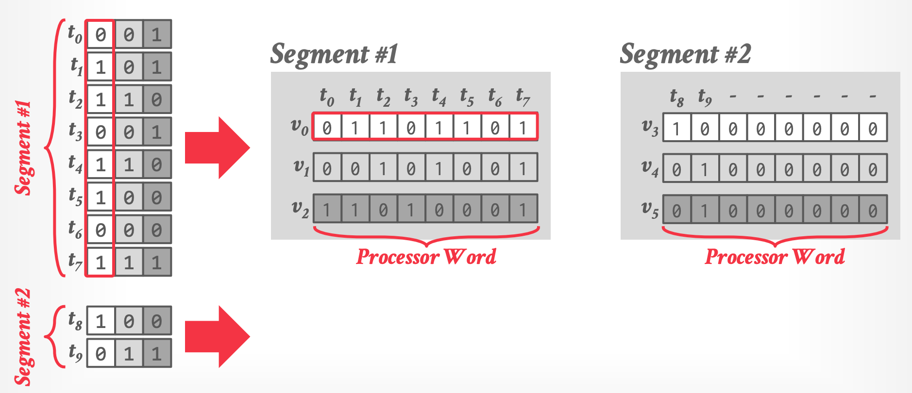

tags:: [[CMU 15-721]]

- 和 OLTP 相比，OLAP 的查询会有许多不同
	- 很少单点查询，大多扫描数据
	- 几乎不会更新数据
- 对顺序扫描的优化方法
	- Data Prefetching
	- Task Parallelization / Multi-threading
	- Clustering / Sorting
	- Late Materialization
	- Materialized Views / Result Caching
	- Data Skipping
	  id:: 64d7aa48-fea6-41fd-ab6f-e1f44888dbf3
	- Data Parallelization / Vectorization
	- Code Specialization / Compilation
- ((64d7aa48-fea6-41fd-ab6f-e1f44888dbf3))
	- Approximate Queries
		- 例如在一个子集上执行来获得近似的结果
			- 对于对结果不需要太精确的场景下是可行的，比如想要获得网站的访问量
	- Data Pruning
		- 通过一些数据结构、算法过滤来跳过对某些数据的访问
		- 需要权衡范围/效率，手动/自动
- 对数据的考量
	- Predicate Selectivity
		- 多少记录会满足 Query 的要求
	- Skewness
		- 是否有重复的数据，还是都是 unique 的数据
	- Clustering / Sorting
		- 是否数据对于 Query 是有序的
- Zone Maps
	- 预计算后的聚合的数据
	- 放在页头中，快速的来判定是否要访问块中的数据
		- {:height 368, :width 702}
	- 场景
		- 在目标属性的位置和值有关系的情况下
	- Trade-off
		- 如果 scope 太大，那这个信息就没有意义，因为很难跳过
		- 如果 scope 太小，就意味着需要多次访问 header 来达成相同范围的查找，会损失效率
- BitMap Indexes
  id:: 64d99ada-3b18-4c6e-b7eb-e73c49955521
	- 对 unique value 提供一个 bitmap 来记录它们所在的位置
	- 对于每个 unique value，建立一个向量，来表示在这个 tuple 的位置上是哪一个值
	- {:height 280, :width 653}
		- 某种程度上，这需要是一种有限类型的 Enum
	- 向量会非常稀疏，因此需要较好的编码和压缩来减少空间的浪费
		- Encoding
			- Equality Encoding
			- Range Encoding
			- Hierarchical Encoding
				- 
				- 对于非稀疏的情况下，会花费更多的空间
				- 如果存储的数据很多，也会导致这棵树很大，为此付出的性能开销要比存储更贵
			- Bit-sliced Encoding
				- 
				- 使用向量化的计算，快速根据 bit-slices 前缀来丢弃不需要访问的数据
				- 对于聚合函数也是可行的
					- {:height 264, :width 748}
			- Bit Weaving
				- 用于列式存储的另外一种存储布局，可以在 SIMD 中高效的对压缩数据进行判定
				- Horizontal
					- Row-oriented storage at the bit-level
						- 
						- {:height 258, :width 618}
							- 4条指令可以检查2条记录
						- 对于多条记录，可以拼接成一条 selection vector
							- 
						- 进一步的，可以进行预运算来存放在内存中
							- 
							- 能快速的知道哪些 tuple 是在向量中为 1 的
						- 单个向量的指令非常少，多个向量之间可以并行执行
				- Vertical
					- Column-oriented storage at the bit-level
						- 垂直的存储中，同一个 tuple 的值会分布在多个向量中
							- 
						- 在查找相等结果时，可以快速的按位筛选，并在筛选完的结果中，再筛选剩余的部分
							- 
							- 2 个指令就可以处理 8 个 tuple
- 如果放弃一些精确度还可以更快
	- Column Imprints
		- 使用一个 bitmap 来推测某个值是否存在，类似布隆过滤器
			- 
	- Column Sketches
		- 将值映射到一个区间里，但有损的获得一个大致的结果
			- 
		- 然后在查询时，将查询目标也同样的映射，在 sketched column 中快速查找
			- 
	- Parting Thoughts
		- Zone Maps are most widely used methods
		- Bitmap indexes are more common in NSM than columnar OLAP systems
		-
	-