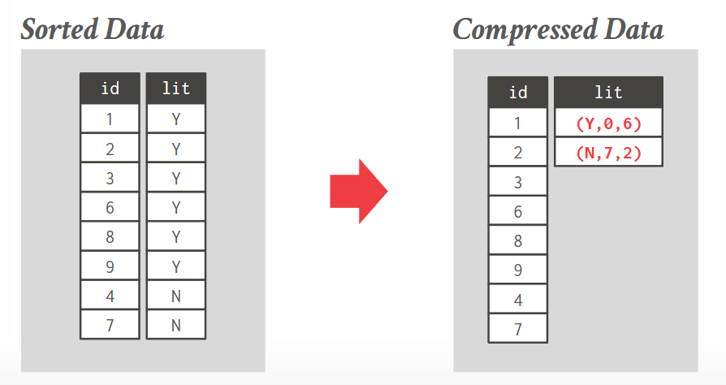
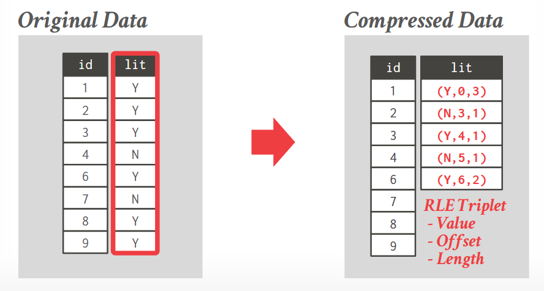
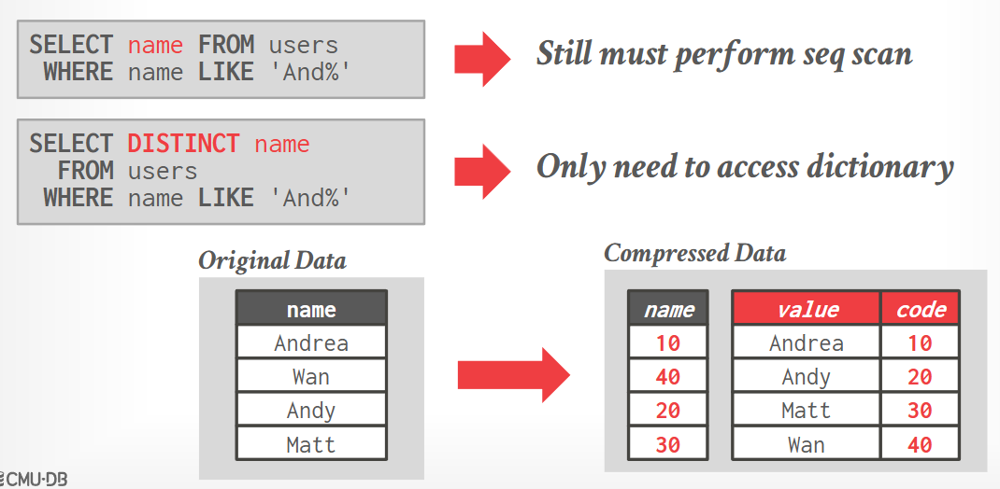
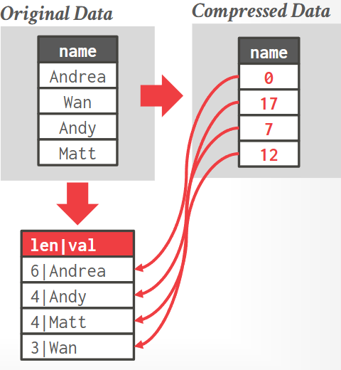
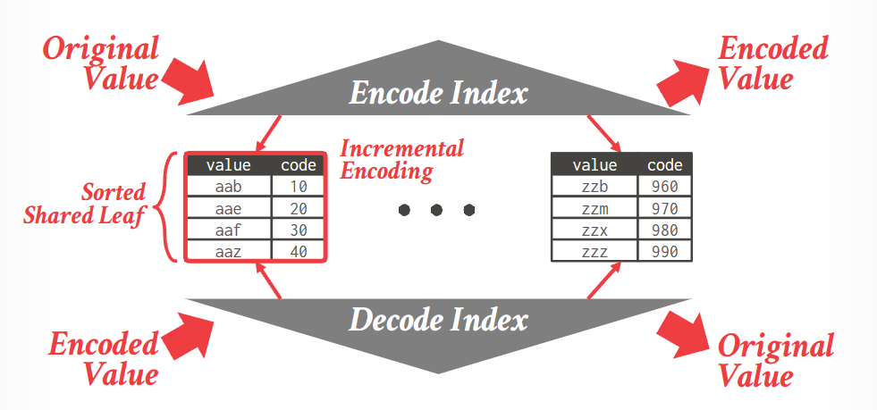
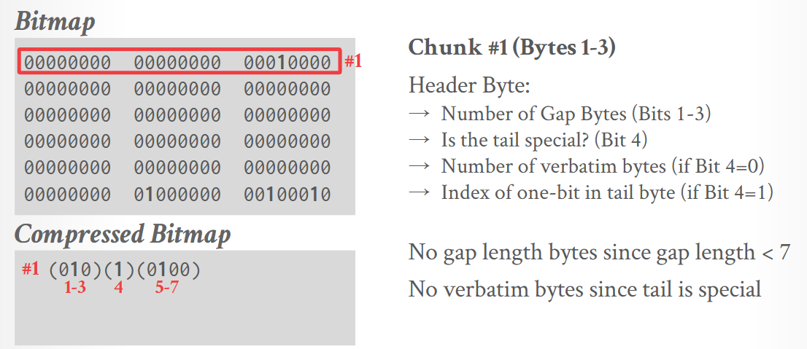
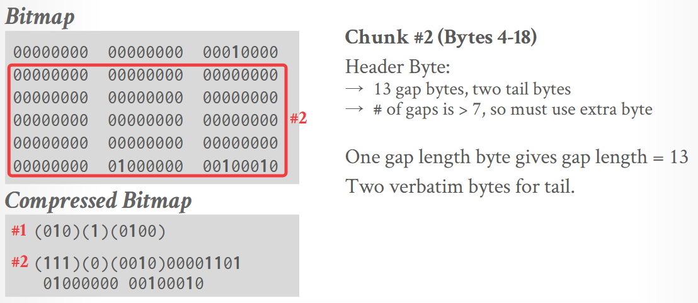
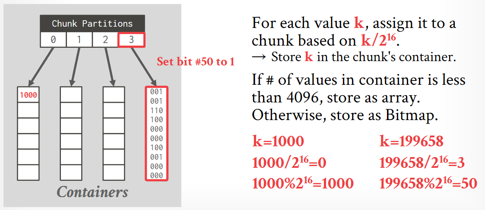
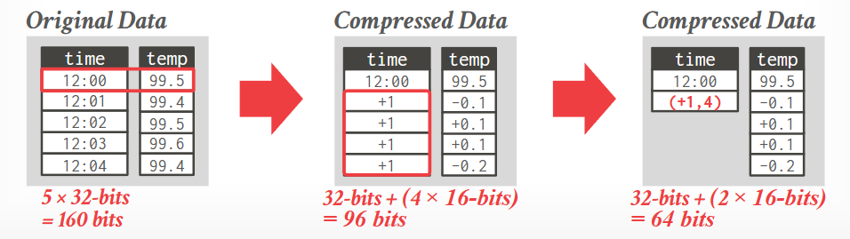
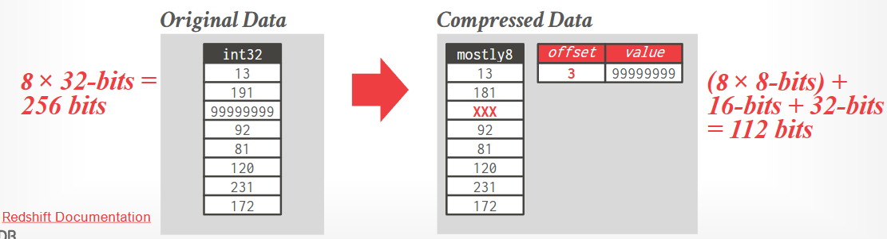

tags:: [[CMU 15-721]]

- ## 观察
	- I/O 是目前 query 主要的瓶颈
	- 当必须读取数据时，我们希望能从其中读取足够多的有效信息，不浪费 IO
- ## 任何压缩必须要实现的目标
	- 必须压缩为固定长度
	- 必须是无损的压缩
	- 尽可能晚的推迟在查询时的解压缩，也就是尽可能多的操作想要在解压操作上处理，如果必须要读取，才解压缩数据
- ## 压缩的粒度
	- Block-Level
		- database page or row group
	- Tuple-Level
		- content of the entire tuple in MSN only
	- Attribute-Level
		- Single attribute value within one tuple
		- Multiple attributes for the same tuple
	- Column-Level
		- Multiple value for one or mote attributes for multiple tuples for DSM only
- ### 朴素压缩
	- 使用通用的压缩方法，直接压缩输入数据
		- LZO, LZ4, Snappy, Brotli, Oracle OZIP, Zstd.
			- Snappy 是其中最广泛使用的算法之一
			- 但最新的的压缩性能和压缩比的权衡的是 Zstd
	- 这不是一个好方法
		- MySQL 中存储压缩数据，每个 page 在内存中大约 16 KB，但存储到磁盘后，是 1,2,4,8 KB 大小中的一个
			- MySQL 在内存中会有一个 mod log 区域，这个位置存放了所有的更新的信息，那么，如果有人放入了更新操作或者删除操作，那么在内存中就可以直接获得结果
			- 这些块就是B+树的节点
			- 缺点
				- 但在想要读取压缩的中的数据时，仍然需要先解压缩，因为其中压缩的结构并不能被数据系统读取和识别，是算法压缩完的字节块而已
				- 如果我想要读取16KB中的1KB的某部分数据，是做不到的
- ## 列式压缩
	- ### Run-length Encoding
		- 如果列已经排序了，那么可以对相邻相同的数据进行合并
		- 三元组为 (value, offset, count)
			- 
		- 但很难，因为通常值列不会被排序，大多是排序主键列
			- 
	- Dictionary Encoding
		- 使用一个字典来描述某个较短的代号到某个频繁实际值的映射关系
		- Build dictionary
			- All at once
			  logseq.order-list-type:: number
			- Incremental
			  logseq.order-list-type:: number
		- 压缩范围
			- Block-level
				- 每个块有自己的 dictionary
				- 不过如果要做 join，那么必须得解压缩数据了，因为多个 block 之间的相同的 key 并不能代表 value 也相同
			- Table-level
				- 每个表有自己的 dictionary
			- Multi-Table
				- 多个表共享一个 dictionary
			- 编码
				- 例如
					- 
				- 有的操作，例如上图中的 `DISTINCT`，可以让查询只在字典上发生，而不需要查询原始数据
			- 数据结构
				- 数组
				  logseq.order-list-type:: number
					- 如果数据不变，那么会是个不错的选择
						- {:height 480, :width 411}
				- 哈希表
				  logseq.order-list-type:: number
				- B+ 树
				  logseq.order-list-type:: number
					- 可以使用一个共享叶子节点的 B+ 树，一颗排序的 original value，另外一颗排序 Encoded Value
						- 
			- Parquet 和 ORC 并不暴露访问压缩字典的 api，因此数据库无法执行谓词下推，访问数据就必须要解压缩
				- 谓词下推简单的说法就是，能够在尽可能接近数据扫描之前进行过滤，来避免访问不需要的数据，而不是读取所有的数据在应用、或者查询器中再判断谓词
			- 一个布隆过滤器也许是有用的
	- Bitmap Encoding
		- {{embed ((64d99ada-3b18-4c6e-b7eb-e73c49955521))}}
		- 压缩 bitmap index
			- 通用压缩
				- Snappy, zstd
			- Byte-aligned bitmap codes
				- 例如
					- 
					- 第一行中，压缩为下面三个部分
						- 第一个部分是 Gap Bytes 的数量，全是 0 的部分，长度为 2
						- 第二个部分是 Tail Bytes，1 表示尾部只有 1 个，0 表示有多个
						- 第三个部分是尾部字节中 1 的位置
						- 从 3 字节压缩到 1 字节
				- 又比如
					- 
						- 当 gap bytes > 7，前三位为 111
						- 因为 tail bytes 超过 1个，第四位为 0
						- 接下来是 4 bit 表示从末尾拷贝多少个 bytes 作为 tail bytes
						- 然后是 Gap bytes 的长度，13 的二进制 `00001101`
						- 最后是从 tail bytes 拷贝过来的两个字节
						- 从 18 字节压缩到 5 字节
				- 已经不再使用了
					- 对 SIMD 不友好
					- 有许多的 if else, 有很多分支，CPU 预测更糟糕
					- 难以随机访问，必须全都解压缩，无法部分操作
			- Roaring Bitmaps
				- 被用于许多系统
				- 如果数据很密集，就存储为位图
				- 如果数据是稀疏的，就存储为 16 位的整数的紧凑数组
				- 
					- 将一个数字 / 2^16
					- 找到对应的 container
					- 如果 container 里的元素少于 4096，container 就是一个数组（例如图里的 1000）
					- 如果数据很多，就存储为 bitmap (例如分区 3)
	- Delta Encoding
		- 存储值和相邻值的差值
			- 
			- 可以和 Run-length encoding 一起使用，可以获得更高的压缩比
			- 读取的时候需要一些重放
	- Bit Packing
	  id:: 64db3c45-9487-4733-8bf8-ecc533789711
		- 如果发现实际数据所需的位数小于声明的数据类型范围，那么可以进行位压缩
			- 
		- 如果有单独的值特别大，可以预留一个标记和 offset 来通知这些数据 可能在一个溢出表中