tags:: [[CMU 15-721]]

- ## Execution Optimization
	- DBMS engineering is an orchestration a bunch of optimizations that seek to make full use of hardware.
	- No a single tech is more important than others
- ## Unscientific Top-3 Optimizations
	- Data Parallelization 向量化
	- Task Parallelization 多线程
	- Code Specialization 编译
- ## 优化目标
	- Reduce Instruction Count
		- 用更少的指令来完成相同的目标
	- Reduce Cycles per Instruction
		- 减少每个指令的周期
			- CPU 预测、内存缺页、缓存未命中等等都会导致在指令数不变的情况下，指令周期变长
	- Parallelize Execution
		- 并行执行每个 query
- ## 词汇表
	- Query Plan
		- 一堆 operations 的 DAG
	- Operator instance
		- operation 的实例们，负责不同的 partition
	- Task / Pipeline
		- 一组 operations 的 sequence
		- 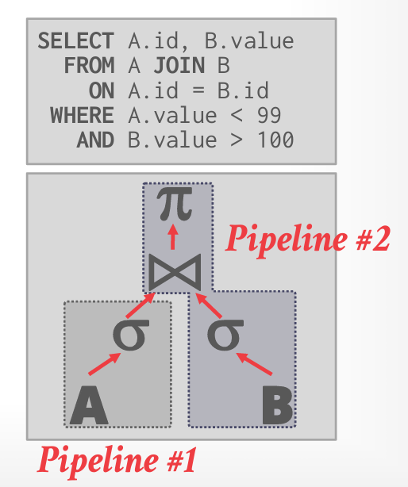{:height 383, :width 368}
- ## [MonetDB/X100 Paper](https://15721.courses.cs.cmu.edu/spring2023/papers/06-execution/boncz-cidr2005.pdf)
	- Show how DBMS are designed incorrectly for modern CPU architectures
	- 通常人容易理解的方法是 CPU 工作最糟糕的方式
	- 基于其中的许多发现，然后提出了一个新的数据库 DBMS 叫做 MonetDB/X100
		- 在 2010 年重命名为 Vectorwise
		- 又被 rebranded 为 Vector
- ## CPU 利用
	- 尽可能的让 CPU 忙碌起来，不要空闲
	- 问题
		- 数据依赖
			- 如果存在数据依赖，那么没有办法，必须等待数据准备好才能执行后续指令
		- 分支预测
			- CPU 先按照预测的分支执行，如果出现问题时，就丢弃已经执行的数据，并回到正确的位置
			- C++ 中存在 likely/unlikely 来提示 CPU 的更可能的分支，但 CPU 2015+ 已经会忽略它，但存在争议，没有数据库真实的使用，需要使用其他方法。
				- 应该避免产生分支
				- 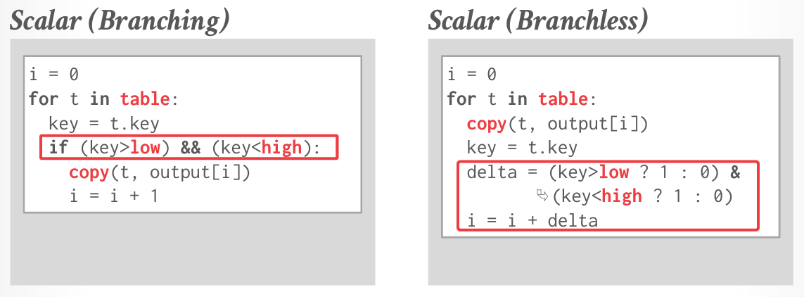
					- 只需要最后处理一下最后一个元素，而不需要考虑分支
			- 然而现有的数据库都是设计给通用类型的，因此在执行之前都需要检查类型，大多使用 switch 来选择合适的路径，这会导致 CPU 的难以进行预测
- ## Processing Model
	- Iterator Model
		- 有时候也称为 Volcano 或者 Pipeline Model
		- 每个 operation 实现一个 next，然后自顶向下的调用 Next，并传递直到最底层的数据提供者
			- 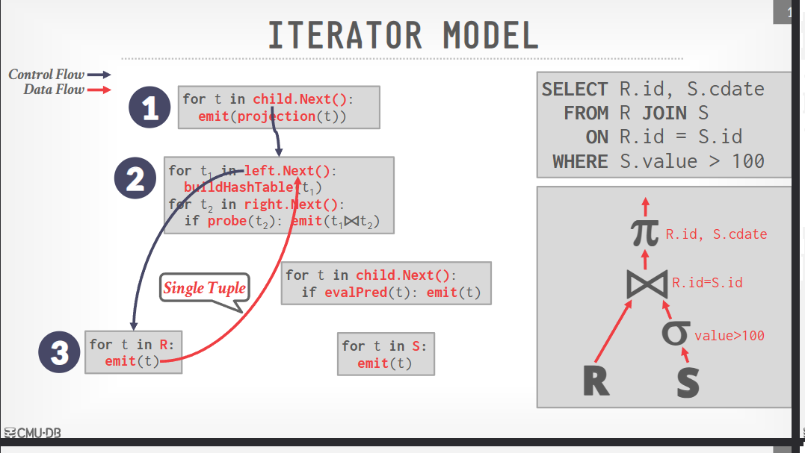
			- 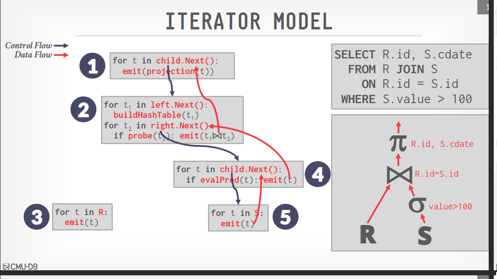
		- 这样几个算子就可以在一个两个数据集合上完成 Join 和 select
		- 这是 OLTP 中经常使用的，允许管道操作
	- Materialization Model
		- 一次输出所有的数据，不会再次调用了
			- 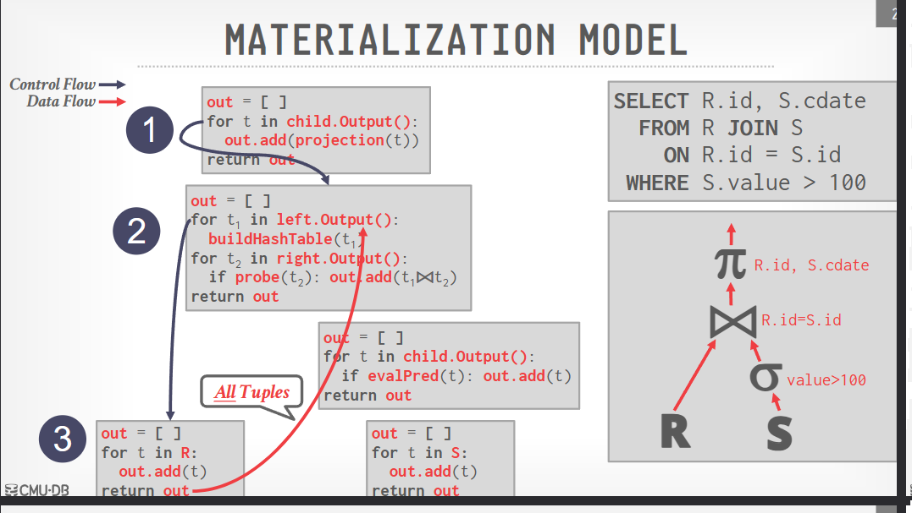
			- 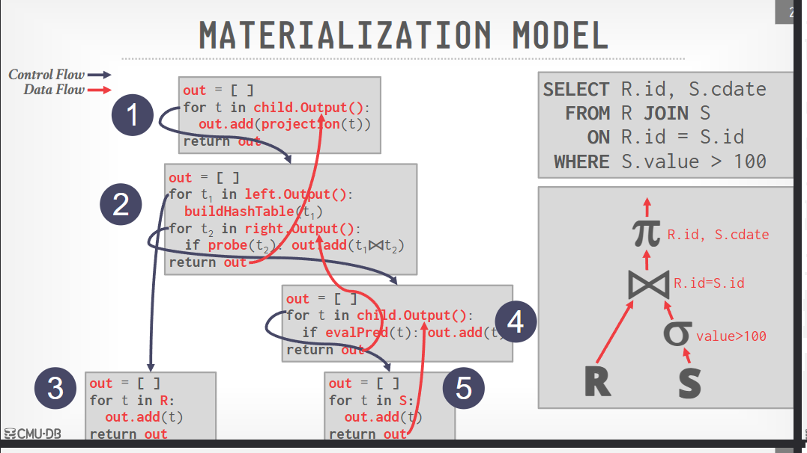
			- 有些运算符可以内联
				- 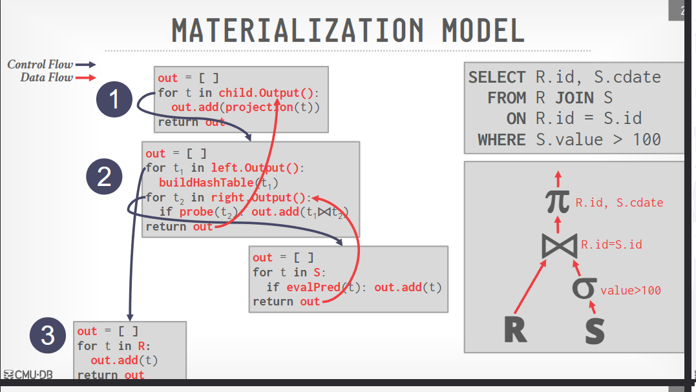
			- 对 OLTP 有利，对 OLAP 不利
				- 更好的函数调用，更低的执行/协作开销
				- 对于许多大量中间结果的 OLAP 查询会非常糟糕
		- 需要下推来避免生成超过特定数量、条件的数据
	- Vectorized/Batch Model
		- 每次操作其中多个 tuple
			- 在达到某个批量数量时，就抛出
			- 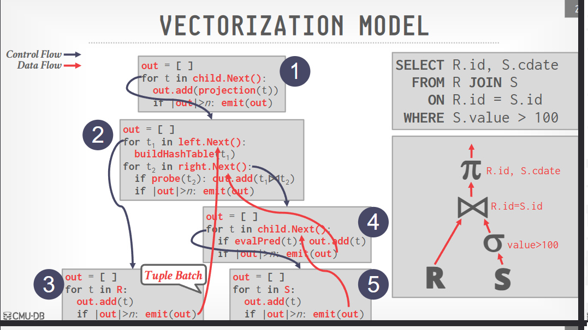
		- 批处理大小根据硬件不同而不同
		- 大大减少了每个运算符的调用次数，非常适用于 OLAP 查询
		- 允许 operation 更轻松的使用 SIMD 向量指令
- 执行计划处理方向
	- 自顶向下
		- 从一个运算符向另外一个运算符拉取数据
		- 容易控制输出，例如 limit 几个结果
		- 父操作在子操作完成之前会阻塞
		- next 函数是虚函数，因此会有一些开销。当然如果来自代码生成，就不用考虑虚函数，会有更好的性能表现。
	- 自底向上
		- 将一个运算符的结果推送给另外一个运算符
		- 可以对寄存器和缓存做更严格的控制
		- 难以对 limit 进行控制
		- 难以实现 Sort-Merge Join，一次只能拿到一部分
- 自底向上 Push-based iterator model
	- 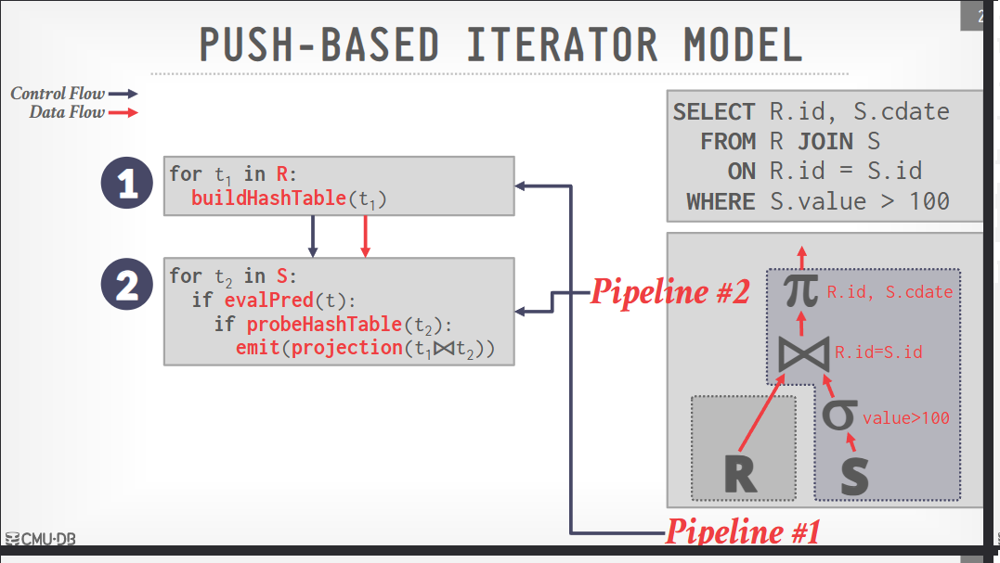
- 并行执行
	- Query 内并行
		- 操作内并行
			- 对不同的数据子集进行相同的操作，并行处理
				- 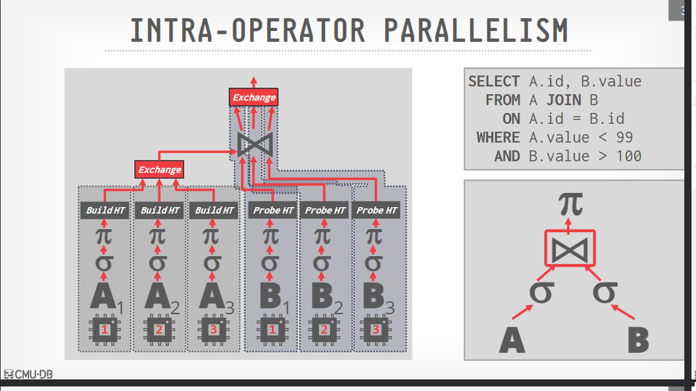
			- 然后通过 exchange 来合并各个线程的输出，来获取所有的结果
			- 在 exchange 之前，为了避免大量物化，可以先做一次投影，叫做投影下推
			- 如果是 Join 操作，那么如上图 B，每个 operator instance 都会 join 完整的中间结果
		- 操作间并行
			- 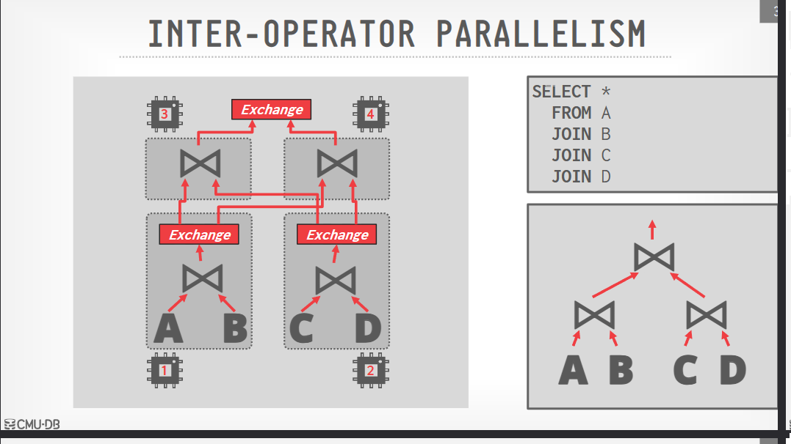
			- 流水线般运行
	- Query 间并行
		- 多线程让 CPU 忙碌起来
- 思考
	- 实现事情的简单的方式并不能为 CPU 提供高效的执行策略
	- 向量化和自底向上执行是 OLAP 查询较为不错的方法