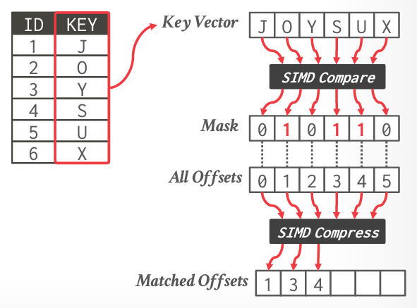

tags:: [[15-721]]

- Why this matters
	- 如果每个核有 4 通道的 SIMD 寄存器，且机器上有 32 个核，那么可以获得比单线程计算 128 倍的提升
	- 这是理论上限，其实是可以轻松获得 2x-4x 的提升
- 矢量化的方向
	- 水平
		- 
	- 垂直
		- 在数据库系统中更常见
		- 
- SIMD 指令
	- 移动数据
	- 算术运算
	- 逻辑指令
	- 比较指令
	- Shuffle 指令
	- 其他
		- 将数据在 x86 和 SIMD 寄存器中转换
		- 缓存控制
			- 在主存间移动数据，跳过 CPU 缓存
- SIMD 的权衡
	- 优点
		- 性能提升
	- 缺点
		- 实现起来非常麻烦
		- 对数据对齐方式有限制
		- SIMD 的寄存器的数据交换并不高效，但在 AVX-512 之后不再是个问题了
- 例子
	- Selection Scan
		- 为了避免分支预测错误带来的开销，之前有这样一个例子
			- {{embed ((64dc7031-660b-4d7f-b57d-05187eca87ac))}}
			- 那么在 SIMD 中可以更快
				- 
				- 通过一次比较，一次压缩就能拿到结果
	- Hash Table Probing
		- 没看懂
	-
	-