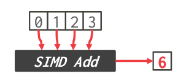
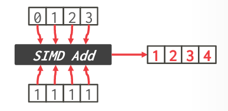

tags:: [[15-721]]

- Why this matters
	- 如果每个核有 4 通道的 SIMD 寄存器，且机器上有 32 个核，那么可以获得比单线程计算 128 倍的提升
	- 这是理论上限，其实是可以轻松获得 2x-4x 的提升
- 矢量化的方向
	- 水平
		- 
	- 垂直
		- 在数据库系统中更常见
		- 
- SIMD 指令
	- 移动数据
	- 算术运算
	- 逻辑指令
	- 比较指令
	- Shuffle 指令
	- 其他
		- 将数据在 x86 和 SIMD 寄存器中转换
		- 缓存控制
			- 在主存间移动数据，跳过 CPU 缓存
		-
	-