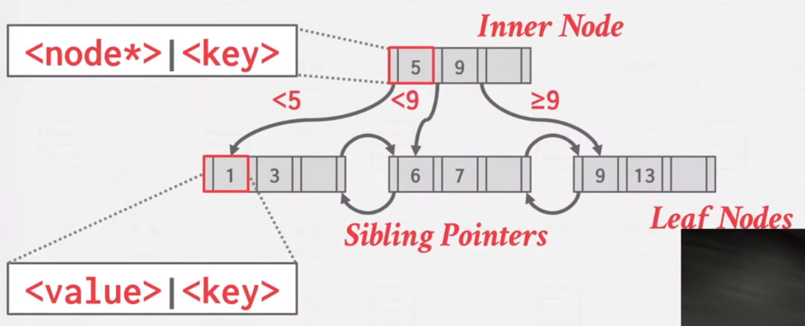

tags:: [[15-445]], [[Course]]

- Table index
	- Replicas of some attribution in a sorted way for quicker accessing.
- B-tree family
	- 通常在数据库领域提及 b-tree，指的就是 [[B+ 树]]
- B+ 树
	- 平衡树
	- 有序的
	- 访问、删除、插入的时间复杂度都是 O(log n)
	- 每层有多个分支
		- 在一个块上存储更多的节点，减少总访问的随机访问次数
		- 完全二叉树，所有的叶子节点都在同一层
		- 每个节点（除了根节点）都至少是半满的
			- `M/2-1 ≤ #keys ≤ M-1`
		- 每个节点如果有 k 个key，那就有 k+1 个非空子节点
	- 
- Leaf node
	- Leaf 里面存储了键值对，键值对可以分别存放在两个数组里，也可以交替排列在同一个数组里
	- value 可以是 Tuple Data，或者是 Record Id
		- InnoDB 中主键索引或者是二级索引，二级索引中找的是主键的 key，而不是 record id
		- SQL Server 和 Oracle 中默认是只存 record id
	-
-