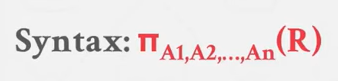
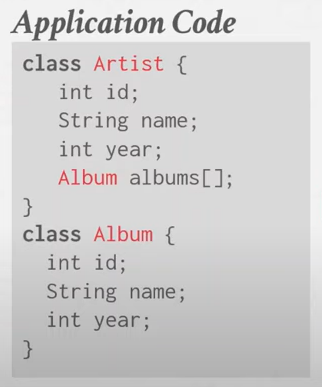

tags:: [[CMU 15-445]]

- 01
	- TODO 另外一个讨论会，如果你对 DB 感兴趣，since 2022 09/12, [[A Database Seminar Series]]
		- https://db.cs.cmnu.edu/seminar2022
	- ## Database
		- 为什么使用一个扁平的文件来存储数据是糟糕的
			- 没有类型约束
			- 多线程访问的可能性极差
			- 线性访问速度
			- 多个数据表之间难以关联，特别是在修改操作时
			- 如何持久化
			- 无法保持一致性
			- 难以高可用
		- ### 这就是为什么你需要一个数据库管理系统
		  collapsed:: true
			- Support definition, creation, querying, update and administration in accordance with some data model. #定义
				- Data model
					- Relational
					- NoSQL
						- Key/Value
						- Graph
						- Document/Object
						- Wide-Column/Column-family
					- Machine Learning
						- Array/Matrix/Vectors
					- Obsolete/Legacy/Rare
						- Hierarchical
						- NMetwork
						- Multi-Value
				- Schema 是一个特定的数据集的描述
		- ### 关系型数据模型
		  collapsed:: true
			- 1969 年 E.F.Codd 通过论文提出，一种高级抽象，而不必在应用代码中实现所有的数据描述。
			- 主要原则 tenets
				- 使用关系来描述数据结构
				- 物理存储由 DBMS 实现，而非应用程序
				- 使用高级语言来访问数据，DBMS 来搞定执行策略
			- Relation
				- is an unordered set that contain the relationship of attributes that represent entities
				- 最开始时，每个数据是一个简单的基础类型/原子类型，现在也可以是一个数组或者之类的复杂结构
				- 每个字段的值都可以为 NULL
				- Primary Key 是每一个记录的独一无二的标识
					- 每个数据库都有自己的自动生成方法，如果你没有设置，会为你生成一个
				- Foreign Key
					- 引用其他表的主键
			- 关系演算，SQL 与关系代数的关系
				- 部分操作
				  collapsed:: true
					- Select
						- 
					- Projection
						- 映射，在课程里大致在描述用于调整列的顺序，操作值
						- 
					- Union
						- 
					- Intersection
						- 
					- Difference
						- 
					- Product
						- Like cross join
						- 
					- Join
						- Like inner join
						- 
					- TODO 确认每个情况下对于重复数据操作后，是否包含重复数据 in SQL Server/Mysql
				- 性能
					- 
						- 引擎如何实现关系代数和执行数据会严重影响性能
						- 在复杂的场景下，其实没有人会完全遵循 SQL 的标准
			-
		- 文档数据模型
			- 
				- 不利于表达：
					- 多个 artist 共同创作的 album
			-