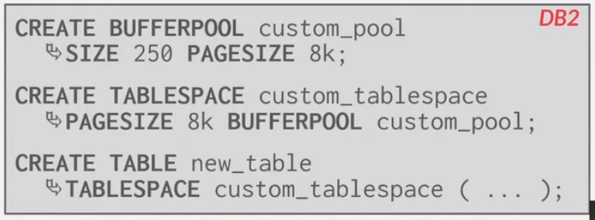
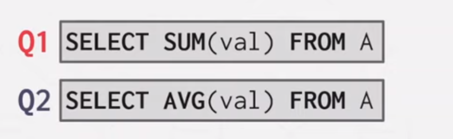
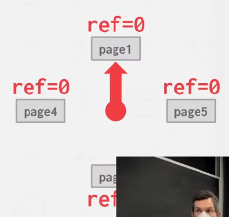

tags:: 15-445

- Video
	- [(5) 06 - Memory Management + Buffer Cache (CMU Intro to Database Systems / Fall 2022) - YouTube](https://www.youtube.com/watch?v=Y9H2HaRKOIw)
- DISK Oriented DBMS
	- Execution engine 根据 Page Directory 来要求将所需的块加载到内存中，然后在内存中访问
	- Buffer Pool Manager 就是负责这个过程的组件
- Buffer pool organization
	- Memory region organized as an array of fixed-size pages
	- An array entry is called a **Frame**
		- When a DBMS ask for a page, a **exact copy** is placed into the frame
		- 其中被修改过的脏页，并不会立刻被刷回，不同的数据库会有不同的策略来刷回这些数据 (Write-Back Cache)
- Page Table VS Page Directory
	- Page Table 是 page id -> page file 的映射集合
	- Page Dictionry 是 page id -> buffer poll 中 page 的映射集合
- Buffer pool optimization
	- Multiple Buffer Pools，减少并发冲突
		- Per database
		- Per page
			- Partition by ObjectId or page id Hash
		- Per table
			- {:height 221, :width 571}
	- Pre fetching
	- Scan sharing
		- 可以复用之前已经查询出的结果
		- 多个查询可以 attch 在一个光标中来扫描表
			- Query 可以不相同，只要同一个 table 就可以跟着一起扫
			- {:height 185, :width 544}
	- Buffer Pool ByPass
		- 大量扫描且只会短期访问一次的记录，可以不放在 buffer pool 中
	- Page 换出算法
		- LRU
		- Clock
			- 
			- 为每一个节点都设置成初始值 0
				- 如果访问就设置为 1
			- 循环反复扫描
				- 如果为1，就设置为 0
				- 如果为 0 就清除
		- 换出容易被污染 SEQUENTIAL FLOODING，和 Linux cache page 一样
			- 避免只访问一次的大量数据将热数据换出了
				- LRU-K
					- 追踪 k 次访问，而不是单次访问。也可以追踪访问间隔，并预测下次什么时候可能会访问。
					- 在 MySQL 中，划分了两块区域，一块存放热数据，需要访问足够多次才会进去，在这块区域内使用 LRU；另外一块区域存放访问低于某个阈值的 page，同样，在这块区域内部使用 LRU.
					- K 需要实践来决定，大多数情况下比 K=1 时要好
				- 优先级
					- 例如 B+ 树的根节点总是重要的，那么似乎不应该经常驱逐它
		- 换出时，可以选择脏页和非脏页，但代价不同
			- 需要在可能的未来访问中来平衡如何选择