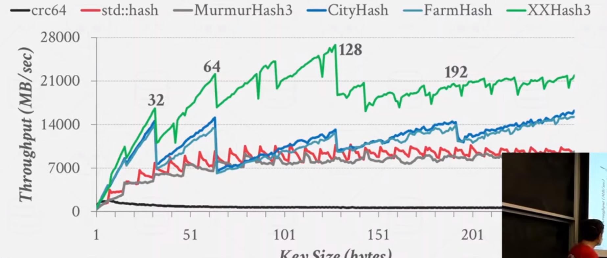
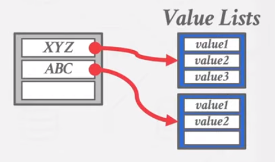
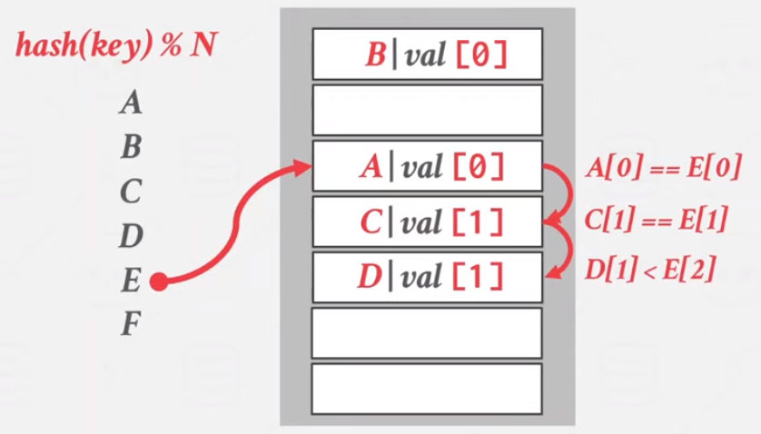
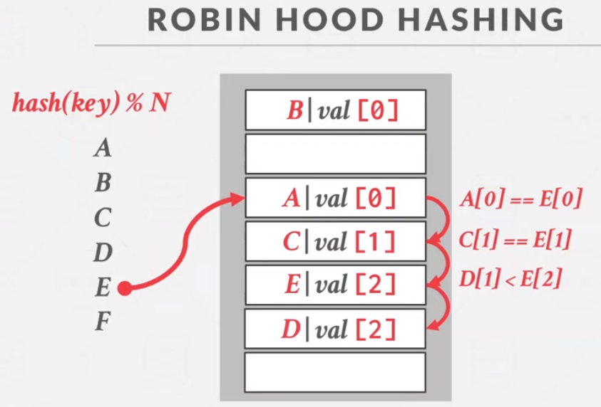

tags:: [[15-445]], [[Course]]

- course status
	- {:height 258, :width 219}
- Design Decisions
	- Data Organization
		- 如何设计数据结构来支撑更好的提供读写能力
	- Concurrency
		- 如何保证并发访问下的安全和性能
- 对于 Hash Tables
	- 用在很多位置，例如 Page Directory, Buffer Pool 等
	- 空间复杂度 O(n)
	- 时间复杂度
		- Avg: O(1)
		- Worst: O(n)
	- Design Decisions # 1: Hash Function
		- 更快的 hash 或者更小的碰撞率(collision rate)
	- Design Decision # 2: Hashing Scheme
		- 如何处理碰撞
		- Trade-off between 分配更大的空间来避免碰撞 还是 小空间+碰撞处理
- xxHash 最好的 Hash 函数
	- [GitHub - Cyan4973/xxHash: Extremely fast non-cryptographic hash algorithm](https://github.com/Cyan4973/xxHash)
		- 作者也是完成了 [zstd](https://github.com/Cyan4973/zstd) 的人
		- {:height 381, :width 809}
	- 权衡
		- 返回 1 是最快的 Hash 函数，但有最糟糕的碰撞
		- **通常直接选择 xxHash，没有太多可讨论的空间**
		- [GitHub - rurban/smhasher: Hash function quality and speed tests](https://github.com/rurban/smhasher) 痴迷于 hash 中间给出了许多测试结果
	- 为什么不用 sha-2?
		- 安全性不是重点考量，为了安全性考虑产生的额外开销是浪费的
		- 访问数据库的人，本应该是具备任何权限的人，即便有各种攻击方式或者数据倾斜攻击，也来自于数据库权限的泄漏而非 hash 算法应该承担和考虑的问题
	- 其他
		- Google CityHash / FarmHash
- Static Hash Schemas
	- 开放地址散列法
	- Non-Unique Keys
		- Choice1: Separate Linked list
			- 
		- Choice2: Redundant Keys
			- 把 value 存在一起
	- Robin Hood Hashing
		- 一旦发生碰撞，计算遍历后将要放过去的位置的距离
			- 
		- 沿路计算哪一个位置的距离比当前更近，则和它交换
			- 
		- 最终使得所有碰撞后的节点的跳数不会差太多
		- 在数据库里不是好的选择，除非读远远大于写，否则会大量的