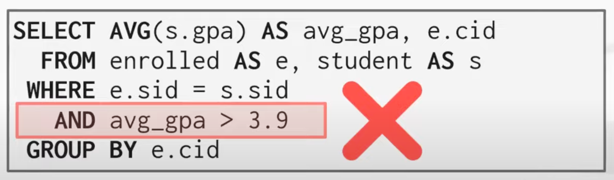
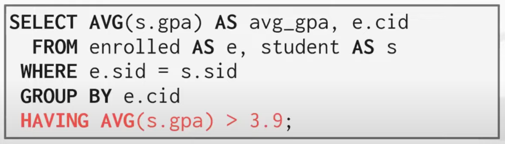
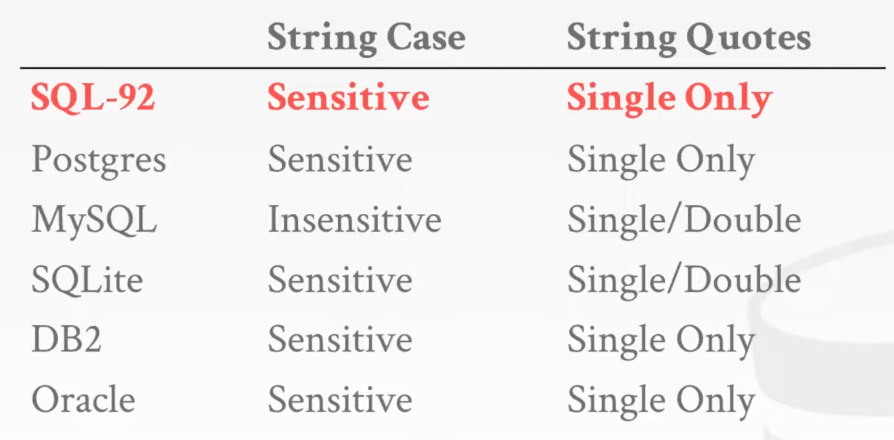

- SQL History
	- `SEQUEL` developed by IBM in 1974 for System R
		- **S**tructured **E**nglish **Q**uery **L**anguage
	- Then released commercial SQL based DBMS Syste,/38, SQL/DS, DB2
	- ANSI standard in 1986. ISO in 1987
		- **S**tructured **Q**uery **L**anguage
	- Latest version
		- SQL:2016
	- SQL is based on bag (duplicates) algebra not set (no duplicates) algebra
- SQL Aggregation
	- Why HAVING?
		- 
			- 在 Where 里无法获取聚合数据的结果
		- 
			- 需要使用 Having 来设置条件，且并不会触发，DB 会识别出这是在 SELECT 中已经计算的值
- String operations
	- String case and String quotes
		- 
			- MySQL is insensitie and can use single/double quotes
	- Concat
		- MSSQL can directly use `+`
		- MySQL needs to use `CONCAT()`, or just list all string items with space
	- Date
		- DATE()
		- DATEDIFF
		- CONVERT(DATETIME, <format>)
- Output Redirection
	- `CREATE TABLE` in Mysql
		- Select and make output as another table
		- ``` MYSQL
		  CREATE TABLE CourseIds (
		      SELECT DISTINCT cid FROM enrolled
		  );
		  
		  ```
	- `INSERT INTO`
		- insert selected contents to existed table
- Output control
	- LIMIT <count> [offset]
- Nested Queries
	-