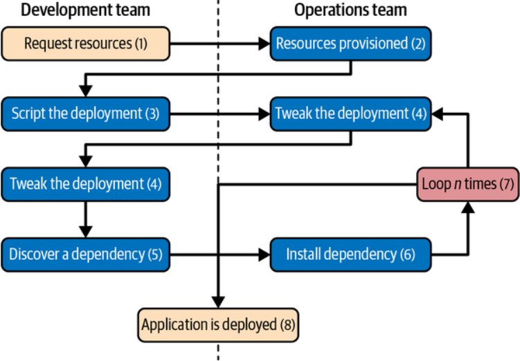
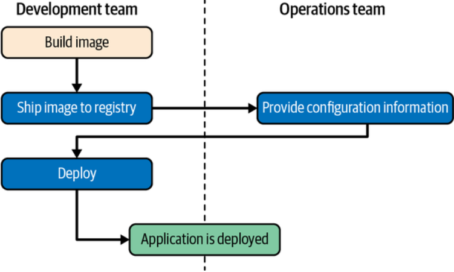
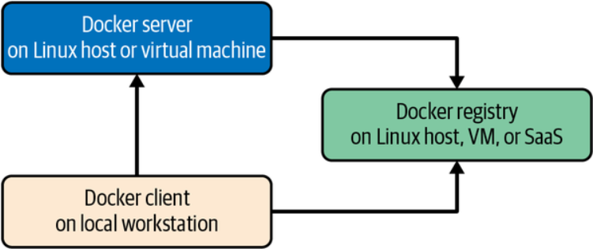

tags:: [[Docker: Up & Running, 3rd Edition@Books]]

- 传统流程
	- 
- 基于 Docker
	- 
	- #+BEGIN_QUOTE
	  Docker允许在开发和测试周期中发现所有的依赖性问题。到应用程序准备好进行第一次部署时，这项工作已经完成了。
	  #+END_QUOTE
- #+BEGIN_QUOTE
  Docker得到了良好的支持，大多数大型公共云都为其提供了一些直接支持。
  #+END_QUOTE
- #+BEGIN_QUOTE
  Docker在2014年的承诺已经完全成为主流，因为最大的公司继续投资于该平台、支持和工具。由于大多数提供商都提供了某种形式的Docker和Linux容器编排以及容器运行时本身，因此Docker在几乎所有常见的生产环境中都得到了良好的支持。如果您所有的工具都围绕Docker和Linux容器构建，那么您的应用程序可以以与云无关的方式部署，从而提供了以前无法实现的新的灵活性。
  #+END_QUOTE
- #+BEGIN_QUOTE
  在2022年，**我们看到Docker开始在服务器市场上失去份额**，转而被最新版本的Kubernetes所取代，这些版本不再需要Docker守护进程，但即使是这些Kubernetes的版本也非常依赖于 containerd 运行时，这是最初由Docker开发的。Docker在许多开发者和CI/CD工作流中仍然有着非常强大的影响力。
  #+END_QUOTE
- Runtimes
	- #+BEGIN_QUOTE
	  主要的高级OCI认证运行时
	  #+END_QUOTE
		- #+BEGIN_QUOTE
		  `containerd` ，这是现代版本的Docker和Kubernetes中默认的高级运行时。
		  #+END_QUOTE
	- #+BEGIN_QUOTE
	  这些较低级别的OCI认证运行时可以被 `containerd` 用来管理和创建容器
	  #+END_QUOTE
		- #+BEGIN_QUOTE
		  [runc](https://github.com/opencontainers/runc) 经常被用作 containerd 的默认低级运行时。
		  #+END_QUOTE
		- #+BEGIN_QUOTE
		  来自英特尔，Hyper和OpenStack基金会的[Kata Containers](https://katacontainers.io/)是一种虚拟化运行时，可以运行混合的容器和虚拟机。
		  #+END_QUOTE
		- #+BEGIN_QUOTE
		  来自Google的[gVisor](https://github.com/google/gvisor)是一个沙盒化的运行时，完全在用户空间中实现。
		  #+END_QUOTE
		- #+BEGIN_QUOTE
		  [Nabla](https://nabla-containers.github.io/) 容器提供了另一种沙盒化运行时，旨在显著减少Linux容器的攻击面。
		  #+END_QUOTE
- ## Aruchitecture
	- #+BEGIN_QUOTE
	  Docker API背后有几个部分，包括 containerd 和 runc ，但基本的系统交互是客户端通过API与服务器进行通信。
	  #+END_QUOTE
		- 
		- #+BEGIN_QUOTE
		  它有一个 docker 客户端和一个 dockerd 服务器, docker 命令行工具和 dockerd 守护进程可以通过Unix套接字和网络端口进行通信。
		  #+END_QUOTE
		- #+BEGIN_QUOTE
		  向互联网分配数字权威机构（IANA）注册了三个端口供Docker守护进程和客户端使用：TCP端口2375用于未加密的流量，端口2376用于加密的SSL连接，以及端口2377用于Docker Swarm模式。
		  ...
		  Unix套接字可以在不同的操作系统中位于不同的路径，但在大多数情况下，它可以在这里找到：/var/run/docker.sock。
		  ...
		  强烈建议不要在Docker中使用网络端口，因为Docker守护进程中缺乏用户身份验证和基于角色的访问控制。
		  #+END_QUOTE
	- #+BEGIN_QUOTE
	  在这个简单的外表下，Docker大量利用内核机制，如iptables，虚拟桥接，Linux控制组（cgroups），Linux命名空间，Linux能力，安全计算模式，各种文件系统驱动程序等等。
	  #+END_QUOTE
- ### 其他
	- #+BEGIN_QUOTE
	  当我们在这本书中谈论[Docker Swarm或Swarm模式](https://docs.docker.com/engine/swarm)时，我们指的是Docker客户端和服务器中内置的Swarm功能，该功能利用了另一个名为SwarmKit的底层库。在互联网上搜索文章时，您可能会找到对较旧的独立版本的Docker Swarm的引用，现在通常被称为[Docker Swarm “经典”版本](https://github.com/docker