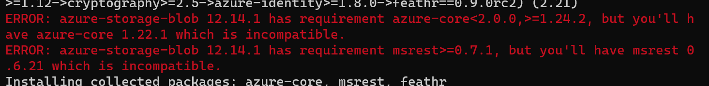
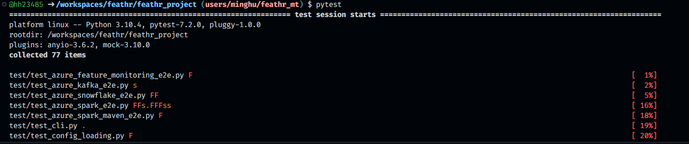
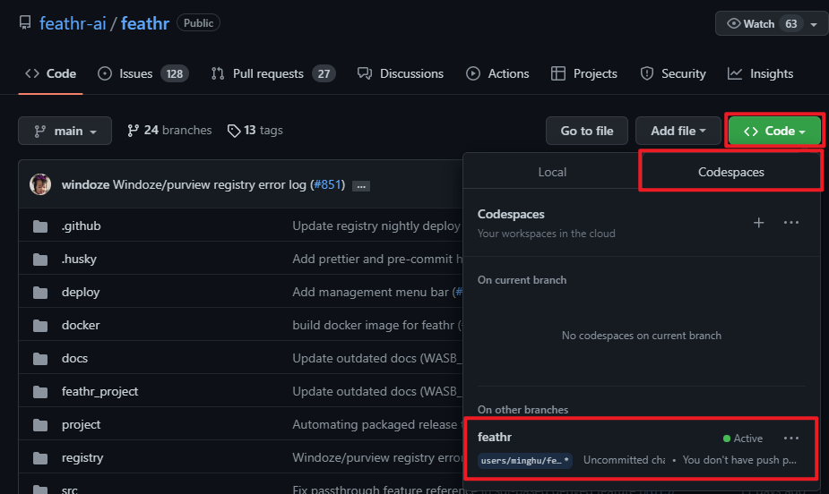

tags:: feathr, 安装环境

- # 克隆项目
	- [[Feathr]] 的仓库地址在 [feathr-ai/feathr: Feathr – An Enterprise-Grade, High Performance Feature Store (github.com)](https://github.com/feathr-ai/feathr)
	- 使用 git 克隆
		- ```
		  git@github.com:feathr-ai/feathr.git
		  ```
- # 初始化 feathr client 开发环境
	- ## 项目路径
		- `./feathr_project`
	- ## 安装依赖
		- 创建 virtual env
			- ``` python
			  # 安装 venv
			  apt install python3.8-venv
			  
			  # 创建 venv
			  python -m venv venv
			  ```
		- 进入 venv
			- ``` bash
			  source ./venv/bin/activate
			  ```
				- 
		- 修复依赖问题
			- #+BEGIN_WARNING
			  当前的版本 [[Nov 13th, 2022]]  下，需要修改 `setup.py` 的依赖来保证兼容，否则后续会出现如下错误。
			   
			  修复方法为，找到 `azure-core` 和 `msrest` 两个依赖，修改版本要求如下：
			  
			  ``` python
			  "azure-core>=1.24.2",
			  "msrest>=0.7.1",
			  ``` 
			  #+END_WARNING
		- 通过 `setup.py` 来安装所需要的依赖
			- ``` bash
			  python -m pip install -e .
			  ```
		- 安装 `pytest`
			- ``` bash
			  pip install pytest pytest_mock
			  ```
		- 执行 `pytest`
			- 
			- 正常情况下会执行许多的测试用例
				- 很多会失败和跳过，这是正常的，完整的测试 feathr 会在官方仓库的 Github Action 中执行，因此本地开发一定会缺少这些环境配置信息
		- 创建本地执行环境
			- ``` bash
			  feathr init
			  ```
			- 会在当前目录下创建 `feathr_user_workspace` 文件夹，文件夹内包含了一个本地可执行的 (linux only) 的样例，可参考 [[feathr spark local 模式测试样例解读]]
	- ## 编辑
		- (基于 WSL) 使用 `code`，来启动 vscode 编辑 WSL 中的项目
- # 其他环境
	- 使用 [[Github Codespace]] 也可以做到和本地完全相同的效果，可能速度还更快，但未深度使用。
		- 
		- 目前担心如下：
			- 默认的环境为 `java11`，超出 feathr 的要求 `1.8`
			- 持久化能力未知，担心代码丢失