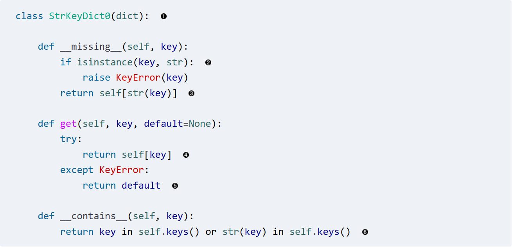
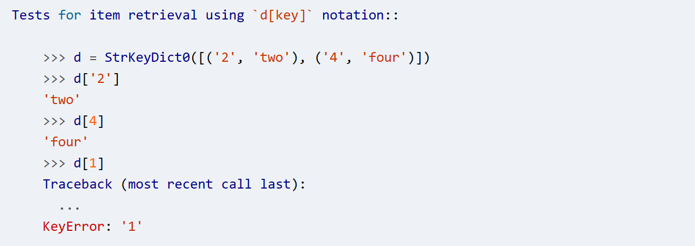
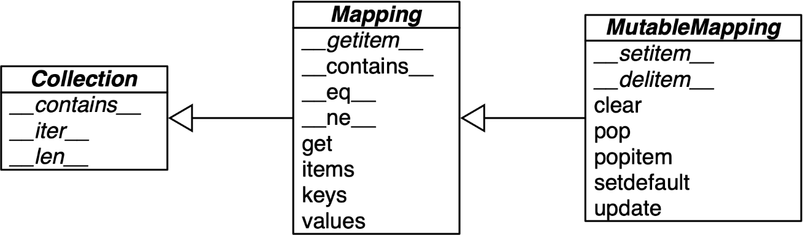

tags:: [[Fluent Python 2nd@Books]]

- 字典
	- dict 的构造可以从任何键值结构创建，只要使用 `{ }`
		- 推导
			- ``` python
			  >>> dial_codes = [
			  ...     (880, 'Bangladesh'),
			  ...     (55,  'Brazil'),
			  ...     (86,  'China'),
			  ...     (91,  'India'),
			  ...     (62,  'Indonesia'),
			  ...     (81,  'Japan'),
			  ...     (234, 'Nigeria'),
			  ...     (92,  'Pakistan'),
			  ...     (7,   'Russia'),
			  ...     (1,   'United States'),
			  ... ]
			  >>> country_dial = {country: code for code, country in dial_codes}
			  
			  ```
		- 解包映射
			- ``` python
			  >>> def dump(**kwargs):
			  ...     return kwargs
			  ...
			  >>> dump(**{'x': 1}, y=2, **{'z': 3})
			  {'x': 1, 'y': 2, 'z': 3}
			  
			  ```
		- 使用 `|` 或者 `|=` 合并两个 dict
			- ``` python
			  >>> d1 = {'a': 1, 'b': 3}
			  >>> d2 = {'a': 2, 'b': 4, 'c': 6}
			  >>> d1 | d2
			  {'a': 2, 'b': 4, 'c': 6}
			  
			  
			  >>> d1
			  {'a': 1, 'b': 3}
			  >>> d1 |= d2
			  >>> d1
			  {'a': 2, 'b': 4, 'c': 6}
			  
			  ```
	- 字典也可以进行模式匹配和映射（匹配任何 `collections.abc.Mapping`)
		- 例如从某种半结构数据中方便的提取数据和匹配
			- ``` python
			  def get_creators(record: dict) -> list:
			      match record:
			          case {'type': 'book', 'api': 2, 'authors': [*names]}:
			              return names
			          case {'type': 'book', 'api': 1, 'author': name}:
			              return [name]
			          case {'type': 'book'}:
			              raise ValueError(f"Invalid 'book' record: {record!r}")
			          case {'type': 'movie', 'director': name}:
			              return [name]
			          case _:
			              raise ValueError(f'Invalid record: {record!r}')
			  
			  ```
		- 也可以使用 **extra 来收集额外的键值对
			- ``` python
			  >>> food = dict(category='ice cream', flavor='vanilla', cost=199)
			  >>> match food:
			  ...     case {'category': 'ice cream', **details}:
			  ...         print(f'Ice cream details: {details}')
			  ...
			  Ice cream details: {'flavor': 'vanilla', 'cost': 199}
			  ```
- 什么是可哈希的
	- #+BEGIN_QUOTE
	  如果一个对象具有在其生命周期内永远不会改变的哈希码（它需要一个 `__hash__()` 方法），并且可以与其他对象进行比较（它需要一个 `__eq__()` 方法），则该对象是可哈希的。具有相等比较的可哈希对象必须具有相同的哈希码
	  #+END_QUOTE
	- ``` python
	  >>> tt = (1, 2, (30, 40))
	  >>> hash(tt)
	  8027212646858338501
	  >>> tl = (1, 2, [30, 40])
	  >>> hash(tl)
	  Traceback (most recent call last):
	    File "<stdin>", line 1, in <module>
	  TypeError: unhashable type: 'list'
	  ```
- `__missing__`
	- 这是一个特殊方法，用来在访问字典时处理不存在的 key
		- 
		- 通过 override 形式能够覆盖对 `__getitem__` 的失败访问，但不覆盖 `__contains__`
			- 这个例子可以让数组里不论存放的 key 是字符串还是数字，都能够被正常的访问
			- 
	- 该特殊方法在特定的实现类中的覆盖范围有一些差异
		- 对于 dict 子类如果只实现了 `__missing__`，意味着对下面两个方法进行了支持
			- `d[k]`
			- `__getitem__`
		- 对于 `collections.UserDict` 的子类，如果只实现了 `__missing__`，支持如下方法
			- `d[k]`
			- `d.get(k)`
		- 对于 `abc.Mapping` 子类中的逻辑完全取决于你是否在 `__getitem__` 中调用 `__missing__`
			- 如果不调用，则默认不会触发
			- 如果自己调用了，那么可以覆盖 `d[k]`, `d.get(k)`，`k in d`
		- `setdefault` 和 `update` 的行为也会受到影响
- `defaultdict`
	- 是一个默认值的 dict 变体，如果这个
- `collections.OrderedDict`
	- 自 3.6 版本开始，内置的 dict 也会保持键的顺序，所以使用 `OrderedDict` 的常见原因是
	- 带有一个 `move_to_end()` 方法可以调整顺序
	- 比 `dict` 更擅长重新排序，空间效率、插入性能都是次要的
- `ChainMap`
	- 像是一个层次的 dict，可以按顺序将多个 dict 组织起来，在查询时按照顺序从第一个 dict 开始查找
	- ``` python
	  >>> d1 = dict(a=1, b=3)
	  >>> d2 = dict(a=2, b=4, c=6)
	  >>> from collections import ChainMap
	  >>> chain = ChainMap(d1, d2)
	  >>> chain['a']
	  1
	  >>> chain['c']
	  6
	  ```
	- ``` python
	  >>> chain['c'] = -1
	  >>> d1
	  {'a': 1, 'b': 3, 'c': -1}
	  >>> d2
	  {'a': 2, 'b': 4, 'c': 6}
	  ```
	- 对于环境变量的、上下文的设置非常有效
		- ``` python
		  import builtins
		  pylookup = ChainMap(locals(), globals(), vars(builtins))
		  ```
- `collections.Counter`
	- ``` python
	  >>> ct = collections.Counter('abracadabra')
	  >>> ct
	  Counter({'a': 5, 'b': 2, 'r': 2, 'c': 1, 'd': 1})
	  >>> ct.update('aaaaazzz')
	  >>> ct
	  Counter({'a': 10, 'z': 3, 'b': 2, 'r': 2, 'c': 1, 'd': 1})
	  >>> ct.most_common(3)
	  [('a', 10), ('z', 3), ('b', 2)]
	  ```
	- 提供了一些有意思的接口
		- most_common 来获取 top n 的元素
		- total 所有元素总计数
		- elements 获取所有的元素，返回的是一个迭代类型，可以用于排序或者转换成 list
		- 也可以使用  + - | 来合并、删除两个 dict
			- ``` python
			  c = Counter(a=3, b=1)
			  **>>> **d = Counter(a=1, b=2)
			  **>>> **c + d                       *# add two counters together:  c[x] + d[x]*
			  Counter({'a': 4, 'b': 3})
			  **>>> **c - d                       *# subtract (keeping only positive counts)*
			  Counter({'a': 2})
			  **>>> **c & d                       *# intersection:  min(c[x], d[x])*
			  Counter({'a': 1, 'b': 1})
			  **>>> **c | d                       *# union:  max(c[x], d[x])*
			  Counter({'a': 3, 'b': 2})
			  ```
		- 如果想要针对非单个字母的，需要手动添加
			- ``` python
			  c = Counter({'red': 4, 'blue': 2})      # a new counter from a mapping
			  c = Counter(cats=4, dogs=8)             # a new counter from keyword args
			  ```
- 需要实现一个 dict 子类的时候，使用 `UserDict` 而不是直接继承自 `dict`
	- UserDict 并不是 dict 子类，而是使用组合的方式，在内部持有了一个 dict 实例
		- `UserDict` 扩展了 `abc.MutableMapping`
		- 
	- 这样可以在必要的时候才重写一些函数，且重写的时候仍然可以依赖 dict 已经实现的功能
		- 
		- 比之前直接实现 dict 需要更少的关注 contains/setitem 的细节，而只需要填写必要的代理逻辑即可
- Inmutable Mapping
	- Python 中没有实现只读的 map，但可以使用 types 中提供的 MappingProxyType
	- ``` python
	  >>> from types import MappingProxyType
	  >>> d = {1: 'A'}
	  >>> d_proxy = MappingProxyType(d) #构造代理
	  >>> d_proxy
	  mappingproxy({1: 'A'})
	  >>> d_proxy[1]  
	  'A'
	  
	  >>> d_proxy[2] = 'x'   #拒绝修改
	  Traceback (most recent call last):
	    File "<stdin>", line 1, in <module>
	  TypeError: 'mappingproxy' object does not support item assignment
	  
	  >>> d[2] = 'B' #但是可以向原来的 map 添加
	  >>> d_proxy  # 仍然可以通过代理显示变化
	  mappingproxy({1: 'A', 2: 'B'})
	  >>> d_proxy[2]
	  'B'
	  >>>
	  ```
- set
	- 使用  {1,2,3 } 就可以创建一个 set
		- 比 set({1,2,3}) 要更高效
	- 但如果需要创建一个空的 set，要使用 set()，而不是 {}，否则创建的会是一个 dict
- set 的结构和方法
	- 
- 进一步阅读
	- Python 标准文档中的示例 [“collections—Container datatypes” (fpy.li)](https://fpy.li/collec)
	- Python 的 PyPy 是第一个实现了紧凑字典的 Python 解释器 [“Faster, more memory efficient and more ordered dictionaries on PyPy” (fpy.li)](https://fpy.li/3-20)
	- 一些 dict 特性的展示
		- [“The Dictionary Even Mightier” (fpy.li)](https://fpy.li/3-22)
		- [“The Mighty Dictionary” (fpy.li)](https://fpy.li/3-23)
		- [“Modern Dictionaries” (fpy.li)](https://fpy.li/3-24)
	- 对于 `True` 和 json 中的 `true`，你可以使用一些方法来让他们表现相同，来获得可以直接拷贝的类型
		- ``` python
		  >>> true, false, null = True, False, None
		  >>> fruit = {
		  ...     "type": "banana",
		  ...     "avg_weight": 123.2,
		  ...     "edible_peel": false,
		  ...     "species": ["acuminata", "balbisiana", "paradisiaca"],
		  ...     "issues": null,
		  ... }
		  >>> fruit
		  {'type': 'banana', 'avg_weight': 123.2, 'edible_peel': False,
		  'species': ['acuminata', 'balbisiana', 'paradisiaca'], 'issues': None}
		  ```
	- 其他
		- [“Saving Memory with __slots__” (oreilly.com)](https://learning.oreilly.com/library/view/fluent-python-2nd/9781492056348/ch11.html#slots_section)