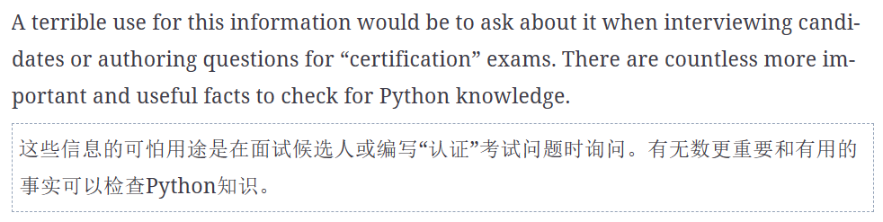

tags:: [[Fluent Python 2nd@Books]]

- python 中的 is 是比较两个对象的 id 是否相同，而 == 比较的是两个对象所持有的值是否相同
	- object 默认实现的 `__eq__` 就是比较两个 id，所以会得到和 is 相同的结果
	- 通常领域对象都会重新实现 `__eq__`
	- ``` python
	  >>> t1 = (1, 2, [30, 40])  
	  >>> t2 = (1, 2, [30, 40])  
	  >>> t1 == t2  
	  True
	  >>> id(t1[-1])  
	  4302515784
	  >>> t1[-1].append(99)  
	  >>> t1
	  (1, 2, [30, 40, 99])
	  >>> id(t1[-1])  
	  4302515784
	  >>> t1 == t2  
	  False
	  
	  ```
- copy 模块提供了 `copy()` 和 `deepcopy()`
	- ``` python
	  >>> import copy
	  >>> bus1 = Bus(['Alice', 'Bill', 'Claire', 'David'])
	  >>> bus2 = copy.copy(bus1)
	  >>> bus3 = copy.deepcopy(bus1)
	  >>> id(bus1), id(bus2), id(bus3)
	  (4301498296, 4301499416, 4301499752)  
	  >>> bus1.drop('Bill')
	  >>> bus2.passengers
	  ['Alice', 'Claire', 'David']          
	  >>> id(bus1.passengers), id(bus2.passengers), id(bus3.passengers)
	  (4302658568, 4302658568, 4302657800)  
	  >>> bus3.passengers
	  ['Alice', 'Bill', 'Claire', 'David']  
	  
	  ```
- `deepcopy` 可以保证循环依赖也被正确的复制
	- 也可以通过实现 `__copy__()` 和 `__deepcopy__()` 来控制 copy 和 deepcopy
- python 中默认值如果是可变类型，那么所有的实例使用默认值的会默认共享同一个，如果任何一个操作修改了，对于所有的对象就都可见了
	- 而不是每次都会新建一个
	- 你可以从 `dir(class.__init__)` 中看到默认值的状态
	- **因此通常，可变类型的默认值是 `None`**
- del 删除的不是对象而是引用
- 如何观察对象的结束
	- 可以使用 `weakref.finalize` 注册一个回调函数
		- ``` python
		  >>> import weakref
		  >>> s1 = {1, 2, 3}
		  >>> s2 = s1         
		  >>> def bye():      
		  ...     print('...like tears in the rain.')
		  ...
		  >>> ender = weakref.finalize(s1, bye)   #不会增加引用计数
		  >>> ender.alive  
		  True
		  >>> del s1
		  >>> ender.alive  
		  True
		  >>> s2 = 'spam'  
		  ...like tears in the rain.
		  >>> ender.alive
		  False
		  
		  ```
- `tuple(t1)` 和 `t1[:]` 返回的都是 t1 同一对象的引用，而不会拷贝一个新的
	- ``` python
	  >>> t1 = (1, 2, 3)
	  >>> t2 = tuple(t1)
	  >>> t2 is t1  
	  True
	  >>> t3 = t1[:]
	  >>> t3 is t1  
	  True
	  
	  ```
	- `str`, `bytes`, `frozenset` 具有相同的行为，对于不可变对象的一种优化
		- 甚至 `frozenset.copy()` 返回的也是相同的对象的引用而不是一个副本
- 延伸阅读
	- [“PyPy, Garbage Collection, and a Deadlock” (fpy.li)](https://fpy.li/6-7)
	- [Understanding Python’s Memory Model, Mutability, and Methods (fpy.li)](https://fpy.li/6-8)
	- [gc module documentation (fpy.li)](https://fpy.li/6-11)
	- [“Design of CPython’s Garbage Collector” (fpy.li)](https://fpy.li/6-12)
	- [PEP 442—Safe object finalization (fpy.li)](https://fpy.li/6-14)
	- [string interning (fpy.li)](https://fpy.li/6-15)
- 其他
	- 对于需要销毁和关闭的对象，尽量使用 with，而不是依赖垃圾回收
	- .
	-