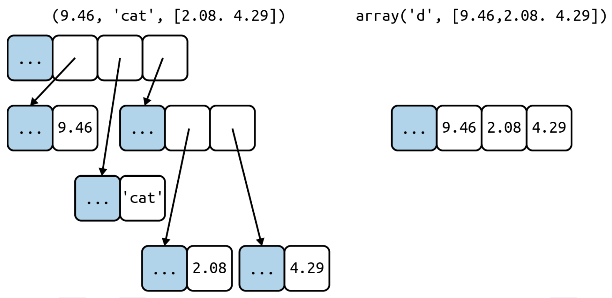
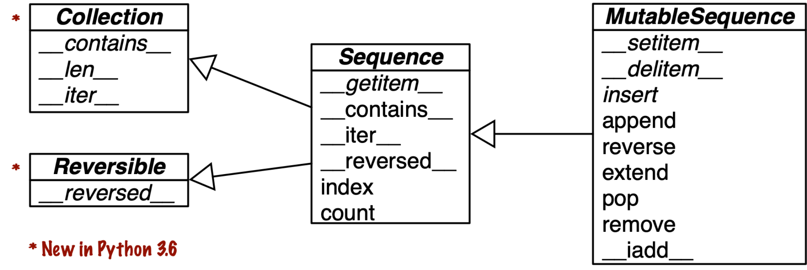
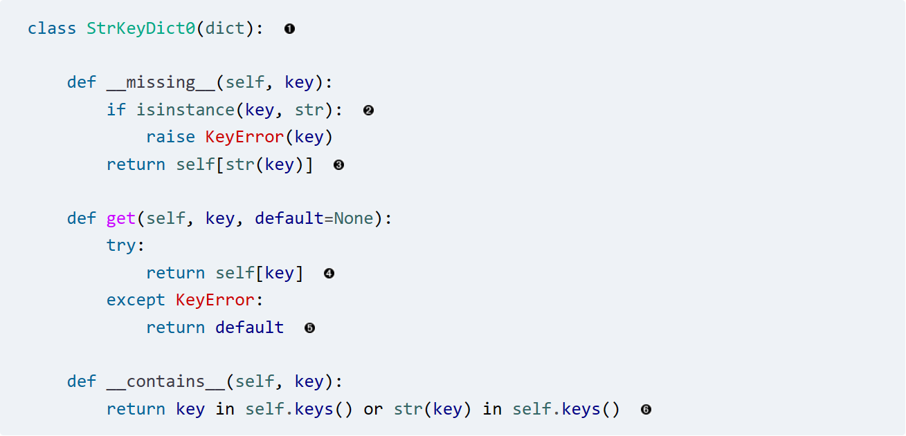
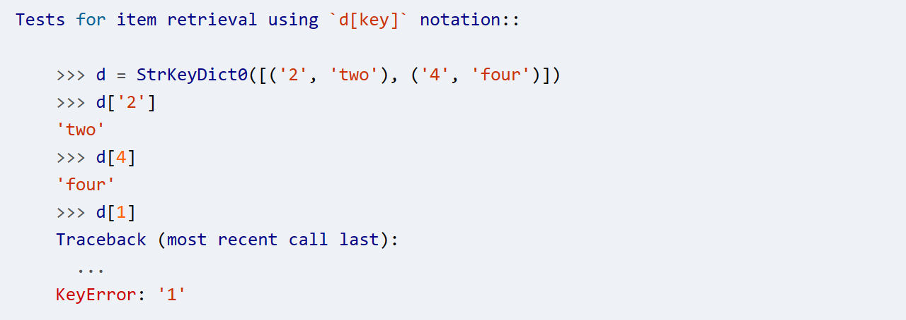
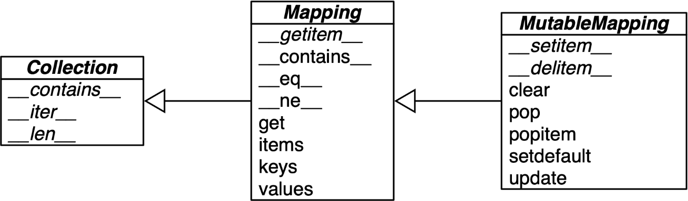
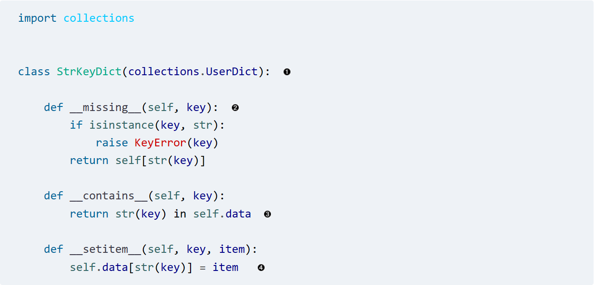
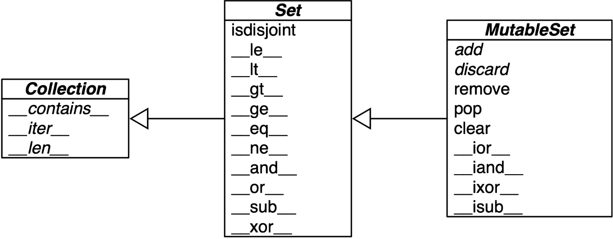
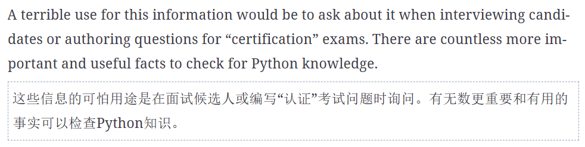

tags:: [[Python]], [[Books]]

- 第一章
  collapsed:: true
	- namedtuple
		- 创建的 tuple 的名称只用于展示，返回的值才用于创建对象
	- 特殊函数通常用于被各种内部逻辑隐式调用
		- `__getitem__` 用于为类提供随机访问的能力
			- 对迭代、choice、`[ ]`访问、排序等提供支持
			- 
				- `dict` 自 3.7 被认为是有序的，但只代表保留了插入顺序，不代表你可以排序
				- python 中对于容器的这种继承关系，并不需要存在真实的继承，而只需要存在对应的特殊函数即可
		- `__contains__` 用于帮助 `in` 快速判断，否则就会顺序扫描一次来比较sure
		- `__len__` 提供 len 关键字的逻辑
		- 特殊函数有 80 多个
			- 功能性
				- col-w-1:: 234px
				  |  类别 | Method names |
				  | ---- | ---- | ---- | ---- |
				  | 字符串/字节表示 | `__repr__ __str__ __format__ __bytes__ __fspath__` |
				  |  转换为数字 | `__bool__ __complex__ __int__ __float__ __hash__ __index__` |
				  | 模仿集合 | `__len__ __getitem__ __setitem__ __delitem__ ``__contains__` |
				  |  迭代 | `__iter__ __aiter__ __next__ __anext__ __reversed__` |
				  | 可调用或协程执行 | `__call__ __await__` |
				  |  上下文管理 | `__enter__ __exit__ __aexit__ __aenter__` |
				  | 实例创建和销毁 | `__new__ __init__ __del__` |
				  |  属性管理 | `__getattr__ __getattribute__ __setattr__ __delattr__ __dir__` |
				  |  属性描述符 | `__get__ __set__ __delete__ __set_name__` |
				  |  抽象基类 | `__instancecheck__ __subclasscheck__` |
				  |  类元编程 | `__prepare__ __init_subclass__ __class_getitem__ __mro_entries__` |
			- 数学运算
				- 各种基础运算都有对应的特殊方法来实现
				- 如果第一个操作数的响应特殊方法无法使用，就会在第二个操作数上调用一个反向操作的特殊方法
	- 进一步阅读
		- [“Data Model” chapter (fpy.li)](https://fpy.li/dtmodel)
		- [Python in a Nutshell, 3rd ed. (fpy.li)](https://fpy.li/pynut3) 对数据模型的访问机制的描述
		- [The Art of the Metaobject Protocol (mit.edu)](https://mitpress.mit.edu/books/art-metaobject-protocol) 解释了元对象协议的概念，其中举了 python 数据模型的例子
			- 书作者也是 AspectJ 的作者
			- 元对象是构建语言核心结构的 API，如果足够灵活就可以扩展出新的编程范式
- 第二章
  collapsed:: true
	- 序列分类
		- 按结构
			- 容器序列
				- 可以容纳不同类型的项目
			- 扁平序列
				- str, bytes, array.array
			- 
	- 可变性
		- 可变
			- list, bytearray, array.array, collections.deque
		- 不可变
			- tuple, str, bytes
		- 
	- python 中每个对象都有一个带元数据的头部，以 float 为例
		- ob_refcnt: 引用计数
		- ob_type: 指向对象类型的指针
		- ob_fval: 一个包含 float 值的 C double
	- 列表推导器
		- ``` python
		  symbols = '$¢£¥€¤'
		  codes = [ord(symbol) for symbol in symbols]
		  
		  ```
			- symbol 这里创建的变量是一个局部变量，不会和外面冲突
			- 但如果是用 `:=` 来分配的话，就可以在外界访问
				- ``` python
				  >>> codes = [last := ord(c) for c in x]
				  >>> last  2
				  
				  ```
		- 推导器可以用于多个循环
			- ``` python
			  >>> tshirts = [(color, size) for color in colors for size in sizes]  #+BEGIN_EXPORT hiccup
			  >>> tshirts
			  [('black', 'S'), ('black', 'M'), ('black', 'L'), ('white', 'S'),
			   ('white', 'M'), ('white', 'L')]
			  ```
		- 但所有的数据都是一次性生成，但好在比 map/filter 更快
	- 生成器表达式
		- 生成器构造的是一个迭代器，可以不断的产出新的元素，而不是一次性生成所有
		- 和列表推导器的差别是，不使用方括号而使用圆括号
			- ``` python
			  >>> colors = ['black', 'white']
			  >>> sizes = ['S', 'M', 'L']
			  >>> for tshirt in (f'{c} {s}' for c in colors for s in sizes):  
			  ...     print(tshirt)
			  ```
	- Tuple 是一个不可变对象，但是其引用的对象可能是可变的
		- 在 python 中如果想要知道一个对象是不是完全不可变，值是不是确定的，可以使用如下方法
			- ``` python
			  >>> def fixed(o):
			  ...     try:
			  ...         hash(o)
			  ...     except TypeError:
			  ...         return False
			  ...     return True
			  ...
			  >>> tf = (10, 'alpha', (1, 2))
			  >>> tm = (10, 'alpha', [1, 2])
			  >>> fixed(tf)
			  True
			  >>> fixed(tm)
			  False
			  ```
			- hash 对于非固定不变的对象，就会抛异常
	- 使用 * 解包
		- ``` python
		  >>> a, b, *rest = range(5)
		  >>> a, b, rest
		  (0, 1, [2, 3, 4])
		  >>> a, b, *rest = range(3)
		  >>> a, b, rest
		  (0, 1, [2])
		  >>> a, b, *rest = range(2)
		  >>> a, b, rest
		  (0, 1, [])
		  
		  >>> a, *body, c, d = range(5)
		  >>> a, body, c, d
		  (0, [1, 2], 3, 4)
		  
		  >> def fun(a, b, c, d, *rest):
		  ...     return a, b, c, d, rest
		  ...
		  >>> fun(*[1, 2], 3, *range(4, 7))
		  (1, 2, 3, 4, (5, 6))
		  
		  ```
	- 嵌套解包
		- `[record] = query_returning_single_row()` 用于 返回值为 list 但只有一个元素
		- `[[field]] = query_returning_single_row_with_single_field()` 用于 返回值为 list，但只有一个元素，且元素只有一个字段
	- 模式匹配中解包
		- ``` python
		      def handle_command(self, message):
		          match message:  1
		              case ['BEEPER', frequency, times]:
		                  self.beep(times, frequency)
		              case ['NECK', angle]:
		                  self.rotate_neck(angle)
		              case ['LED', ident, intensity]:
		                  self.leds[ident].set_brightness(ident, intensity)
		              case ['LED', ident, red, green, blue]:
		                  self.leds[ident].set_color(ident, red, green, blue)
		              case _:
		                  raise InvalidCommand(message)
		  ```
			- 第一个元素都是字符串，然后，其他元素会被逐步放置
		- 另外一个例子
			- ``` python
			  metro_areas = [
			      ('Tokyo', 'JP', 36.933, (35.689722, 139.691667)),
			      ('Delhi NCR', 'IN', 21.935, (28.613889, 77.208889)),
			      ('Mexico City', 'MX', 20.142, (19.433333, -99.133333)),
			      ('New York-Newark', 'US', 20.104, (40.808611, -74.020386)),
			      ('São Paulo', 'BR', 19.649, (-23.547778, -46.635833)),
			  ]
			  
			  def main():
			      print(f'{"":15} | {"latitude":>9} | {"longitude":>9}')
			      for record in metro_areas:
			          match record:  
			              case [name, _, _, (lat, lon)] if lon <= 0:  
			                  print(f'{name:15} | {lat:9.4f} | {lon:9.4f}')
			  
			  ```
		- 被匹配的可以是元组或者列表，可嵌套
		- 规则和普通的解包是相同的，也可以使用 `*`
		- 也可以自己设置格式 `case [str(name), *_, (float(lat), float(lon))]`
		- `_` 可以匹配任何变量，`*_` 可以匹配任意数量的项目，而不绑定到任何变量
	- 切片也用作 `list` 的操作控制
		- ``` python
		  >>> l = list(range(10))
		  >>> l
		  [0, 1, 2, 3, 4, 5, 6, 7, 8, 9]
		  >>> l[2:5] = [20, 30]
		  >>> l
		  [0, 1, 20, 30, 5, 6, 7, 8, 9]
		  >>> del l[5:7]
		  >>> l
		  [0, 1, 20, 30, 5, 8, 9]
		  >>> l[3::2] = [11, 22]
		  >>> l
		  [0, 1, 20, 11, 5, 22, 9]
		  >>> l[2:5] = 100  1
		  Traceback (most recent call last):
		    File "<stdin>", line 1, in <module>
		  TypeError: can only assign an iterable
		  >>> l[2:5] = [100]
		  >>> l
		  [0, 1, 100, 22, 9]
		  ```
	- 对序列使用 + 和 *
		- + 可以用于拼接
		- * 可以用于重复序列中的值
			- ``` python
			  >>> l = [1, 2, 3]
			  >>> l * 5
			  [1, 2, 3, 1, 2, 3, 1, 2, 3, 1, 2, 3, 1, 2, 3]
			  >>> 5 * 'abcd'
			  'abcdabcdabcdabcdabcd'
			  
			  ```
	- 自增操作
		- 对于 python 自带的可变序列，都实现了 `__iadd__`
		-
	- 切片
		- 切片实际上是构造了一个 slice 对象，并传递给容器的 __getitem__ 方法，来够造一个新的容器
		- 也可以如下操作
			- ``` python
			  >>> invoice = """
			  ... 0.....6.................................40........52...55........
			  ... 1909  Pimoroni PiBrella                     $17.50    3    $52.50
			  ... 1489  6mm Tactile Switch x20                 $4.95    2     $9.90
			  ... 1510  Panavise Jr. - PV-201                 $28.00    1    $28.00
			  ... 1601  PiTFT Mini Kit 320x240                $34.95    1    $34.95
			  ... """
			  >>> SKU = slice(0, 6)
			  >>> DESCRIPTION = slice(6, 40)
			  >>> UNIT_PRICE = slice(40, 52)
			  >>> QUANTITY =  slice(52, 55)
			  >>> ITEM_TOTAL = slice(55, None)
			  >>> line_items = invoice.split('\n')[2:]
			  >>> for item in line_items:
			  ...     print(item[UNIT_PRICE], item[DESCRIPTION])
			  ...
			      $17.50   Pimoroni PiBrella
			       $4.95   6mm Tactile Switch x20
			      $28.00   Panavise Jr. - PV-201
			      $34.95   PiTFT Mini Kit 320x240
			  
			  ```
		- 当切片在等号左边的时候，事实上是对容器原地的修改
			- ``` python
			  >>> l = list(range(10))
			  >>> l
			  [0, 1, 2, 3, 4, 5, 6, 7, 8, 9]
			  >>> l[2:5] = [20, 30]
			  >>> l
			  [0, 1, 20, 30, 5, 6, 7, 8, 9]
			  >>> del l[5:7]
			  >>> l
			  [0, 1, 20, 30, 5, 8, 9]
			  >>> l[3::2] = [11, 22]
			  >>> l
			  [0, 1, 20, 11, 5, 22, 9]
			  
			  ```
	- ((652a5a67-68b2-4c96-84d2-c5738766f844)) 可以传入一个 key
		- key 可以执行用于排序的元素，例如使用 key = len 或者 key=str.lower 来影响元素的排序
			- ``` python
			  >>> fruits = ['grape', 'raspberry', 'apple', 'banana']
			  >>> sorted(fruits)
			  ['apple', 'banana', 'grape', 'raspberry']  1
			  >>> fruits
			  ['grape', 'raspberry', 'apple', 'banana']  2
			  >>> sorted(fruits, reverse=True)
			  ['raspberry', 'grape', 'banana', 'apple']  3
			  >>> sorted(fruits, key=len)
			  ['grape', 'apple', 'banana', 'raspberry']  4
			  >>> sorted(fruits, key=len, reverse=True)
			  ['raspberry', 'banana', 'grape', 'apple']  5
			  >>> fruits
			  ['grape', 'raspberry', 'apple', 'banana']  6
			  >>> fruits.sort()                          7
			  >>> fruits
			  ['apple', 'banana', 'grape', 'raspberry']  8
			  
			  ```
		- python 使用的排序算法是 [[Timsort]]，是一种自适应算法，根据数据的有序程度切换插入排序和归并的排序策略
	- 对于只包含数字的列表，使用 `array.array` 的效率会更高
		- 支持所有的可变序列操作 `.pop`, `.insert`, `.extend`
		- 创建时候需要提供一个类型码来告诉 python 如何存储数组中每个项的底层 C 类型
			- ``` python
			  >>> from array import array  1
			  >>> from random import random
			  >>> floats = array('d', (random() for i in range(10**7)))  2    #设置为 d, double
			  >>> floats[-1]  3
			  0.07802343889111107
			  >>> fp = open('floats.bin', 'wb')
			  >>> floats.tofile(fp)  4
			  >>> fp.close()  # 存储大量浮点数到文件
			  
			  >>> floats2 = array('d')  5
			  >>> fp = open('floats.bin', 'rb')
			  >>> floats2.fromfile(fp, 10**7)  6 #还原大量浮点数
			  >>> fp.close()
			  
			  >>> floats2[-1]  7
			  0.07802343889111107
			  >>> floats2 == floats  8
			  True
			  
			  ```
		- 和 list 相比还有一些特别地方
			- 支持 s.byteswap()，对数组中所有的 item 进行字节交换以转换字节序
			- 支持 s.copy()
			- s.__deepcopy__() 对 copy.deepcopy 进行了优化
			- 支持 s.fromlist(l) 来从列表中添加
			- s.itemsize 获取每个数组项的字节长度
			- 不支持 s.sort()
				- 需要使用 a = array.array(a.typecode, sorted(a)) 重新构造一个数组
			- s.typecode 获取标识 item 的 C 类型
	- memoryview
		- 一共钟祥内存序列类型
		- 处理数组的切片而无需复制字节，受到了 [[NumPy]] 的启发
		- ``` python
		  >>> from array import array
		  >>> octets = array('B', range(6))
		  
		  # 从 array 构造了 memoryview
		  >>> m1 = memoryview(octets)
		  
		  # 转换为 list
		  >>> m1.tolist()
		  [0, 1, 2, 3, 4, 5]
		  
		  # 转换格式，但没有复制字节
		  >>> m2 = m1.cast('B', [2, 3])
		  >>> m2.tolist()
		  [[0, 1, 2], [3, 4, 5]]
		  >>> m3 = m1.cast('B', [3, 2])
		  >>> m3.tolist()
		  [[0, 1], [2, 3], [4, 5]]
		  
		  # 对 memoryview 的修改，会修改到源数据
		  >>> m2[1,1] = 22
		  >>> m3[1,1] = 33
		  >>> octets  7
		  array('B', [0, 1, 2, 33, 22, 5])
		  
		  ```
	- 对于高级复杂的数据处理要求，可以使用 [[NumPy]]
		- ``` python
		  >>> from array import array
		  >>> octets = array('B', range(6))  1
		  >>> m1 = memoryview(octets)  2
		  >>> m1.tolist()
		  [0, 1, 2, 3, 4, 5]
		  >>> m2 = m1.cast('B', [2, 3])  3
		  >>> m2.tolist()
		  [[0, 1, 2], [3, 4, 5]]
		  >>> m3 = m1.cast('B', [3, 2])  4
		  >>> m3.tolist()
		  [[0, 1], [2, 3], [4, 5]]
		  >>> m2[1,1] = 22  5
		  >>> m3[1,1] = 33  6
		  >>> octets  7
		  array('B', [0, 1, 2, 33, 22, 5])
		  
		  ```
		- 也同样支持从文件加载、保存和操作
			- ``` python
			  >>> import numpy
			  >>> floats = numpy.loadtxt('floats-10M-lines.txt') #加载数据
			  >>> floats[-3:]
			  array([ 3016362.69195522,   535281.10514262,  4566560.44373946])
			  >>> floats *= .5 #矩阵操作
			  >>> floats[-3:]
			  array([ 1508181.34597761,   267640.55257131,  2283280.22186973]) #逆向操作
			  
			  >>> from time import perf_counter as pc
			  >>> t0 = pc(); floats /= 3; pc() - t0    #计算时间
			  0.03690556302899495
			  
			  >>> numpy.save('floats-10M', floats)    #保存到文件
			  >>> floats2 = numpy.load('floats-10M.npy', 'r+')
			  >>> floats2 *= 6
			  >>> floats2[-3:]
			  memmap([ 3016362.69195522,   535281.10514262,  4566560.44373946])
			  
			  ```
	- deque
		- 双向队列，collections.deque 用来创建一个**线程安全**的双端队列
		- 可以设置为有界
			- ``` python
			  >>> from collections import deque
			  >>> dq = deque(range(10), maxlen=10)
			  >>> dq
			  deque([0, 1, 2, 3, 4, 5, 6, 7, 8, 9], maxlen=10)
			  
			  >>> dq.rotate(3) #旋转
			  >>> dq
			  deque([7, 8, 9, 0, 1, 2, 3, 4, 5, 6], maxlen=10)
			  
			  >>> dq.rotate(-4)  #逆转4个
			  >>> dq
			  deque([1, 2, 3, 4, 5, 6, 7, 8, 9, 0], maxlen=10)
			  
			  >>> dq.appendleft(-1)  #从左边添加
			  >>> dq
			  deque([-1, 1, 2, 3, 4, 5, 6, 7, 8, 9], maxlen=10)
			  
			  >>> dq.extend([11, 22, 33])  #从右边添加
			  >>> dq
			  deque([3, 4, 5, 6, 7, 8, 9, 11, 22, 33], maxlen=10)
			  
			  >>> dq.extendleft([10, 20, 30, 40])  #按顺序从左边添加
			  >>> dq
			  deque([40, 30, 20, 10, 3, 4, 5, 6, 7, 8], maxlen=10)
			  
			  ```
			- `maxlen` 设置了一个上界
			- 已满 deque 中，继续往下塞，会导致丢弃另一端的 item
		- Python 标准库包实现了其他队列
			- queue
			- multiprocessing
			- asyncio
			- heapq
	- 扩展阅读
	  tags:: 扩展阅读
		- NumPy 的书籍
			- [From Python to NumPy (fpy.li)](https://fpy.li/2-31)
			- [Python Data Science Handbook (fpy.li)](https://fpy.li/2-29)
			- [Python for Data Analysis (fpy.li)](https://fpy.li/2-30)
		- memoryview
			- [“Less copies in Python with the buffer protocol and memoryviews” (fpy.li)](https://fpy.li/2-28)
		- 官方的排序指南 [“Sorting HOW TO” (fpy.li)](https://fpy.li/2-22)
- 第三章
  collapsed:: true
	- 字典
		- dict 的构造可以从任何键值结构创建，只要使用 `{ }`
			- 推导
				- ``` python
				  >>> dial_codes = [
				  ...     (880, 'Bangladesh'),
				  ...     (55,  'Brazil'),
				  ...     (86,  'China'),
				  ...     (91,  'India'),
				  ...     (62,  'Indonesia'),
				  ...     (81,  'Japan'),
				  ...     (234, 'Nigeria'),
				  ...     (92,  'Pakistan'),
				  ...     (7,   'Russia'),
				  ...     (1,   'United States'),
				  ... ]
				  >>> country_dial = {country: code for code, country in dial_codes}
				  
				  ```
			- 解包映射
				- ``` python
				  >>> def dump(**kwargs):
				  ...     return kwargs
				  ...
				  >>> dump(**{'x': 1}, y=2, **{'z': 3})
				  {'x': 1, 'y': 2, 'z': 3}
				  
				  ```
			- 使用 `|` 或者 `|=` 合并两个 dict
				- ``` python
				  >>> d1 = {'a': 1, 'b': 3}
				  >>> d2 = {'a': 2, 'b': 4, 'c': 6}
				  >>> d1 | d2
				  {'a': 2, 'b': 4, 'c': 6}
				  
				  
				  >>> d1
				  {'a': 1, 'b': 3}
				  >>> d1 |= d2
				  >>> d1
				  {'a': 2, 'b': 4, 'c': 6}
				  
				  ```
		- 字典也可以进行模式匹配和映射（匹配任何 `collections.abc.Mapping`)
			- 例如从某种半结构数据中方便的提取数据和匹配
				- ``` python
				  def get_creators(record: dict) -> list:
				      match record:
				          case {'type': 'book', 'api': 2, 'authors': [*names]}:
				              return names
				          case {'type': 'book', 'api': 1, 'author': name}:
				              return [name]
				          case {'type': 'book'}:
				              raise ValueError(f"Invalid 'book' record: {record!r}")
				          case {'type': 'movie', 'director': name}:
				              return [name]
				          case _:
				              raise ValueError(f'Invalid record: {record!r}')
				  
				  ```
			- 也可以使用 **extra 来收集额外的键值对
				- ``` python
				  >>> food = dict(category='ice cream', flavor='vanilla', cost=199)
				  >>> match food:
				  ...     case {'category': 'ice cream', **details}:
				  ...         print(f'Ice cream details: {details}')
				  ...
				  Ice cream details: {'flavor': 'vanilla', 'cost': 199}
				  ```
	- 什么是可哈希的
		- #+BEGIN_QUOTE
		  如果一个对象具有在其生命周期内永远不会改变的哈希码（它需要一个 `__hash__()` 方法），并且可以与其他对象进行比较（它需要一个 `__eq__()` 方法），则该对象是可哈希的。具有相等比较的可哈希对象必须具有相同的哈希码
		  #+END_QUOTE
		- ``` python
		  >>> tt = (1, 2, (30, 40))
		  >>> hash(tt)
		  8027212646858338501
		  >>> tl = (1, 2, [30, 40])
		  >>> hash(tl)
		  Traceback (most recent call last):
		    File "<stdin>", line 1, in <module>
		  TypeError: unhashable type: 'list'
		  ```
	- `__missing__`
		- 这是一个特殊方法，用来在访问字典时处理不存在的 key
			- 
			- 通过 override 形式能够覆盖对 `__getitem__` 的失败访问，但不覆盖 `__contains__`
				- 这个例子可以让数组里不论存放的 key 是字符串还是数字，都能够被正常的访问
				- 
		- 该特殊方法在特定的实现类中的覆盖范围有一些差异
			- 对于 dict 子类如果只实现了 `__missing__`，意味着对下面两个方法进行了支持
				- `d[k]`
				- `__getitem__`
			- 对于 `collections.UserDict` 的子类，如果只实现了 `__missing__`，支持如下方法
				- `d[k]`
				- `d.get(k)`
			- 对于 `abc.Mapping` 子类中的逻辑完全取决于你是否在 `__getitem__` 中调用 `__missing__`
				- 如果不调用，则默认不会触发
				- 如果自己调用了，那么可以覆盖 `d[k]`, `d.get(k)`，`k in d`
			- `setdefault` 和 `update` 的行为也会受到影响
	- `defaultdict`
		- 是一个默认值的 dict 变体，如果这个
	- `collections.OrderedDict`
		- 自 3.6 版本开始，内置的 dict 也会保持键的顺序，所以使用 `OrderedDict` 的常见原因是
		- 带有一个 `move_to_end()` 方法可以调整顺序
		- 比 `dict` 更擅长重新排序，空间效率、插入性能都是次要的
	- `ChainMap`
		- 像是一个层次的 dict，可以按顺序将多个 dict 组织起来，在查询时按照顺序从第一个 dict 开始查找
		- ``` python
		  >>> d1 = dict(a=1, b=3)
		  >>> d2 = dict(a=2, b=4, c=6)
		  >>> from collections import ChainMap
		  >>> chain = ChainMap(d1, d2)
		  >>> chain['a']
		  1
		  >>> chain['c']
		  6
		  ```
		- ``` python
		  >>> chain['c'] = -1
		  >>> d1
		  {'a': 1, 'b': 3, 'c': -1}
		  >>> d2
		  {'a': 2, 'b': 4, 'c': 6}
		  ```
		- 对于环境变量的、上下文的设置非常有效
			- ``` python
			  import builtins
			  pylookup = ChainMap(locals(), globals(), vars(builtins))
			  ```
	- `collections.Counter`
		- ``` python
		  >>> ct = collections.Counter('abracadabra')
		  >>> ct
		  Counter({'a': 5, 'b': 2, 'r': 2, 'c': 1, 'd': 1})
		  >>> ct.update('aaaaazzz')
		  >>> ct
		  Counter({'a': 10, 'z': 3, 'b': 2, 'r': 2, 'c': 1, 'd': 1})
		  >>> ct.most_common(3)
		  [('a', 10), ('z', 3), ('b', 2)]
		  ```
		- 提供了一些有意思的接口
			- most_common 来获取 top n 的元素
			- total 所有元素总计数
			- elements 获取所有的元素，返回的是一个迭代类型，可以用于排序或者转换成 list
			- 也可以使用  + - | 来合并、删除两个 dict
				- ``` python
				  c = Counter(a=3, b=1)
				  **>>> **d = Counter(a=1, b=2)
				  **>>> **c + d                       *# add two counters together:  c[x] + d[x]*
				  Counter({'a': 4, 'b': 3})
				  **>>> **c - d                       *# subtract (keeping only positive counts)*
				  Counter({'a': 2})
				  **>>> **c & d                       *# intersection:  min(c[x], d[x])*
				  Counter({'a': 1, 'b': 1})
				  **>>> **c | d                       *# union:  max(c[x], d[x])*
				  Counter({'a': 3, 'b': 2})
				  ```
			- 如果想要针对非单个字母的，需要手动添加
				- ``` python
				  c = Counter({'red': 4, 'blue': 2})      # a new counter from a mapping
				  c = Counter(cats=4, dogs=8)             # a new counter from keyword args
				  ```
	- 需要实现一个 dict 子类的时候，使用 `UserDict` 而不是直接继承自 `dict`
		- UserDict 并不是 dict 子类，而是使用组合的方式，在内部持有了一个 dict 实例
			- `UserDict` 扩展了 `abc.MutableMapping`
			- 
		- 这样可以在必要的时候才重写一些函数，且重写的时候仍然可以依赖 dict 已经实现的功能
			- 
			- 比之前直接实现 dict 需要更少的关注 contains/setitem 的细节，而只需要填写必要的代理逻辑即可
	- Inmutable Mapping
		- Python 中没有实现只读的 map，但可以使用 types 中提供的 MappingProxyType
		- ``` python
		  >>> from types import MappingProxyType
		  >>> d = {1: 'A'}
		  >>> d_proxy = MappingProxyType(d) #构造代理
		  >>> d_proxy
		  mappingproxy({1: 'A'})
		  >>> d_proxy[1]  
		  'A'
		  
		  >>> d_proxy[2] = 'x'   #拒绝修改
		  Traceback (most recent call last):
		    File "<stdin>", line 1, in <module>
		  TypeError: 'mappingproxy' object does not support item assignment
		  
		  >>> d[2] = 'B' #但是可以向原来的 map 添加
		  >>> d_proxy  # 仍然可以通过代理显示变化
		  mappingproxy({1: 'A', 2: 'B'})
		  >>> d_proxy[2]
		  'B'
		  >>>
		  ```
	- set
		- 使用  {1,2,3 } 就可以创建一个 set
			- 比 set({1,2,3}) 要更高效
		- 但如果需要创建一个空的 set，要使用 set()，而不是 {}，否则创建的会是一个 dict
	- set 的结构和方法
		- 
	- 进一步阅读
		- Python 标准文档中的示例 [“collections—Container datatypes” (fpy.li)](https://fpy.li/collec)
		- Python 的 PyPy 是第一个实现了紧凑字典的 Python 解释器 [“Faster, more memory efficient and more ordered dictionaries on PyPy” (fpy.li)](https://fpy.li/3-20)
		- 一些 dict 特性的展示
			- [“The Dictionary Even Mightier” (fpy.li)](https://fpy.li/3-22)
			- [“The Mighty Dictionary” (fpy.li)](https://fpy.li/3-23)
			- [“Modern Dictionaries” (fpy.li)](https://fpy.li/3-24)
		- 对于 `True` 和 json 中的 `true`，你可以使用一些方法来让他们表现相同，来获得可以直接拷贝的类型
			- ``` python
			  >>> true, false, null = True, False, None
			  >>> fruit = {
			  ...     "type": "banana",
			  ...     "avg_weight": 123.2,
			  ...     "edible_peel": false,
			  ...     "species": ["acuminata", "balbisiana", "paradisiaca"],
			  ...     "issues": null,
			  ... }
			  >>> fruit
			  {'type': 'banana', 'avg_weight': 123.2, 'edible_peel': False,
			  'species': ['acuminata', 'balbisiana', 'paradisiaca'], 'issues': None}
			  ```
		- 其他
			- [“Saving Memory with __slots__” (oreilly.com)](https://learning.oreilly.com/library/view/fluent-python-2nd/9781492056348/ch11.html#slots_section)
- 第四章
  collapsed:: true
	- 获取当前环境相关的编码设置
		- ``` python
		  import locale
		  import sys
		  - expressions = """
		        locale.getpreferredencoding()
		        type(my_file)
		        my_file.encoding
		        sys.stdout.isatty()
		        sys.stdout.encoding
		        sys.stdin.isatty()
		        sys.stdin.encoding
		        sys.stderr.isatty()
		        sys.stderr.encoding
		        sys.getdefaultencoding()
		        sys.getfilesystemencoding()
		    """
		  - my_file = open('dummy', 'w')
		  - for expression in expressions.split():
		    value = eval(expression)
		    print(f'{expression:>30} -> {value!r}')
		  ```
	- Windows 上的执行时的编码和 stdout 的编码会是完全不同的值，很奇妙
		- ```
		  Z:\>python default_encodings.py > encodings.log # 会得到和上面不同的结果
		  ```
	- 中间省略了，没看
	- 正则表达式中的 str 和 bytes
		- 正则表达式如果对于输入也使用 bytes，那么 regex 也可以使用 bytes 来编译
		- regex 有参数 `re.ASCII` 来限制`\w`, `\W`, `\b`, `\B`, `\d`, `\D`, `\s`, 和`\S` 等参数只匹配 `ASCII`
- 第五章
  collapsed:: true
	- Data Class Builder
		- 构建类的简单方式，这些类只是一些数据字段的集合，不具备其他功能
			- 相比于手动构造一个类，继承自 object 的一些默认实现的方法并不是很有用
				- `__repr__` 没什么用
				- `__eq__` 只会比较 id
				- 等等
				- ``` python
				  >>> from coordinates import Coordinate
				  >>> moscow = Coordinate(55.76, 37.62)
				  >>> moscow
				  <coordinates.Coordinate object at 0x107142f10>  1
				  >>> location = Coordinate(55.76, 37.62)
				  >>> location == moscow  2
				  False
				  
				  ```
		- 三种
			- `collections.namedtuple`
				- ``` python
				  >>> from collections import namedtuple
				  >>> Coordinate = namedtuple('Coordinate', 'lat lon')
				  >>> issubclass(Coordinate, tuple)
				  True
				  >>> moscow = Coordinate(55.756, 37.617) #可以 print
				  >>> moscow
				  Coordinate(lat=55.756, lon=37.617)  
				  >>> moscow == Coordinate(lat=55.756, lon=37.617)  #可以直接比较
				  True
				  ```
			- `typing.NamedTuple`
				- ``` python
				  >>> import typing
				  >>> Coordinate = typing.NamedTuple('Coordinate',
				  ...     [('lat', float), ('lon', float)]) # 提供了相同的功能
				  >>> issubclass(Coordinate, tuple)
				  True
				  >>> typing.get_type_hints(Coordinate)
				  {'lat': <class 'float'>, 'lon': <class 'float'>}
				  ```
				- 也可以在构造类时使用
					- ``` python
					  from typing import NamedTuple
					  
					  class Coordinate(NamedTuple):
					      lat: float
					      lon: float
					  
					      def __str__(self):
					          ns = 'N' if self.lat >= 0 else 'S'
					          we = 'E' if self.lon >= 0 else 'W'
					          return f'{abs(self.lat):.1f}°{ns}, {abs(self.lon):.1f}°{we}'
					  ```
					- 但 NamedTuple 并不是超类
			- `@dataclasses.dataclass`
				- ``` python
				  from dataclasses import dataclass
				  
				  @dataclass(frozen=True)
				  class Coordinate:
				      lat: float
				      lon: float
				  
				      def __str__(self):
				          ns = 'N' if self.lat >= 0 else 'S'
				          we = 'E' if self.lon >= 0 else 'W'
				          return f'{abs(self.lat):.1f}°{ns}, {abs(self.lon):.1f}°{we}'
				  
				  ```
		- 一些操作和特性
			- ||  命名元组 |  命名元组 |  数据类 |
			  | ---- | ---- | ---- |
			  |  可变实例（指的是在类构造时使用） | NO | NO | YES |
			  |  类语句语法 | NO | YES | YES |
			  |  构建字典 | x._asdict() | x._asdict() | dataclasses.asdict(x) |
			  |  获取字段名称 | x._fields | x._fields | [f.name for f in dataclasses.fields(x)] |
			  |  获取默认值 | x._field_defaults | x._field_defaults | [f.default for f in dataclasses.fields(x)] |
			  |  获取字段类型 | N/A | x.__annotations__ | x.__annotations__ |
			  | 新实例与更改 | x._replace(…) | x._replace(…) | dataclasses.replace(x, …) |
			  |  在运行时创建新的类 | namedtuple(…) | NamedTuple(…) | dataclasses.make_dataclass(…) |
		- namedtuple 支持设置最右边的 N 个元素的默认值
			- ``` python
			  >>> Coordinate = namedtuple('Coordinate', 'lat lon reference', defaults=['WGS84'])
			  >>> Coordinate(0, 0)
			  Coordinate(lat=0, lon=0, reference='WGS84')
			  >>> Coordinate._field_defaults
			  {'reference': 'WGS84'}
			  
			  ```
		- namedtuple 的可以添加成员方法，但传递的是外部函数，参数需要模拟 self，因此传递一个相同类型的参数
			- ``` python
			  >>> Card.suit_values = dict(spades=3, hearts=2, diamonds=1, clubs=0)  
			  >>> def spades_high(card):                                            
			  ...     rank_value = FrenchDeck.ranks.index(card.rank)
			  ...     suit_value = card.suit_values[card.suit]
			  ...     return rank_value * len(card.suit_values) + suit_value
			  ...
			  >>> Card.overall_rank = spades_high                                   
			  >>> lowest_card = Card('2', 'clubs')
			  >>> highest_card = Card('A', 'spades')
			  >>> lowest_card.overall_rank()                                        
			  0
			  >>> highest_card.overall_rank()
			  51
			  
			  ```
		- 类型提示
			- Python 类型提示不强制，如果需要查看效果，必须运行特定的工具，例如 `mypy`
			- 可以通过 __annotations__ 里获取类型提示信息
				- ``` python
				  class DemoPlainClass:
				      a: int           
				      b: float = 1.1   
				      c = 'spam'       
				      
				  >>> from demo_plain import DemoPlainClass
				  >>> DemoPlainClass.__annotations__
				  {'a': <class 'int'>, 'b': <class 'float'>}
				  
				  ```
			- 上面例子中的 `DemoPlainClass` class 的 `a` 在有值之前是不存在的
				- ``` python
				  >>> DemoPlainClass.a
				  Traceback (most recent call last):
				    File "<stdin>", line 1, in <module>
				  AttributeError: type object 'DemoPlainClass' has no attribute 'a'
				  >>> DemoPlainClass.b
				  1.1
				  >>> DemoPlainClass.c
				  'spam'
				  
				  ```
			- 然而在 `typing.NamedTuple` 的基础上构建的类并不相通，即便字段没有值，也会存在
				- ``` python
				  import typing
				  
				  class DemoNTClass(typing.NamedTuple):
				      a: int           
				      b: float = 1.1   
				      c = 'spam'       
				  ```
				- ``` python
				  >>> from demo_nt import DemoNTClass
				  >>> DemoNTClass.__annotations__
				  {'a': <class 'int'>, 'b': <class 'float'>}
				  >>> DemoNTClass.a
				  <_collections._tuplegetter object at 0x101f0f940>
				  >>> DemoNTClass.b
				  <_collections._tuplegetter object at 0x101f0f8b0>
				  >>> DemoNTClass.c
				  'spam'
				  
				  ```
			- `@dataclass` 和 `class` 会比较像，但还会生成一个 `__doc__` 字段
				- ``` python
				  >>> from dataclasses import dataclass
				  >>>
				  >>> @dataclass
				  ... class DemoDataClass:
				  ...     a: int
				  ...     b: float = 1.1
				  ...     c = 'spam'
				  ...
				  >>> DemoDataClass
				  <class '__main__.DemoDataClass'>
				  >>> DemoDataClass.__doc__
				  'DemoDataClass(a: int, b: float = 1.1)'
				  
				  ```
	- 更多关于 @dataclass 装饰器
		- |  选项 |  意义 |  默认 |  注释 |
		  | ---- | ---- | ---- |
		  | `init` |  生成 `__init__` | `True` | 如果用户实现了 `__init__` ，则忽略。 |
		  | `repr` |  生成 `__repr__` | `True` | 如果用户实现了 `__repr__` ，则忽略。 |
		  | `eq` |  生成 `__eq__` | `True` | 如果用户实现了 `__eq__` ，则忽略。 |
		  | `order` | 生成 `__lt__` , `__le__` , `__gt__` , `__ge__` | `False` | 如果 `True` ，则在 `eq=False` 时引发异常，或者如果定义或继承了任何将生成的比较方法。 |
		  | `unsafe_hash` |  生成 `__hash__` | `False` | 复杂的语义和几个注意事项-请参阅：dataclass文档。 |
		  | `frozen` | 使实例“不可变” | `False` | 实例将相对安全，不容易发生意外更改，但并非真正不可变。|
		- `@dataclass` 不能使用可变默认值
			- ``` python
			  @dataclass
			  class ClubMember:
			      name: str
			      guests: list = []
			      
			  $ python3 club_wrong.py
			  Traceback (most recent call last):
			    File "club_wrong.py", line 4, in <module>
			      class ClubMember:
			    ...several lines omitted...
			  ValueError: mutable default <class 'list'> for field guests is not allowed:
			  use default_factory
			  
			  ```
			- 需要使用 `default_factory` 和 `field`
				- ``` python
				  from dataclasses import dataclass, field
				  
				  @dataclass
				  class ClubMember:
				      name: str
				      guests: list[str] = field(default_factory=list)
				  ```
		- `field` 接受的参数，用来控制生成的内容
			- |  选项 |  意义 |  默认 |
			  | ---- | ---- | ---- |
			  | `default` |  字段的默认值 | `_MISSING_TYPE`[a](https://learning.oreilly.com/library/view/fluent-python-2nd/9781492056348/ch05.html#idm46582453966752) |
			  | `default_factory` | 用于生成默认值的0参数函数 | `_MISSING_TYPE` |
			  | `init` | 在参数中包含字段 `__init__` | `True` |
			  | `repr` | 在 `__repr__` 中包含字段 | `True` |
			  | `compare` | 使用字段进行比较方法 `__eq__` ， `__lt__` 等。 | `True` |
			  | `hash` | 在计算中包含字段 `__hash__` | `None`[b](https://learning.oreilly.com/library/view/fluent-python-2nd/9781492056348/ch05.html#idm46582453951136) |
			  | `metadata` | 使用用户定义的数据进行映射；被 `@dataclass` 忽略 | `None` |
		- @dataclass 会自动调用 `__post_init__`
			- 用于在 `__init__` (单纯赋值) 之后，对放入的成员进行一些校验工作
			- ``` python
			  @dataclass
			  class HackerClubMember(ClubMember):                         
			      all_handles = set()                                     
			      handle: str = ''                                        
			  
			      def __post_init__(self):
			          cls = self.__class__                                
			          if self.handle == '':                               
			              self.handle = self.name.split()[0]
			          if self.handle in cls.all_handles:                  
			              msg = f'handle {self.handle!r} already exists.'
			              raise ValueError(msg)
			          cls.all_handles.add(self.handle)   
			  
			  ```
			- [在 @dataclass 中，所有具有类型标注的类变量都被视为实例级别的变量 (python.org)](https://docs.python.org/zh-cn/3/library/dataclasses.html)
				- 但这个设计没有办法通过 mypy，因为会认为缺少类型标注
				- 那么如果想要构造一个类变量且带标准，需要如下方法
					- ``` python
					  all_handles: ClassVar[set[str]] = set()
					  ```
		- @dataclass 与伪类型
			- 可能在构造 dataclass 时你希望传入一个对象，但并不想要它成为其中一个字段，你需要借助 `InitVar`
			- ``` python
			  @dataclass
			  class C:
			      i: int
			      j: int = None
			      database: InitVar[DatabaseType] = None
			  
			      def __post_init__(self, database):
			          if self.j is None and database is not None:
			              self.j = database.lookup('j')
			  
			  c = C(10, database=my_database)
			  
			  ```
			- 这个 database 并不会被视作一个字段，但必须要在构造函数中传入，你可以在 `__post_init__` 中访问
		- 使用 `self.__class__.__name__` 获得类名
		- 使用 fields(self.__class__) 来获得所有的字段序列
		- 使用 `getattr(obj, f.name)` 来获得字段的值
		- 类实例用作模式匹配
			- 按字段
				- ``` python
				  import typing
				  
				  class City(typing.NamedTuple):
				      continent: str
				      name: str
				      country: str
				  
				  
				  cities = [
				      City('Asia', 'Tokyo', 'JP'),
				      City('Asia', 'Delhi', 'IN'),
				      City('North America', 'Mexico City', 'MX'),
				      City('North America', 'New York', 'US'),
				      City('South America', 'São Paulo', 'BR'),
				  ]
				  
				  def match_asian_cities():
				      results = []
				      for city in cities:
				          match city:
				              case City(continent='Asia'):
				                  results.append(city)
				      return results
				  
				  ```
			- 按字段位置
				- ``` python
				  def match_asian_countries_pos():
				      results = []
				      for city in cities:
				          match city:
				              case City('Asia', _, country):
				                  results.append(country)
				      return results
				  
				  ```
				- 如果想要知道顺序，可以使用 `City.__match_args__`
		- 延伸阅读
			- [“Why not just use namedtuple?” (fpy.li)](https://fpy.li/5-18)
			- [“Why not just use typing.NamedTuple?” (fpy.li)](https://fpy.li/5-19)
			- [“Dataclasses: The code generator to end all code generators” (video) (fpy.li)](https://fpy.li/5-23)
			- [“Ultimate guide to data classes in Python 3.7” (fpy.li)](https://fpy.li/5-22)
- 第六章
  collapsed:: true
	- python 中的 is 是比较两个对象的 id 是否相同，而 == 比较的是两个对象所持有的值是否相同
		- object 默认实现的 `__eq__` 就是比较两个 id，所以会得到和 is 相同的结果
		- 通常领域对象都会重新实现 `__eq__`
		- ``` python
		  >>> t1 = (1, 2, [30, 40])  
		  >>> t2 = (1, 2, [30, 40])  
		  >>> t1 == t2  
		  True
		  >>> id(t1[-1])  
		  4302515784
		  >>> t1[-1].append(99)  
		  >>> t1
		  (1, 2, [30, 40, 99])
		  >>> id(t1[-1])  
		  4302515784
		  >>> t1 == t2  
		  False
		  
		  ```
	- copy 模块提供了 `copy()` 和 `deepcopy()`
		- ``` python
		  >>> import copy
		  >>> bus1 = Bus(['Alice', 'Bill', 'Claire', 'David'])
		  >>> bus2 = copy.copy(bus1)
		  >>> bus3 = copy.deepcopy(bus1)
		  >>> id(bus1), id(bus2), id(bus3)
		  (4301498296, 4301499416, 4301499752)  
		  >>> bus1.drop('Bill')
		  >>> bus2.passengers
		  ['Alice', 'Claire', 'David']          
		  >>> id(bus1.passengers), id(bus2.passengers), id(bus3.passengers)
		  (4302658568, 4302658568, 4302657800)  
		  >>> bus3.passengers
		  ['Alice', 'Bill', 'Claire', 'David']  
		  
		  ```
	- `deepcopy` 可以保证循环依赖也被正确的复制
		- 也可以通过实现 `__copy__()` 和 `__deepcopy__()` 来控制 copy 和 deepcopy
	- python 中默认值如果是可变类型，那么所有的实例使用默认值的会默认共享同一个，如果任何一个操作修改了，对于所有的对象就都可见了
		- 而不是每次都会新建一个
		- 你可以从 `dir(class.__init__)` 中看到默认值的状态
		- **因此通常，可变类型的默认值是 `None`**
	- del 删除的不是对象而是引用
	- 如何观察对象的结束
		- 可以使用 `weakref.finalize` 注册一个回调函数
			- ``` python
			  >>> import weakref
			  >>> s1 = {1, 2, 3}
			  >>> s2 = s1         
			  >>> def bye():      
			  ...     print('...like tears in the rain.')
			  ...
			  >>> ender = weakref.finalize(s1, bye)   #不会增加引用计数
			  >>> ender.alive  
			  True
			  >>> del s1
			  >>> ender.alive  
			  True
			  >>> s2 = 'spam'  
			  ...like tears in the rain.
			  >>> ender.alive
			  False
			  
			  ```
	- `tuple(t1)` 和 `t1[:]` 返回的都是 t1 同一对象的引用，而不会拷贝一个新的
		- ``` python
		  >>> t1 = (1, 2, 3)
		  >>> t2 = tuple(t1)
		  >>> t2 is t1  
		  True
		  >>> t3 = t1[:]
		  >>> t3 is t1  
		  True
		  
		  ```
		- `str`, `bytes`, `frozenset` 具有相同的行为，对于不可变对象的一种优化
			- 甚至 `frozenset.copy()` 返回的也是相同的对象的引用而不是一个副本
	- 延伸阅读
		- [“PyPy, Garbage Collection, and a Deadlock” (fpy.li)](https://fpy.li/6-7)
		- [Understanding Python’s Memory Model, Mutability, and Methods (fpy.li)](https://fpy.li/6-8)
		- [gc module documentation (fpy.li)](https://fpy.li/6-11)
		- [“Design of CPython’s Garbage Collector” (fpy.li)](https://fpy.li/6-12)
		- [PEP 442—Safe object finalization (fpy.li)](https://fpy.li/6-14)
		- [string interning (fpy.li)](https://fpy.li/6-15)
	- 其他
		- 对于需要销毁和关闭的对象，尽量使用 with，而不是依赖垃圾回收
		- .
		-
- 第七章
	-
-