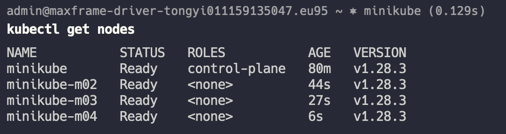

tags:: [[Kubernetes]], [[读书笔记]]

- 第二章 容器基础
	- “Docker镜像格式”和“容器镜像”这两个短语可能有点令人困惑。镜像不是单个文件，而是指向其他文件的清单文件的规范。用户通常将清单和相关文件视为一个单元。
		- Docker 在此基础上提供了构建、上传和下载的 API
- 第三章 部署 Kubernetes
	- `minikube start --nodes 4`，启动之前保证 docker 不在 root 权限下运行，且已经安装 kubectl
	- `kubectl get componentstatuses` 启动之后可以得到如下组件
		- ``` 
		  kubectl get componentstatuses
		  Warning: v1 ComponentStatus is deprecated in v1.19+
		  NAME                 STATUS    MESSAGE   ERROR
		  scheduler            Healthy   ok
		  controller-manager   Healthy   ok
		  etcd-0               Healthy   ok
		  ```
		- `controller-manager` 负责运行各种控制器，以调节集群中的行为；例如，确保服务的所有副本都可用且健康。
		- `scheduler` 负责将不同的 Pod 放置在集群中的不同节点上。
		- 最后， `etcd` 服务器是集群的存储，存储着所有的 API 对象。
	- `kubectl get nodes`，列出所有的节点
		- 
	- Kubectl describe nodes <node_name> 可以获得节点的基本信息
		- ``` node information
		  $ kubectl describe nodes minikube
		  # 系统运行的版本、参数、标签等
		  Name:               minikube
		  Roles:              control-plane
		  Labels:             beta.kubernetes.io/arch=amd64
		                      beta.kubernetes.io/os=linux
		                      kubernetes.io/arch=amd64
		                      kubernetes.io/hostname=minikube
		                      kubernetes.io/os=linux
		                      minikube.k8s.io/commit=8220a6eb95f0a4d75f7f2d7b14cef975f050512d
		                      minikube.k8s.io/name=minikube
		                      minikube.k8s.io/primary=true
		                      minikube.k8s.io/updated_at=2024_02_25T20_12_46_0700
		                      minikube.k8s.io/version=v1.32.0
		                      node-role.kubernetes.io/control-plane=
		                      node.kubernetes.io/exclude-from-external-load-balancers=                 
		  Annotations:        kubeadm.alpha.kubernetes.io/cri-socket: unix:///var/run/cri-dockerd.sock
		                      node.alpha.kubernetes.io/ttl: 0
		                      volumes.kubernetes.io/controller-managed-attach-detach: true
		  CreationTimestamp:  Sun, 25 Feb 2024 20:12:42 +0800
		  Taints:             <none>
		  Unschedulable:      false
		  Lease:
		    HolderIdentity:  minikube
		    AcquireTime:     <unset>
		    RenewTime:       Sun, 25 Feb 2024 21:33:58 +0800
		  
		  # 状态，有充足的磁盘、内存和 PID
		  Conditions:
		    Type             Status  LastHeartbeatTime                 LastTransitionTime                Reason                       Message
		    ----             ------  -----------------                 ------------------                ------                       -------
		    MemoryPressure   False   Sun, 25 Feb 2024 21:33:35 +0800   Sun, 25 Feb 2024 20:12:40 +0800   KubeletHasSufficientMemory   kubelet has sufficient memory available
		    DiskPressure     False   Sun, 25 Feb 2024 21:33:35 +0800   Sun, 25 Feb 2024 20:12:40 +0800   KubeletHasNoDiskPressure     kubelet has no disk pressure
		    PIDPressure      False   Sun, 25 Feb 2024 21:33:35 +0800   Sun, 25 Feb 2024 20:12:40 +0800   KubeletHasSufficientPID      kubelet has sufficient PID available
		    Ready            True    Sun, 25 Feb 2024 21:33:35 +0800   Sun, 25 Feb 2024 20:12:46 +0800   KubeletReady                 kubelet is posting ready status
		  Addresses:
		    InternalIP:  192.168.49.2
		    Hostname:    minikube
		    
		  # 容量
		  Capacity:
		    cpu:                4
		    ephemeral-storage:  205373416Ki
		    hugepages-1Gi:      0
		    hugepages-2Mi:      0
		    memory:             3800Mi
		    pods:               110
		  Allocatable:
		    cpu:                4
		    ephemeral-storage:  205373416Ki
		    hugepages-1Gi:      0
		    hugepages-2Mi:      0
		    memory:             3800Mi
		    pods:               110
		  
		  # 节点上的软件版本，Docker 版本，Kubernetes 版本，Linux 内核版本等等
		  System Info:
		    Machine ID:                 d40ba049f9a24524a0ef68d7171485f1
		    System UUID:                b888935b-aac7-4bc2-9797-f53ed5178d37
		    Boot ID:                    7226b524-ae8b-482f-b23e-f53bcaff12c8
		    Kernel Version:             5.10.112-005.ali5000.alios7.x86_64
		    OS Image:                   Ubuntu 22.04.3 LTS
		    Operating System:           linux
		    Architecture:               amd64
		    Container Runtime Version:  docker://24.0.7
		    Kubelet Version:            v1.28.3
		    Kube-Proxy Version:         v1.28.3
		  PodCIDR:                      10.244.0.0/24
		  PodCIDRs:                     10.244.0.0/24
		  
		  # 节点上的 pods 信息
		  Non-terminated Pods:          (8 in total)
		    Namespace                   Name                                CPU Requests  CPU Limits  Memory Requests  Memory Limits  Age
		    ---------                   ----                                ------------  ----------  ---------------  -------------  ---
		    kube-system                 coredns-5dd5756b68-4kcln            100m (2%)     0 (0%)      70Mi (1%)        170Mi (4%)     81m
		    kube-system                 etcd-minikube                       100m (2%)     0 (0%)      100Mi (2%)       0 (0%)         81m
		    kube-system                 kindnet-wlqhl                       100m (2%)     100m (2%)   50Mi (1%)        50Mi (1%)      74s
		    kube-system                 kube-apiserver-minikube             250m (6%)     0 (0%)      0 (0%)           0 (0%)         81m
		    kube-system                 kube-controller-manager-minikube    200m (5%)     0 (0%)      0 (0%)           0 (0%)         81m
		    kube-system                 kube-proxy-gzdsl                    0 (0%)        0 (0%)      0 (0%)           0 (0%)         81m
		    kube-system                 kube-scheduler-minikube             100m (2%)     0 (0%)      0 (0%)           0 (0%)         81m
		    kube-system                 storage-provisioner                 0 (0%)        0 (0%)      0 (0%)           0 (0%)         81m
		  Allocated resources:
		    (Total limits may be over 100 percent, i.e., overcommitted.)
		    Resource           Requests    Limits
		    --------           --------    ------
		    cpu                850m (21%)  100m (2%)
		    memory             220Mi (5%)  220Mi (5%)
		    ephemeral-storage  0 (0%)      0 (0%)
		    hugepages-1Gi      0 (0%)      0 (0%)
		    hugepages-2Mi      0 (0%)      0 (0%)
		  
		  # 事件信息
		  Events:
		    Type    Reason                   Age                    From             Message
		    ----    ------                   ----                   ----             -------
		    Normal  Starting                 81m                    kube-proxy
		    Normal  Starting                 2m32s                  kube-proxy
		    Normal  Starting                 28m                    kube-proxy
		    Normal  NodeAllocatableEnforced  81m                    kubelet          Updated Node Allocatable limit across pods
		    Normal  NodeHasSufficientMemory  81m (x8 over 81m)      kubelet          Node minikube status is now: NodeHasSufficientMemory
		    Normal  NodeHasNoDiskPressure    81m (x8 over 81m)      kubelet          Node minikube status is now: NodeHasNoDiskPressure
		    Normal  NodeHasSufficientPID     81m (x7 over 81m)      kubelet          Node minikube status is now: NodeHasSufficientPID
		    Normal  Starting                 81m                    kubelet          Starting kubelet.
		    Normal  Starting                 81m                    kubelet          Starting kubelet.
		    Normal  NodeHasSufficientMemory  81m                    kubelet          Node minikube status is now: NodeHasSufficientMemory
		    Normal  NodeHasNoDiskPressure    81m                    kubelet          Node minikube status is now: NodeHasNoDiskPressure
		    Normal  NodeHasSufficientPID     81m                    kubelet          Node minikube status is now: NodeHasSufficientPID
		    Normal  NodeNotReady             81m                    kubelet          Node minikube status is now: NodeNotReady
		    Normal  NodeAllocatableEnforced  81m                    kubelet          Updated Node Allocatable limit across pods
		    Normal  NodeReady                81m                    kubelet          Node minikube status is now: NodeReady
		    Normal  RegisteredNode           81m                    node-controller  Node minikube event: Registered Node minikube in Controller
		    Normal  Starting                 28m                    kubelet          Starting kubelet.
		    Normal  NodeHasSufficientMemory  28m (x8 over 28m)      kubelet          Node minikube status is now: NodeHasSufficientMemory
		    Normal  NodeHasNoDiskPressure    28m (x8 over 28m)      kubelet          Node minikube status is now: NodeHasNoDiskPressure
		    Normal  NodeHasSufficientPID     28m (x7 over 28m)      kubelet          Node minikube status is now: NodeHasSufficientPID
		    Normal  NodeAllocatableEnforced  28m                    kubelet          Updated Node Allocatable limit across pods
		    Normal  RegisteredNode           28m                    node-controller  Node minikube event: Registered Node minikube in Controller
		    Normal  Starting                 2m37s                  kubelet          Starting kubelet.
		    Normal  NodeHasSufficientMemory  2m37s (x8 over 2m37s)  kubelet          Node minikube status is now: NodeHasSufficientMemory
		    Normal  NodeHasNoDiskPressure    2m37s (x8 over 2m37s)  kubelet          Node minikube status is now: NodeHasNoDiskPressure
		    Normal  NodeHasSufficientPID     2m37s (x7 over 2m37s)  kubelet          Node minikube status is now: NodeHasSufficientPID
		    Normal  NodeAllocatableEnforced  2m37s                  kubelet          Updated Node Allocatable limit across pods
		    Normal  RegisteredNode           2m21s                  node-controller  Node minikube event: Registered Node minikube in Controller
		  ```
		- 可见 node 跟踪非常多的信息和 pod 的状态，这些资源也将用于 pod 的调度分配
	- kube-system 命名空间的组件
		- Kube-proxy
			- ``` bash
			  $ kubectl get daemonSets --namespace=kube-system kube-proxy
			  NAME         DESIRED   CURRENT   READY   UP-TO-DATE   AVAILABLE   NODE SELECTOR            AGE
			  kube-proxy   4         4         4       4            4           kubernetes.io/os=linux   88m
			  ```
			- 负责将网络流量路由到 Kubernetes 集群中的负载均衡服务
				- 作为 daemonSet 运行，该代理会在所有的节点上都存在
		- Kubernetes DNS
			- 为集群提供服务命名和发现功能，作为一个 deployment 运行
			- ``` bash
			  kubectl get deployments --namespace=kube-system
			  NAME      READY   UP-TO-DATE   AVAILABLE   AGE
			  coredns   1/1     1            1           90m
			  
			  ```
	- Namespace
		- Kubernetes 使用命名空间来组织集群中的对象，将每个命名空间视为保存一组对象的文件夹。
		- 默认情况下 kubectl 与默认命名空间交互，如果要使用不同的命名空间，需要传递 `-n` 参数来指定
	- Context
		- context 用于配置上下文，通常记录在 `~/.kube/config` 下
		- 可以使用如下命令获得所有的配置
			- ```  bash
			  kubectl config get-contexts
			  CURRENT   NAME       CLUSTER    AUTHINFO   NAMESPACE
			  *         minikube   minikube   minikube   default
			  
			  ```
		- 可以如下命令创建一个具有不同默认命名空间的上下文
			- `kubectl config set-context my-context --namespace=mystuff`
		- 然后通过 `kubectl config use-context my-context` 来启用
	- Kubernetes 对象
		- 查看对象
			- kubernetes 包含的所有内容都用 RESTful 资源表示方法，每个对象都存在于唯一的路径上
			- kubectl get <resource-name> <obj-name> 是获取对象信息的基本命令
				- 默认情况下，kubectl 使用人类可读的方式打印
				- 可以使用 -o wide 来输出更多信息
				- 可以使用 -o json  或者 -o yaml 来查看原始 json 或者 yaml
				- 可以使用 `--no-headers` 跳过人类可读表格的顶部
				- 可以使用 `--watch` 来持续观察，如果字段有变化就会更新到客户端
			- 可以使用 JSONPath 来选择返回对象中的字段
				- `kubectl get pods my-pod -o jsonpath --template={.status.podIP}`
					- ``` bash
					  $ kubectl get pods etcd-minikube --namespace=kube-system -o jsonpath --template {.status}
					  {"conditions":[{"lastProbeTime":null,"lastTransitionTime":"2024-02-25T13:31:28Z","status":"True","type":"Initialized"},{"lastProbeTime":null,"lastTransitionTime":"2024-02-25T13:31:42Z","status":"True","type":"Ready"},{"lastProbeTime":null,"lastTransitionTime":"2024-02-25T13:31:42Z","status":"True","type":"ContainersReady"},{"lastProbeTime":null,"lastTransitionTime":"2024-02-25T13:31:28Z","status":"True","type":"PodScheduled"}],"containerStatuses":[{"containerID":"docker://32cb666eb3eade7bedcc723193b8a6f43d6b6cea49c1025e7047b401a747f5c9","image":"registry.k8s.io/etcd:3.5.9-0","imageID":"docker-pullable://registry.k8s.io/etcd@sha256:e013d0d5e4e25d00c61a7ff839927a1f36479678f11e49502b53a5e0b14f10c3","lastState":{"terminated":{"containerID":"docker://080aed74f6e5e329ec4dfe0bcf6be3396cfe38015f4efed6e39a77a367bae2e1","exitCode":0,"finishedAt":"2024-02-25T13:28:28Z","reason":"Completed","startedAt":"2024-02-25T13:05:19Z"}},"name":"etcd","ready":true,"restartCount":2,"started":true,"state":{"running":{"startedAt":"2024-02-25T13:31:29Z"}}}],"hostIP":"192.168.49.2","phase":"Running","podIP":"192.168.49.2","podIPs":[{"ip":"192.168.49.2"}],"qosClass":"Burstable","startTime":"2024-02-25T13:31:28Z"}
					  ```
			- 可以使用 `kubectl get pods,services` 返回多个类型的对象
			- 如果想要看某种对象支持的所有字段列表，可以使用如下命令
				- `kubectl explain pods`
		- 创建、更新和销毁 kubernetes 对象
			- Kubernetes 使用 yaml 或者 json 文件在服务器上创建、更新或删除对象
				- ```
				  kubectl apply -f obj.yaml
				  ```
			- apply 只会修改与当前对象不同的对象
			- 可以使用 --dry-run 来查看可能会发生的事情，但实际不会发送到服务器上
			- 可以使用 edit 来替换 apply 进入一个编辑器来交互式的编辑
			- apply 命令会记录配置的历史
				- 可以使用 `edit-last-applied`, `set-last-applied` 和 `view-last-applied` 来操作记录
				- #疑问 从文档中没有看的很明白 myobj.yaml 中应该包含什么内容
				- ``` bash
				  kubectl apply -f myobj.yaml view-last-applied
				  ```
			- 删除
				- `kubectl delete -f obj.yaml`
					- 删除不会有确认，一旦发出命令，对象就会被删除
				- `kubectl delete <resource-name> <obj-name>`
		- labeling 或 annotating 对象
			- 向名为 bar 的 pod 标记 color=red，可以使用 `kubectl label pods bar color=red`
			-
