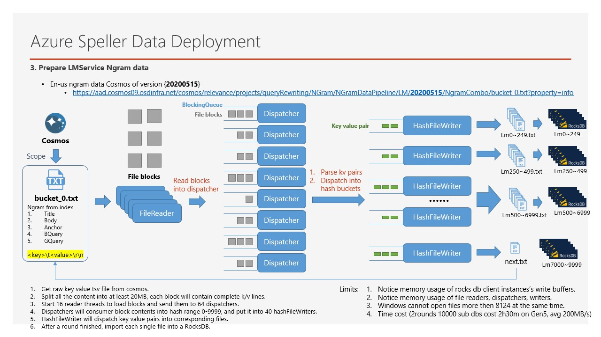

tags:: Spark, Sharing

- TOC {{renderer :tocgen, [[]], 2, h}}
- [[Spark]] is a big data framework, a multi-language engine for executing data engineering, data science, and machine learning on single-node machines or clusters. In this page,  I want to introduce some **basic concepts of Spark**, some key architectures and how to run on MT to help you better understand and get started with Spark.
- # Quick Introduction about Why Spark
	- ## Start from MapReduce
	  collapsed:: true
		- **MapReduce** is a programming model and software framework first introduced by **Google** in 2004 to address the challenges of processing large data sets. The main idea behind MapReduce is to **divide a large task into smaller subtasks that can be processed in parallel across multiple computing nodes.**
		- Why was it introduced?
			- To address the challenges of processing large data sets efficiently.
		- How does it work?
			- Here is a [simple brief of MapReduce](https://hci.stanford.edu/courses/cs448g/a2/files/map_reduce_tutorial.pdf)
			- Use a unified abstraction, there are two phases: map and reduce.
				- The map function processes input data and generates intermediate key-value pairs.
				- The reduce function aggregates the intermediate results to produce the final output.
			- Example: **[Word Counting]([[An Example of word count on MapReduce]])**
				- {{embed ((6425a352-7bfd-4b83-bc9c-a65c6b0f2856))}}
		- Benefits of using MapReduce
			- **Simplification of programming model**
			- **Scalability**
			- **Independence of tasks**
		- Beside the framework, MapReduce is simple to simulate in python or other languages, why we still need the framework, then why Spark?
	- ## Example on such job without big data framework
	  collapsed:: true
		- A Data Generate Job in Azure Speller
			- Convert a few big language model data into [[RocksDB]] directories
				- Each line is a Key Value pair
				- Max file is about 600-800GB
				- Use hash to split into 1000-10000 parts
				- Download from cosmos, and upload to cosmos
			- Challenges #.ol
			  id:: 6425b521-2d4b-4ad3-8acb-57489ff1f572 #.ol
				- How to read/write faster?
				- How to utilize resources as much as possible?
				- How to avoid exceeding the memory limit?
				- How to balance read and write speeds? RocksDB need compact.
				- How to avoid thread competition and safety issues?
				- How to debug?
				- How to support partitioning methods other than Hash, such as Range?
				- How to download and upload quickly?
				- How to avoid failure because WIndows can only open 8000 files?
				- How to recover from a failure?
				- How to run on multiple machines?
			- 
	- ## Why need big data framework like MapReduce?
		- Just write how to deal with action like local simple functions, no worry about these ((6425b521-2d4b-4ad3-8acb-57489ff1f572))
			- Write Map function
			- Write Reduce function
		- Common features of big data frameworks #.ol
			- **Distributed computing**: Big data frameworks enable parallel processing of data across multiple nodes in a cluster.
			- **Fault tolerance**: Big data frameworks can handle node failures in a cluster and automatically reassign work to other nodes.
			- **Data storage and management**: Big data frameworks provide tools for storing and managing large amounts of data across distributed systems.
			- **Data processing and analysis**: Big data frameworks offer a wide range of tools for processing and analyzing data at scale.
	- ## Why use Spark instead of MapReduce?
		- MapReduce has some drawbacks in its implementation
			- Map Reduce has limited expressive power, while many data processing requires higher-level expressions, such as `Join`, `Zip`, `FlatMap`, `Sum`, `Max`, etc.
			  background-color:: red
				- Scope and Spark allowed users to write code like SQL, and high level operations.
				  background-color:: green
			- Map Reduce can only express one operation per task, and often data processing may contain multiple operations. While Map Reduce itself cannot concatenate and organize.
			  background-color:: red
				- Scope and Spark will convert the job to DAG.
				  background-color:: green
			- Map Reduce is not faster enough compare to Spark.
			  background-color:: red
				- Spark will use memory as much as possible, also support pipeline execution.
				  background-color:: green
	- ## Write Word
	- ## How big data framework like Spark works?
		- Big data application 3 elements:
			- **Input Data**: Stored in DFS, like HDFS, cosmos
			- **User Source Code**
			- **Configuration**
		- Big data framework has four layers:
			- User Layer
			  Distributed Data Parallel Processing Layer
			  Resource management and task scheduling layer
			  Physical execution layer
	-
- # Spark Internal
	- [[What's RDD]]
	- [[]]
- # Practice
	- [[Write a Spark job on MT in 5 minutes]]
	- [[What happened in Spark - SparkUI]]
	-