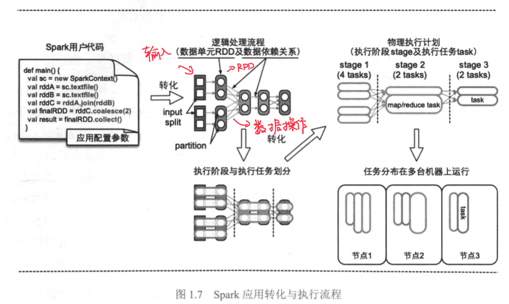
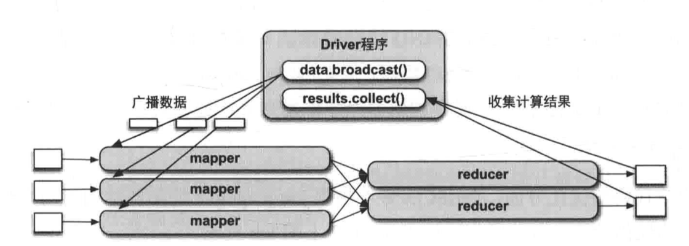
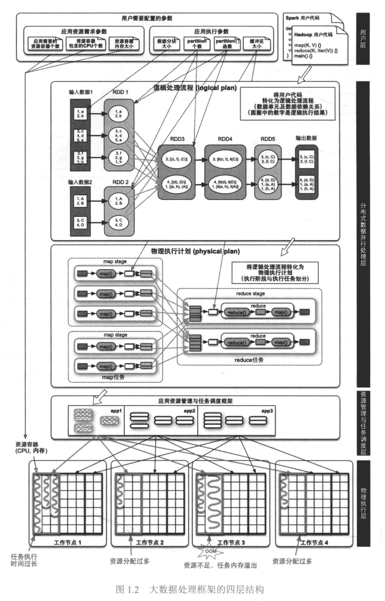
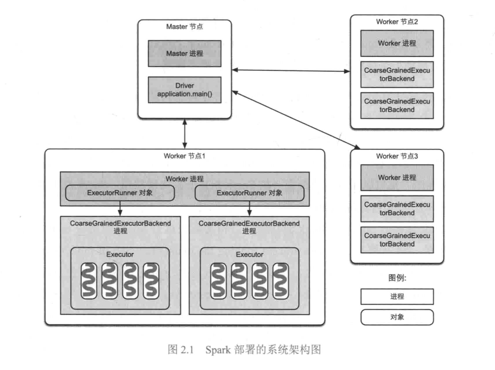
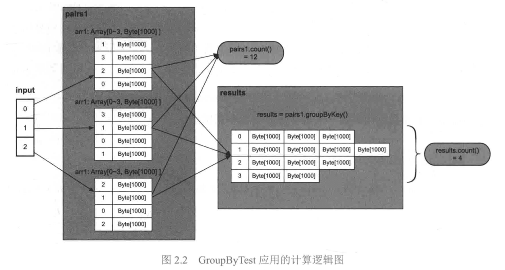
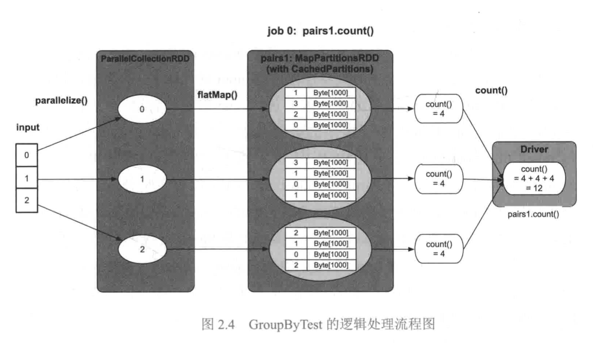
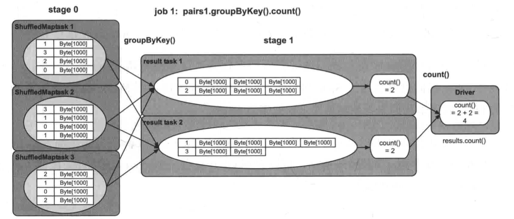

tags:: Spark, Sharing

- TOC {{renderer :tocgen, [[]], 2, h}}
- [[Spark]] is a big data framework, a multi-language engine for executing data engineering, data science, and machine learning on single-node machines or clusters. In this page,  I want to introduce some **basic concepts of Spark**, some key architectures and how to run on MT to help you better understand and get started with Spark.
- # Quick Introduction about Why Spark
	- ## Start from MapReduce
	  collapsed:: true
		- **MapReduce** is a programming model and software framework first introduced by **Google** in 2004 to address the challenges of processing large data sets. The main idea behind MapReduce is to **divide a large task into smaller subtasks that can be processed in parallel across multiple computing nodes.**
		- Why was it introduced?
			- To address the challenges of processing large data sets efficiently.
		- How does it work?
			- Here is a [simple brief of MapReduce](https://hci.stanford.edu/courses/cs448g/a2/files/map_reduce_tutorial.pdf)
			- Use a unified abstraction, there are two phases: map and reduce.
				- The map function processes input data and generates intermediate key-value pairs.
				- The reduce function aggregates the intermediate results to produce the final output.
			- Example: **[Word Counting]([[An Example of word count on MapReduce]])**
				- {{embed ((6425a352-7bfd-4b83-bc9c-a65c6b0f2856))}}
		- Benefits of using MapReduce
			- **Simplification of programming model**
			- **Scalability**
			- **Independence of tasks**
		- Beside the framework, MapReduce is simple to simulate in python or other languages, why we still need the framework, then why Spark?
	- ## Example on such job without big data framework
	  collapsed:: true
		- A Data Generate Job in Azure Speller
			- Convert a few big language model data into [[RocksDB]] directories
				- Each line is a Key Value pair
				- Max file is about 600-800GB
				- Use hash to split into 1000-10000 parts
				- Download from cosmos, and upload to cosmos
			- Challenges #.ol
			  id:: 6425b521-2d4b-4ad3-8acb-57489ff1f572 #.ol
				- How to read/write faster?
				- How to utilize resources as much as possible?
				- How to avoid exceeding the memory limit?
				- How to balance read and write speeds? RocksDB need compact.
				- How to avoid thread competition and safety issues?
				- How to debug?
				- How to support partitioning methods other than Hash, such as Range?
				- How to download and upload quickly?
				- How to avoid failure because WIndows can only open 8000 files?
				- How to recover from a failure?
				- How to run on multiple machines?
			- 
	- ## Why need big data framework like MapReduce?
	  collapsed:: true
		- Just write how to deal with action like local simple functions, no worry about these ((6425b521-2d4b-4ad3-8acb-57489ff1f572))
			- Write Map function
			- Write Reduce function
		- Common features of big data frameworks #.ol
			- **Distributed computing**: Big data frameworks enable parallel processing of data across multiple nodes in a cluster.
			- **Fault tolerance**: Big data frameworks can handle node failures in a cluster and automatically reassign work to other nodes.
			- **Data storage and management**: Big data frameworks provide tools for storing and managing large amounts of data across distributed systems.
			- **Data processing and analysis**: Big data frameworks offer a wide range of tools for processing and analyzing data at scale.
	- ## Why use Spark instead of MapReduce?
		- MapReduce has some drawbacks in its implementation
			- Map Reduce has limited expressive power, while many data processing requires higher-level expressions, such as `Join`, `Zip`, `FlatMap`, `Sum`, `Max`, etc.
			  background-color:: red
				- Scope and Spark allowed users to write code like SQL, and high level operations.
				  background-color:: green
			- Map Reduce can only express one operation per task, and often data processing may contain multiple operations. While Map Reduce itself cannot concatenate and organize.
			  background-color:: red
				- Scope and Spark will convert the job to DAG.
				  background-color:: green
			- Map Reduce is not faster enough compare to Spark.
			  background-color:: red
				- Spark will use memory as much as possible, also support pipeline execution.
				  background-color:: green
	- ## Write WordCount in Map Reduce and Spark #codesnipaste
		- ### Map Reduce Version
			- #### Java
				- ``` java
				  public static class WordCountMapper extends Mapper<LongWritable, Text, Text, IntWritable> {
				      private final static IntWritable one = new IntWritable(1);
				      private Text word = new Text();
				  
				      public void map(LongWritable key, Text value, Context context) throws IOException, InterruptedException {
				          String line = value.toString();
				          StringTokenizer tokenizer = new StringTokenizer(line);
				          while (tokenizer.hasMoreTokens()) {
				              word.set(tokenizer.nextToken());
				              context.write(word, one);
				          }
				      }
				  }
				  
				  public static class WordCountReducer extends Reducer<Text, IntWritable, Text, IntWritable> {
				      private IntWritable result = new IntWritable();
				  
				      public void reduce(Text key, Iterable<IntWritable> values, Context context) throws IOException, InterruptedException {
				          int sum = 0;
				          for (IntWritable val : values) {
				              sum += val.get();
				          }
				          result.set(sum);
				          context.write(key, result);
				      }
				  }
				  ```
		- ### Spark Version
			- #### Java
				- ``` java
				  import org.apache.spark.SparkConf;
				  import org.apache.spark.api.java.JavaRDD;
				  import org.apache.spark.api.java.JavaSparkContext;
				  
				  public class WordCount {
				      public static void main(String[] args) {
				          // Create a SparkConf object and set the app name
				          SparkConf conf = new SparkConf().setAppName("WordCount");
				  
				          // Create a JavaSparkContext object
				          JavaSparkContext sc = new JavaSparkContext(conf);
				  
				          // Load the input text file into an RDD
				          JavaRDD<String> input = sc.textFile(args[0]);
				  
				          // Split each line into words
				          JavaRDD<String> words = input.flatMap(line -> Arrays.asList(line.split(" ")).iterator());
				  
				          // Map each word to a tuple of (word, 1)
				          JavaPairRDD<String, Integer> pairs = words.mapToPair(word -> new Tuple2<>(word, 1));
				  
				          // Reduce by key to get the count of each word
				          JavaPairRDD<String, Integer> counts = pairs.reduceByKey((a, b) -> a + b);
				  
				          // Save the output to a text file
				          counts.saveAsTextFile(args[1]);
				  
				          // Stop the SparkContext
				          sc.stop();
				      }
				  }
				  ```
			- #### Python
				- ``` python
				  from pyspark import SparkConf, SparkContext
				  
				  # Create a SparkConf object and set the app name
				  conf = SparkConf().setAppName("WordCount")
				  
				  # Create a SparkContext object
				  sc = SparkContext(conf=conf)
				  
				  # Load the input text file into an RDD
				  input = sc.textFile("input.txt")
				  
				  # Split each line into words
				  words = input.flatMap(lambda line: line.split(" "))
				  
				  # Map each word to a tuple of (word, 1)
				  pairs = words.map(lambda word: (word, 1))
				  
				  # Reduce by key to get the count of each word
				  counts = pairs.reduceByKey(lambda a, b: a + b)
				  
				  # Save the output to a text file
				  counts.saveAsTextFile("output")
				  
				  # Stop the SparkContext
				  sc.stop()
				  ```
			- ### Scala
			  collapsed:: true
				- ``` scala
				  import org.apache.spark.{SparkConf, SparkContext}
				  
				  object WordCount {
				    def main(args: Array[String]) {
				      // Create a SparkConf object and set the app name
				      val conf = new SparkConf().setAppName("WordCount")
				  
				      // Create a SparkContext object
				      val sc = new SparkContext(conf)
				  
				      // Load the input text file into an RDD
				      val input = sc.textFile(args(0))
				  
				      // Split each line into words
				      val words = input.flatMap(line => line.split(" "))
				  
				      // Map each word to a tuple of (word, 1)
				      val pairs = words.map(word => (word, 1))
				  
				      // Reduce by key to get the count of each word
				      val counts = pairs.reduceByKey(_ + _)
				  
				      // Save the output to a text file
				      counts.saveAsTextFile(args(1))
				  
				      // Stop the SparkContext
				      sc.stop()
				    }
				  }
				  ```
	- ## We got the code, how to run it?
		- Create a project, and paste the code in
		- Local
			- Run directly in IDE
		- Remote
			- Submit to spark endpoint
- # Spark Internal Basic
	- All this content comes from a great book [大数据处理框架Apache Spark设计与实现（全彩） (豆瓣) (douban.com)](https://book.douban.com/subject/35140409/)
	- ## How a Spark application run?
	  collapsed:: true
		- Here are the steps:
			- An big data application can be describe as <`Input Data`, `User Source Code`, `Configuration`>
				- Input data are hosted in HDFS or generated in the code
				- Configurations are resource related, like buffer size, memory limit, CPU, instance number, dependency files
			- Once submit to Spark, it will create a [Driver]([[Spark Driver]]) to deal follow actions: #.ol
				- Analyze and **convert** them into spark **logic plan**, which means the **Actions** and **Orders**.
				- Based on logic plan, spark will **convert** the logic plan **to physical plan**, which means how to execute the job
				- Request for **resources**, **schedule** executors and **run** it
				- Collect result.
		- Fig about the progress
			- {:height 384, :width 699}
			  id:: 6425d71c-9fe1-43f5-b43e-dbffd4e28a56
		- Fig about the execute mode
		  collapsed:: true
			- {:height 278, :width 599}
		- Fig about the system layer
		  collapsed:: true
			- 
	- ## What's RDD
	  collapsed:: true
		- [[RDD]], full name is [[Resilient Distributed Dataset]], is a fundamental abstract data structure in Spark.
		- Putting aside those concepts in the official introduction, the RDD is a object with partition information, with such features:
			- Stands for a collection, different type RDD implements express different collections
			- **Immutable**, for parallel computation
			- Contains **partition information**, like partition list, partitioner
			- Contains dependency **relationships with parent RDDs**
			- Contains **some partition data**
			- **Operations** are defined on the RDD, like `rdd.Count()`, `rdd.Filter()`, `rdd.GroupByKey()`
		- Because RDDs contain this information, they can adequately represent the dataset in a distributed computation and thus be the data abstraction for all intermediate results.
			- {{embed ((6425d71c-9fe1-43f5-b43e-dbffd4e28a56))}}
				- The squares represent java objects
				- **The circles are RDDs**
		- RDDs are created by an API provided by Spark, and can be constructed from ordinary in-memory object data, or from files, streams.
			- Create from HDFS file
				- ``` java
				  // Load data from an HDFS file into an RDD
				  JavaRDD<String> lines = sc.textFile("hdfs://path/to/input/file.txt");
				  ```
			- Create from a array
				- ``` java
				  // Load data from a Java memory array into an RDD
				  Integer[] data = new Integer[]{1, 2, 3, 4, 5};
				  JavaRDD<Integer> rdd = sc.parallelize(Arrays.asList(data));
				  ```
	- ## What's the deployment mode of Spark
	  collapsed:: true
		- Big data frameworks are almost always deployed in master-slave mode, and when Spark is deployed in a cluster, it looks like the following diagram
			- {:height 598, :width 752}
		- ### Master node and Worker node
		  collapsed:: true
			- **Master node** is responsible for managing applications and tasks
				- The Master node has a resident **Master process** on it
				- Responsible for managing all Worker nodes
				- Assigning Spark tasks to Worker nodes
				- Collecting information about the operation of tasks on Worker nodes
				- Monitor the survival status of Worker nodes, etc.
			- **Worker nodes** are responsible for executing tasks
				- Resident worker processes on worker nodes
				- Communicate with the Master node
				- Responsible for managing the execution of Spark tasks
					- e.g. start Executor to execute specific Spark tasks
					- Monitoring the status of tasks, etc.
		- ### When Spark cluster starts
		  collapsed:: true
			- The Master process is started on the Master node
			- The Worker process is started on each Worker node
		- ### When submit applications
		  collapsed:: true
			- Create a **driver** process (which run the `main()` of application)
			- Driver on **master node** notify **worker node** to start **executors**, **executors will take up declared resources**
			- Executors run tasks as threads, 1 CPU per task. All the tasks belong to the same job.
		- TODO OnYarn
		- ### Summary
			- 一个农场主(`Master`)有多片草场(`Worker`),农主要把草场租给 3 个牧民来放马、牛、羊。假设现在有3个项目(`Application`)需要农主来运作:第1个牧民需要一片牧场来放 100 匹马,第2个牧民需要一片牧场来放 50 牛,第 3 个牧民需要一片牧场来放80只羊
				- 每个牧民可以看作是一个`Driver`,而马、牛、可以看作是task。为了保持资源合理利用、避免冲突,在放牧前,农场主需要根据项目求为每个牧民划定可利用的草场范围,而且尽量让每个牧民在每个草场都有一小片可放的区域(`Executor`)
				- 在放牧时,每个牧民(`Driver`)只负责管理自己的动物(`Task`)
				- 农场主(`Master`)负责监控草场(`Worker`)、牧民(`Driver`)等状况
	- ## A new example with more actions for analysis
		- Let's give an example for further analysis. It's a dummy code, without any meanings, just generate a RDD with randomly int, then run `RDD.count` and `RDD.groupByKey`.
			- ``` scala
			  def main(args: Array[String]): Unit = {
			      // setup spark context
			      val spark = SparkSession
			          .builder
			          .appName("Spark basic example")
			          .getOrCreate()
			  
			      val numMappers = 3
			      val numKVPairs = 4
			      val valSize = 1000
			      val numReducers = 2
			      val input = 0 until numMappers // input is [0, 1, 2]
			  
			      // generate a rdd
			      val pairs = spark.sparkContext.parallelize(input, numMappers).flatMap { p =>
			          val ranGen = new Random
			          val arr1 = new Array[(Int, Array[Byte])](numKVPairs)
			          for (i <- 0 until numKVPairs) {
			              val value = new Array[Byte](valSize)
			              ranGen.nextBytes(value)
			              arr1(i) = (ranGen.nextInt(numKVPairs), value)
			          }
			          arr1
			      }.cache()
			  
			      // pairs is an rdd with numMappers * numKVPairs elements
			      // each element is a tuple of (Int, Arrat[Byte]), as well as a key-value pair
			      // key is between 0 and numKVPairs - 1
			      // value is an array of bytes of length valSize
			  
			      println(pairs1.count())
			      println(paris1.toDebugString)
			      val results = paris1.groupByKey(numReducers)
			      println(results.count())
			      println(results.toDebugString)
			      spark.stop()
			  }
			  ```
		- ### What's the logic plan and physical plan will be?
			- Ideally the **steps** will be like:
				- {:height 519, :width 854}
			- Little more dtails
				- Before `paris1.count()`, the calculation has not started. That's [functional programming](https://www.databricks.com/session/spark-as-the-gateway-drug-to-typed-functional-programming).
				- Here is a `cache()` a important ability of Spark
			- #### Let's run it, then we can go to Spark UI and see what's happening
				- TODO graph of jobs
					- Here are two jobs, `pairs1.count()` and `results.count()`
					- The two jobs has different number of stages
				- TODO debug string
					- Different types of RDD
			- **Logic Plan** Summary
				- Focus on **Data Source**, **Data Model**, **Data Action**, **Result**
				- Job0: input -> [[ParallelCollectionRDD]] -> [[MapParitionsRDD]]
					- {:height 409, :width 688}
				- Job1: input -> [[ParallelCollectionRDD]] -> [[MapParitionsRDD]] -> [[ShuffledRDD]]
					- TODO 2.4
					- {:height 332, :width 809}
			- Physical Plan Summary
				- Focus on stages and task level
				- For Job 0
					- has 2 RDDs, merged in 1 stage
					- has 3 tasks
					- Driver collects all results together and final result
				- For Job 1
					- Has 2 stages
						- Stage0 contains 3 tasks, 1 RDD
						- Stage 1 contains 2 tasks, 1 RDD
				- Shuffle happened here for Job1-Stage1 to find data from Job1-Stage0
					- First RDD each partition in stage1 get **parts of data** from all stage 0 final RDD partitions
					  id:: 642b070f-4959-4b7d-97e0-2729fcfc1d7b
					- TODO add graph
				- Task in the same stage can run in parallel
			- Questions
				- How the job, stage, task decided?
				- How shuffle implements?
	- ## How Spark generate logic plan
		- Three main questions:
			- ((642b08b1-2a52-46c9-99ac-8761c0226e48))
			- ((642b08d0-4f08-42de-b18a-6673f7cf17c6))
			- ((642b0905-d68b-416a-9c13-a0059627f221))
		- ### How to generate RDD, which kind RDD should be selected?
		  id:: 642b08b1-2a52-46c9-99ac-8761c0226e48
		- ### How to build RDD relationships
		  id:: 642b08d0-4f08-42de-b18a-6673f7cf17c6
		- ### How to calculate RDD data?
		  id:: 642b0905-d68b-416a-9c13-a0059627f221
	- ## How spark convert logic plan to physical plan
	- ## How spark do shuffle
	- ## How Spark do caching
	- ## How Spark do fault tolerance
	- ## How Spark manage memory
	- Big data application 3 elements:
		- **Input Data**: Stored in DFS, like HDFS, cosmos
		- **User Source Code**
		- **Configuration**
	- Big data framework has four layers:
		- User Layer
		  Distributed Data Parallel Processing Layer
		  Resource management and task scheduling layer
		  Physical execution layer
	-
- # Spark Internal
	- [[What's RDD]]
	- [[]]
- # Practice
	- [[Write a Spark job on MT in 5 minutes]]
	- [[What happened in Spark - SparkUI]]
	-