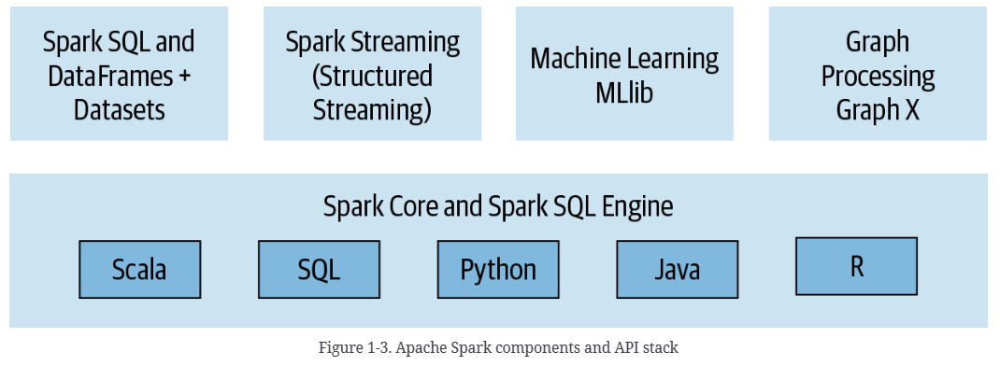

tags:: Spark, Sharing

- TOC {{renderer :tocgen, [[]], 4, h}}
- [[Spark]] is a big data framework, a multi-language engine for executing data engineering, data science, and machine learning on single-node machine or clusters. In this page,  I want to introduce some **basic concepts of Spark**, some key architectures and how to run on MT to help you better understand and get started with Spark.
- # Introduce of Spark
	- ## Overview
	  collapsed:: true
		- > Apache Spark is  a **unified** engine designed for **large-scale** **distributed** data processing .
			- > Spark provides **in-memory storage for intermediate computations**, making it **much faster than Hadoop MapReduce**.
			- > Incorporates libraries with  composable APIs for **machine learning (MLlib)**, **SQL for interactive queries (Spark SQL)**, **stream processing (Structured Streaming)** for interacting with real-time data, and **graph processing (GraphX)**.
		- ### Four characteristics
			- Speed
			  collapsed:: true
				- > Early papers published on Spark demonstrated that it was 10 to 20 times faster than [[Hadoop MapReduce]] for certain jobs. Today, it’s many orders of magnitude faster
					- >First, its internal implementation benefits immensely from the hardware industry‘ s recent huge strides in improving the price and performance of CPUs and memory.
					- >Second, Spark builds its query computations as a directed acyclic graph (DAG). Scheduler and query optimizer construct an efficient computational graph that can usually be decomposed into tasks that are executed in parallel across workers on the cluster
					- > its physical execution engine, Tungsten, uses whole-stage code generation to generate compact code for execution (we will cover SQL optimization and whole-stage code generation.
			- Ease of use
			  collapsed:: true
				- > providing a fundamental abstraction of a simple logical data structure called a [[Resilient Distributed Dataset]] (RDD)
				- > higher-level structured data abstractions, such as [[DataFrame]]s and [[Dataset]]s
				- > transformations and actions as operations, Spark offers a simple programming model that you can use to build big data applications in familiar languages.
			- Modularity
			  collapsed:: true
				- >programming languages: [[Scala]], [[Java]], [[Python]], SQL, and R. Spark offers unified libraries with well-documented APIs that include the following modules as core components: [[Spark SQL]], [[Spark Structured Streaming]], Spark MLlib, and GraphX
					- {:height 359, :width 930}
			- Extensibility
			  collapsed:: true
				- >use Spark to read data stored in myriad sources—Apache Hadoop, Apache Cassandra, Apache HBase, MongoDB, Apache Hive, RDBMSs, and more.
				- >use Spark to read data stored in myriad sources—Apache Hadoop, Apache Cassandra, Apache HBase, MongoDB, Apache Hive, RDBMSs, and more
				- {:height 420, :width 471}
	- ## Quick examples
	  collapsed:: true
		- ### Read from Json by Spark SQL
		  collapsed:: true
			- Spark SQL: You can read data stored in an RDBMS table or from file formats with structured data (CSV, text, JSON, Avro, ORC, Parquet, etc.) and then construct permanent or temporary tables in Spark
			- ``` scala
			  // In Scala
			  // Read data off Amazon S3 bucket into a Spark DataFrame
			  spark.read.json("s3://apache_spark/data/committers.json")
			    .createOrReplaceTempView("committers")
			  // Issue a SQL query and return the result as a Spark DataFrame
			  val results = spark.sql("""SELECT name, org, module, release, num_commits
			      FROM committers WHERE module = 'mllib' AND num_commits > 10
			      ORDER BY num_commits DESC""")
			  ```
		- ### Run LR with Spark ML
		  collapsed:: true
			- **MLlib**: includes other low-level ML primitives, including a generic gradient descent optimization. The following Python code snippet encapsulates the basic operations a data scientist may do when building a model (more extensive examples will be discussed in Chapters 10 and 11):
			- ``` python
			  # In Python
			  from pyspark.ml.classification import LogisticRegression
			  ...
			  training = spark.read.csv("s3://...")
			  test = spark.read.csv("s3://...")
			  
			  # Load training data
			  lr = LogisticRegression(maxIter=10, regParam=0.3, elasticNetParam=0.8)
			  
			  # Fit the model
			  lrModel = lr.fit(training)
			  
			  # Predict
			  lrModel.transform(test)
			  ...
			  ```
		- ### Read from Stream and write to Stream
		  collapsed:: true
			- **Spark Structured Stream** Regards stream as a continually growing table, with new rows of data appended at the end
			- ``` python
			  # In Python
			  # Read a stream from a local host
			  from pyspark.sql.functions import explode, split
			  lines = (spark 
			    .readStream
			    .format("socket")
			    .option("host", "localhost")
			    .option("port", 9999)
			    .load())
			  
			  # Perform transformation
			  # Split the lines into words
			  words = lines.select(explode(split(lines.value, " ")).alias("word"))
			  
			  # Generate running word count
			  word_counts = words.groupBy("word").count()
			  
			  # Write out to the stream to Kafka
			  query = (word_counts
			    .writeStream 
			    .format("kafka") 
			    .option("topic", "output"))
			  ```
		- ### Join two grph by GraphX
		  collapsed:: true
			- **GraphX**: GraphX is a library for manipulating graphs (e.g., social network graphs, routes and connection points, or network topology graphs) and performing graph-parallel computations. The available algorithms include PageRank, Connected Components, and Triangle Counting.
			- ``` scala
			  // In Scala
			  val graph = Graph(vertices, edges)
			  messages = spark.textFile("hdfs://...")
			  val graph2 = graph.joinVertices(messages) {
			    (id, vertex, msg) => ...
			  }
			  ```
	- ## Play with Spark
		- Run with Spark-Shell
			- Install in [Windows](https://www.ics.uci.edu/~shantas/Install_Spark_on_Windows10.pdf)
			- [[Start spark-shell with docker image in 5 mins]]
		- Run with [MT Spark Livy](https://eng.ms/docs/experiences-devices/webxt/search-content-platform/magnetar/bing-magnetar-platform/magnetar-platform-public-wiki/use/mtspark/livy), [MT Job Portal](https://eng.ms/docs/experiences-devices/webxt/search-content-platform/magnetar/bing-magnetar-platform/magnetar-platform-public-wiki/use/mtspark/multitenancysparknetonmt/multitenancysparknetonmt), [MT Jupyter Notebook](https://eng.ms/docs/experiences-devices/webxt/search-content-platform/magnetar/bing-magnetar-platform/magnetar-platform-public-wiki/use/mtspark/jupyter)
			- [[Write a Spark job on MT in 5 mins]]
		- Run with [Azure Synapse Spark](https://learn.microsoft.com/en-us/azure/synapse-analytics/spark/apache-spark-overview)
- # Quick Introduction about Why Spark
	- ## Start from MapReduce
	  collapsed:: true
		- **MapReduce** is a programming paradigm and software framework first introduced by **Google** in 2004 to address the challenges of processing large data sets. The main idea behind MapReduce is to **divide a large task into smaller subtasks that can be processed in parallel across multiple computing nodes.**
		- Why was it introduced?
			- To address the challenges of processing large data sets efficiently.
		- How does it work?
			- Here is a [simple brief of MapReduce](https://hci.stanford.edu/courses/cs448g/a2/files/map_reduce_tutorial.pdf)
			- Use a unified abstraction, there are two phases: **map** and **reduce**.
				- The **map** function **processes input data and generates intermediate key-value pairs.**
				- The **reduce** function **aggregates the intermediate results to produce the final output.**
			- Example: **[Word Counting]([[An Example of word count on MapReduce]])**
				- {{embed ((6425a352-7bfd-4b83-bc9c-a65c6b0f2856))}}
		- Benefits of using MapReduce
			- **Simplification of programming model**
			- **Scalability**
			- **Independence of tasks for better parallelism**
	- ## Example on such job without big data framework
		- **A Data Generate Job in Azure Speller**
		  collapsed:: true
			- Convert a few big language model data into [[RocksDB]] directories
				- Each line is a Key Value pair
				- Max file is about 600-800GB
				- Use hash to split into 1000-10000 parts
				- Download from cosmos, and upload to cosmos
			- Challenges #.ol
			  id:: 642e3f84-9a3c-412b-b02e-791095044578
				- How to read/write faster?
				- How to utilize resources as much as possible?
				- How to avoid exceeding the memory limit?
				- How to balance read and write speeds? RocksDB need compact.
				- How to avoid thread competition and safety issues?
				- How to debug?
				- How to support partitioning methods other than Hash, such as Range?
				- How to download and upload quickly?
				- How to avoid failure because WIndows can only open 8000 files?
				- How to recover from a failure?
				- How to run on multiple machines?
			- 
	- ## Why need big data framework like MapReduce?
		- Just write how to deal with action like local simple functions, no worry about these ((642e3f84-9a3c-412b-b02e-791095044578))
		  collapsed:: true
			- Write Map function
			- Write Reduce function
		- Common features of big data frameworks #.ol
		  collapsed:: true
			- **Distributed computing**: Big data frameworks enable parallel processing of data across multiple nodes in a cluster.
			- **Fault tolerance**: Big data frameworks can handle node failures in a cluster and automatically reassign work to other nodes.
			- **Data storage and management**: Big data frameworks provide tools for storing and managing large amounts of data across distributed systems.
			- **Data processing and analysis**: Big data frameworks offer a wide range of tools for processing and analyzing data at scale.
	- ## Why use Spark instead of MapReduce?
		- MapReduce has some drawbacks in its implementation
			- Map Reduce has limited expressive power, while many data processing requires higher-level expressions, such as `Join`, `Zip`, `FlatMap`, `Sum`, `Max`, etc.
			  background-color:: red
				- Scope and Spark allowed users to write code like SQL, and high level operations.
				  background-color:: green
			- Map Reduce can only express one operation per task, and often data processing may contain multiple operations. While Map Reduce itself cannot concatenate and organize.
			  background-color:: red
				- Scope and Spark will convert the job to DAG.
				  background-color:: green
			- Map Reduce is not faster enough compare to Spark.
			  background-color:: red
				- Spark will use memory as much as possible, also support pipeline execution.
				  background-color:: green
			- Other Spark features like eco-systems
			  background-color:: green
	- ## Write WordCount in Map Reduce and Spark
		- ### Map Reduce Version
			- #### Java
			  collapsed:: true
				- ``` java
				  public static class WordCountMapper extends Mapper<LongWritable, Text, Text, IntWritable> {
				      private final static IntWritable one = new IntWritable(1);
				      private Text word = new Text();
				  
				      public void map(LongWritable key, Text value, Context context) throws IOException, InterruptedException {
				          String line = value.toString();
				          StringTokenizer tokenizer = new StringTokenizer(line);
				          while (tokenizer.hasMoreTokens()) {
				              word.set(tokenizer.nextToken());
				              context.write(word, one);
				          }
				      }
				  }
				  
				  public static class WordCountReducer extends Reducer<Text, IntWritable, Text, IntWritable> {
				      private IntWritable result = new IntWritable();
				  
				      public void reduce(Text key, Iterable<IntWritable> values, Context context) throws IOException, InterruptedException {
				          int sum = 0;
				          for (IntWritable val : values) {
				              sum += val.get();
				          }
				          result.set(sum);
				          context.write(key, result);
				      }
				  }
				  ```
		- ### Spark Version
			- #### Java
			  collapsed:: true
				- ``` java
				  import org.apache.spark.SparkConf;
				  import org.apache.spark.api.java.JavaRDD;
				  import org.apache.spark.api.java.JavaSparkContext;
				  
				  public class WordCount {
				      public static void main(String[] args) {
				          // Create a SparkConf object and set the app name
				          SparkConf conf = new SparkConf().setAppName("WordCount");
				  
				          // Create a JavaSparkContext object
				          JavaSparkContext sc = new JavaSparkContext(conf);
				  
				          // Load the input text file into an RDD
				          JavaRDD<String> input = sc.textFile(args[0]);
				  
				          // Split each line into words
				          JavaRDD<String> words = input.flatMap(line -> Arrays.asList(line.split(" ")).iterator());
				  
				          // Map each word to a tuple of (word, 1)
				          JavaPairRDD<String, Integer> pairs = words.mapToPair(word -> new Tuple2<>(word, 1));
				  
				          // Reduce by key to get the count of each word
				          JavaPairRDD<String, Integer> counts = pairs.reduceByKey((a, b) -> a + b);
				  
				          // Save the output to a text file
				          counts.saveAsTextFile(args[1]);
				  
				          // Stop the SparkContext
				          sc.stop();
				      }
				  }
				  ```
				- Job link: [Bing MagneTar](https://magnetar/job-detail.html?appId=application_1680736712923_0541&subCluster=MTPrime-PROD-CO4-4#tab=stages#jobid=-1#stageid=0#exeid=0#attemptid=0)
			- #### Python
			  collapsed:: true
				- ``` python
				  from pyspark import SparkConf, SparkContext
				  
				  # Create a SparkConf object and set the app name
				  conf = SparkConf().setAppName("WordCount")
				  
				  # Create a SparkContext object
				  sc = SparkContext(conf=conf)
				  
				  # Load the input text file into an RDD
				  input = sc.textFile("input.txt")
				  
				  # Split each line into words
				  words = input.flatMap(lambda line: line.split(" "))
				  
				  # Map each word to a tuple of (word, 1)
				  pairs = words.map(lambda word: (word, 1))
				  
				  # Reduce by key to get the count of each word
				  counts = pairs.reduceByKey(lambda a, b: a + b)
				  
				  # Save the output to a text file
				  counts.saveAsTextFile("output")
				  
				  # Stop the SparkContext
				  sc.stop()
				  ```
			- ### Scala
			  collapsed:: true
				- ``` scala
				  import org.apache.spark.{SparkConf, SparkContext}
				  
				  object WordCount {
				    def main(args: Array[String]) {
				      // Create a SparkConf object and set the app name
				      val conf = new SparkConf().setAppName("WordCount")
				  
				      // Create a SparkContext object
				      val sc = new SparkContext(conf)
				  
				      // Load the input text file into an RDD
				      val input = sc.textFile(args(0))
				  
				      // Split each line into words
				      val words = input.flatMap(line => line.split(" "))
				  
				      // Map each word to a tuple of (word, 1)
				      val pairs = words.map(word => (word, 1))
				  
				      // Reduce by key to get the count of each word
				      val counts = pairs.reduceByKey(_ + _)
				  
				      // Save the output to a text file
				      counts.saveAsTextFile(args(1))
				  
				      // Stop the SparkContext
				      sc.stop()
				    }
				  }
				  ```
	- ## We got the code, how to run it?
		- [[Write a Spark job on MT in 5 mins]]
	- ## How to debug?
		- MT not support, but for local spark, you can use the same version JDK locally, and use JVM remote debug capability to connect to Spark master.
			- Here is an answer [How to debug Spark application on Spark Standalone? - Stack Overflow](https://stackoverflow.com/questions/29090745/how-to-debug-spark-application-on-spark-standalone).
			- IDE like IDEA provides Spark remote debug mode as well.
- # Spark Internal Basic
	- All this content comes from a great book [[大数据处理框架 Apache Spark 设计与实现@Book]]. Contents are based on [[RDD]] API instead of [[DataFrame]] and [[Spark SQL]], because it's more easy to understand and RDD is the fundamental of others.
	- ## How a Spark application run?
		- Here are the steps:
			- An big data application can be describe as <*Input Data*, *User Source Code*, *Configuration*>
				- *Input data* are hosted in file system like HDFS or generated in the code directly
				- *Configurations* are resource related, like buffer size, memory limit, CPU, instance number, dependency files
			- Once submit to Spark, it will create a [Driver]([[Spark Driver]]) to deal follow actions: #.ol
				- Analyze and **convert** them into spark **logic plan**, which means the **Actions** and **Orders**.
				- Based on logic plan, spark will **convert** the logic plan **to physical plan**, which means how to execute the job
				- Request for **resources**, **schedule** executors and **run** it
		- Fig about the progress
			- {:height 567, :width 989}
			  id:: 6425d71c-9fe1-43f5-b43e-dbffd4e28a56
		- Fig about the execute mode
			- {:height 390, :width 1012}
		- Fig about the system layer
			- 
	- ## What's RDD
		- **RDD**, full name is [[Resilient Distributed Dataset]], is a fundamental abstract data structure in Spark.
		- Putting aside those concepts in the official introduction, the RDD is a object with partition information, with such features:
			- Stands for a collection, different type RDD implements express different collections
			- **Immutable**, for parallel computation
			- Contains **partition information**, like partition list, partitioner
			- Contains dependency **relationships with parent RDDs**
			- Contains **some partition data**
			- **Operations** are defined on the RDD, like `rdd.Count()`, `rdd.Filter()`, `rdd.GroupByKey()`
		- Because RDDs contain this information, they can adequately represent the dataset in a distributed computation and thus be the data abstraction for all intermediate results.
			- {{embed ((6425d71c-9fe1-43f5-b43e-dbffd4e28a56))}}
				- The squares represent java objects
				- **The circles are RDDs**
		- RDDs are created by an API provided by Spark, and can be constructed from ordinary in-memory object data, or from files, streams.
			- Create from file
				- ``` java
				  // Load data from an HDFS file into an RDD
				  JavaRDD<String> lines = sc.textFile("hdfs://path/to/input/file.txt");
				  ```
			- Create from a array
				- ``` java
				  // Load data from a Java memory array into an RDD
				  Integer[] data = new Integer[]{1, 2, 3, 4, 5};
				  JavaRDD<Integer> rdd = sc.parallelize(Arrays.asList(data));
				  ```
			- Create from stream
				- ``` scala
				  val conf = new SparkConf().setAppName("streaming").setMaster("local[*]")
				  val ssc = new StreamingContext(conf, Seconds(1))
				  
				  val stream = ssc.socketTextStream("localhost", 9999)
				  val rdd = stream.flatMap(_.split(" ")).map((_, 1)).reduceByKey(_ + _)
				  ```
			- Create from other RDD [[Spark Transformation]]
	- ## What's support Spark distributed execution
		- At high level in Spark architecture
		  collapsed:: true
			- In **Application** level, here is a `Driver` program responsible for orchestrating parallel operations on Spark Cluster.
			  collapsed:: true
				- **`Driver`** will access distributed components in the cluster - `Executor`s and `ClusterManager` - through a `SparkSession`
					- > Request resources (CPU, memory, etc) from cluster manager for executors (JVMs)
					- > transform all Spark operations into DAG computations
					- Schedules and distributes DAG executions as tasks across the Spark executors
					- Communicate with executors directly once resources are allocated
				- **`SparkSession`** provides a single unified entry point to all of Spark's functionality
				  collapsed:: true
					- ``` scala
					  // In Scala
					  import org.apache.spark.sql.SparkSession
					  
					  // Build SparkSession
					  val spark = SparkSession
					    .builder
					    .appName("LearnSpark")
					    .config("spark.sql.shuffle.partitions", 6)
					    .getOrCreate()
					  ```
					-
				- **`Executor`** runs on each worker node in cluster, communicate with driver and responsible for executing tasks on workers
					- > **In most deployments modes, only a single executor runs per node.**
			- **ClusterManager** is responsible for managing and allocating resources for the cluster of `Node`s on **Cluster** level.
			  collapsed:: true
				- Spark support for cluster managers: Default built-in StandAlone, [[Apache Hadoop YARN]], [[Apache Mesos]], [[Kubernetes]]
				- {:height 657, :width 824}
			- {:height 598, :width 752}
		- ### Master node and Worker node (StandAlone mode)
		  collapsed:: true
			- **Master node** is responsible for managing applications and tasks
				- The Master node has a resident **Master process** on it
				- Responsible for managing all Worker nodes
				- Assigning Spark tasks to Worker nodes
				- Collecting information about the operation of tasks on Worker nodes
				- Monitor the survival status of Worker nodes, etc.
			- **Worker nodes** are responsible for executing tasks
				- Resident worker processes on worker nodes
				- Communicate with the Master node
				- Responsible for managing the execution of Spark tasks
					- e.g. start Executor to execute specific Spark tasks
					- Monitoring the status of tasks, etc.
			- When Spark cluster starts will start master and worker processes
				- The Master process is started on the Master node
				- The Worker process is started on each Worker node
		- ### When submit applications
		  collapsed:: true
			- Create a **driver** process (which run the `main()` of application)
			- Driver on **master node** notify **worker node** to start **executors**, **executors will take up declared resources**
			- Executors run tasks as threads, 1 CPU per task. All the tasks belong to the same job.
		- ### Summary
			- 一个农场主(`Master`)有多片草场(`Worker`),农主要把草场租给 3 个牧民来放马、牛、羊。假设现在有3个项目(`Application`)需要农主来运作:第1个牧民需要一片牧场来放 100 匹马,第2个牧民需要一片牧场来放 50 牛,第 3 个牧民需要一片牧场来放80只羊
				- 每个牧民可以看作是一个`Driver`,而马、牛、可以看作是task。为了保持资源合理利用、避免冲突,在放牧前,农场主需要根据项目求为每个牧民划定可利用的草场范围,而且尽量让每个牧民在每个草场都有一小片可放的区域(`Executor`)
				- 在放牧时,每个牧民(`Driver`)只负责管理自己的动物(`Task`)
				- 农场主(`Master`)负责监控草场(`Worker`)、牧民(`Driver`)等状况
	- ## A new example with more actions for analysis
		- Let's give an example for further analysis. It's a dummy code, without any meanings, just generate a RDD with randomly int, then run `RDD.count` and `RDD.groupByKey`.
			- ``` scala
			  def main(args: Array[String]): Unit = {
			      // setup spark context
			      val spark = SparkSession
			          .builder
			          .appName("Spark basic example")
			          .getOrCreate()
			  
			      val numMappers = 3
			      val numKVPairs = 4
			      val valSize = 1000
			      val numReducers = 2
			      val input = 0 until numMappers // input is [0, 1, 2]
			  
			      // generate a rdd
			      val pairs = spark.sparkContext.parallelize(input, numMappers).flatMap { p =>
			          val ranGen = new Random
			          val arr1 = new Array[(Int, Array[Byte])](numKVPairs)
			          for (i <- 0 until numKVPairs) {
			              val value = new Array[Byte](valSize)
			              ranGen.nextBytes(value)
			              arr1(i) = (ranGen.nextInt(numKVPairs), value)
			          }
			          arr1
			      }.cache()
			  
			      // pairs is an rdd with numMappers * numKVPairs elements
			      // each element is a tuple of (Int, Arrat[Byte]), as well as a key-value pair
			      // key is between 0 and numKVPairs - 1
			      // value is an array of bytes of length valSize
			  
			      println(pairs1.count())
			      println(paris1.toDebugString)
			      val results = paris1.groupByKey(numReducers)
			      println(results.count())
			      println(results.toDebugString)
			      spark.stop()
			  }
			  ```
			- Job Link: [Bing MagneTar](https://magnetar/job-detail.html?appId=application_1680736712923_0799&subCluster=MTPrime-PROD-CO4-4)
		- ### What's the logic plan and physical plan will be?
			- Ideally the **steps** will be like:
				- {:height 581, :width 1046}
			- Little more dtails
				- Before `paris1.count()`, the calculation has not started. That's [functional programming](https://www.databricks.com/session/spark-as-the-gateway-drug-to-typed-functional-programming).
				- Here is a `cache()` a important ability of Spark
			- #### Let's run it, then we can go to Spark UI and see what's happening
				- graph of jobs
				  collapsed:: true
					- 
					- Here are two jobs, `pairs1.count()` and `results.count()`
					- The two jobs has different number of stages
				- debug string
				  collapsed:: true
					- Different types of RDD
					- ``` text
					  12
					  (3) MapPartitionsRDD[1] at flatMapToPair at Main.java:28 [Memory Deserialized 1x Replicated]
					   |       CachedPartitions: 3; MemorySize: 12.4 KiB; ExternalBlockStoreSize: 0.0 B; DiskSize: 0.0 B
					   |  ParallelCollectionRDD[0] at parallelize at Main.java:27 [Memory Deserialized 1x Replicated]
					  4
					  (2) MapPartitionsRDD[3] at groupByKey at Main.java:47 []
					   |  ShuffledRDD[2] at groupByKey at Main.java:47 []
					   +-(3) MapPartitionsRDD[1] at flatMapToPair at Main.java:28 []
					      |      CachedPartitions: 3; MemorySize: 12.4 KiB; ExternalBlockStoreSize: 0.0 B; DiskSize: 0.0 B
					      |  ParallelCollectionRDD[0] at parallelize at Main.java:27 []
					  ```
			- #### Logic Plan Summary
				- Focus on **Data Source**, **Data Model**, **Data Action**, **Result**
					- **Data Source**: Generated inputs
					- **Data Model**: RDDs
					- **Data Action**: [Transform]([[Spark Transformation]]) like `flatMap`, [Action]([[Spark Action]]) like `count`
					- **Result**: Final result
				- Job0: input -> [[ParallelCollectionRDD]] -> [[MapPartitionsRDD]]
					- {:height 409, :width 688}
				- Job1: input -> [[ParallelCollectionRDD]] -> [[MapPartitionsRDD]] -> [[ShuffledRDD]]
					- {:height 378, :width 880}
			- #### Physical Plan Summary
				- Focus on stages and task level
				- For Job 0
					- has 2 RDDs, merged in 1 stage
					- has 3 tasks
						- {:height 226, :width 954}
					- Driver collects all results together and final result
				- For Job 1
					- Has 2 stages
						- Stage 1 contains 3 tasks, 2 RDD
						- Stage 2 contains 2 tasks, 2 RDD
				- Shuffle happened here for Job1-Stage2 to find data from Job1-Stage1
					- First RDD each partition in stage2 get **parts of data** from all stage 1 final RDD partitions
					  id:: 642b070f-4959-4b7d-97e0-2729fcfc1d7b
						- {:height 565, :width 523}
				- Task in the same stage can run in parallel
			- Questions
				- How the job, stage, task decided?
				- How shuffle implements?
	- ## How Spark generate logic plan
		- Three main questions:
			- ((642b08b1-2a52-46c9-99ac-8761c0226e48))
			- ((642b08d0-4f08-42de-b18a-6673f7cf17c6))
			- ((642b0905-d68b-416a-9c13-a0059627f221))
		- ### How to generate RDD, which kind RDD should be generated?
		  id:: 642b08b1-2a52-46c9-99ac-8761c0226e48
			- [[RDD]]s support two types of operations: *[transformations]([[Spark Transformation]])*, which  [[#blue]]==create a new dataset from an existing one== , and *[actions]([[Spark Action]])*, which  [[#blue]]==return a value to the driver program after running a computation on the dataset== .
			- Different transformation will generate different types of RDD
				- [What's tansformation?](((642cd333-da61-467c-8d3a-f18b14c1a8ca)))
				- [Kinds of transformation](((642ce69a-00d6-4762-8ff3-12ff3349c8ea)))
		- ### How to build RDD relationships
		  id:: 642b08d0-4f08-42de-b18a-6673f7cf17c6
			- Questions
				- How to build relationships with RDD?
					- Could be `RDD1=>RD2`, or `(RDD1, RDD2) => RDD3` or even `(RDD1, RDD2, RDD3) => RDD4`, etc
				- How to decide how many partitions should be split in generated RDD?
					- If not specified, the new partitions number be the max partitions number in parent RDDs.
					- For parent RDDs, here are three common types of [partitioning method]([[Spark 如何划分 RDD 分区]])
				- What's the relationships between partitions in child RDD and parent RDDs?
					- Depends on transformation and parent RDDs' partition number
		- ### How to calculate RDD data?
		  id:: 642b0905-d68b-416a-9c13-a0059627f221
			- As long as we can deal RDD partitions number and relationships, spark can apply transformations and actions to each records.
			- logically, the progress just like apply function to local applications in such two ways:
				- ``` scala
				  int[] array = {1,2,3,4,5,6,7,8,9,10};
				  // map(func)
				  for (int i = 0; i < array.length; i++) {
				      newRecord = func(array[i]);
				      output(newRecord)
				  }
				  ```
					- {:height 191, :width 445}
				- ``` scala
				  int[] array = {1,2,3,4,5,6,7,8,9,10};
				  // mapPartitions(func)
				  list[] newRecords = func(array);
				  output(newRecords)
				  ```
					- {:height 164, :width 445}
			- For more details you can go to:
				- [Common use transformations]([[Spark 常见 Transformation]])
				- [Common use actions]([[Spark 常见 Action]])
		- From such transformations and actions, Spark shows a huge expressive improvement over MapReduce.
			- RDD vs <K, V>
			- High level transformation and action vs map() and reduce()
	- ## How spark convert logic plan to physical plan
		- ### How to split job, stage, and task?
			- Sorry but has to start another new code snippet
				- {:height 669, :width 990}
				- code here
					- ``` scala
					  // Define an array of tuples with integer and character values
					  val data1 = Array[(Int, Char)] ((1, 'a'), (2, 'b'), (3, 'c'), (4, 'd'), (5, 'e'), (3, 'f'), (2, 'g'), (1, 'h'))
					  
					  // Parallelize the data and create an RDD with 3 partitions
					  val rdd1 = sc.parallelize(data1, 3)
					  
					  // Partition the RDD using a hash partitioner with 3 partitions
					  val partitionedRDD = rdd1.partitionBy(new HashPartitioner(3))
					  
					  // Define an array of tuples with integer and string values
					  val data2 = Array[(Int, String)] ((1, 'A'), (2, 'B'), (3, 'C'), (4, 'D'))
					  
					  // Parallelize the data and create an RDD with 2 partitions, then map each tuple to a new tuple with the second value repeated
					  val rdd2 = sc.parallelize(data2, 2).map(x => (x._1, x._2 + "" + x._2))
					  
					  // Define an array of tuples with integer and string values
					  val data3 = Array[(Int, String)] ((3, 'X'), (5, 'Y'), (3, 'Z'), (4, 'Y'))
					  
					  // Parallelize the data and create an RDD with 2 partitions
					  val rdd3 = sc.parallelize(data3, 2)
					  
					  // Union the two RDDs together
					  val unionedRDD = rdd2.union(rdd3)
					  
					  // Join the partitioned RDD with the unioned RDD
					  val resultRDD = partitionedRDD.join(unionedRDD)
					  
					  // Print the result RDD
					  resultRDD.foreach(println)
					  ```
					- Job Link: [Bing MagneTar](https://magnetar/job-detail.html?appId=application_1680736712923_0873&subCluster=MTPrime-PROD-CO4-4)
				- This code contains such transactions
				  id:: 642e3f84-6646-4567-a079-91d5970e10bc
					- rdd1: `partitionBy`, `join`
					- rdd2: `map`, `union`, `join`
					- rdd3: `union`, `join`
			- 3 rules to split stages and tasks
				- Each action is a **Job**
				- Scan from back to front
					- when meet [[NarrowDependency]], merge into current **Stage**
						- RDD partition numbers are the same in a stage
					- when meet [[ShuffleDependency]], start a new **Stage**
				- Each partition is a **Task**
			- So in this case, the stages and tasks are like follows
				- {:height 952, :width 945}
				- 
		- ### How to decided the tasks calculation order?
		  collapsed:: true
			- Stages will be scheduled as DAG
			- Tasks will be executed in parallel
		- ### How intermediate data is stored and calculated inside the task?
		  collapsed:: true
			- If each RDD is completely computed and then the value of the next RDD is computed, then once the RDD is very large, it will result in a large memory.
			- So Spark uses a pipelined approach to computing RDDs inside the task
			  background-color:: green
				- Abstract the transformation such pattern, `recordx` are records in first RDD, `f` is the first transformation, `g` is the second transformation.
					- `record1 => f(record1) => record1' => g(record1) => record1''`
					- `record2 => f(record2) => record2' => g(record2) => record2''`
					- `record3 => f(record3) => record3' => g(record3) => record3''`
					- {:height 474, :width 784}
				- From this perspective, an idea is if `f` and `g` for `record1` are no need to care about `record2` and `record3`, then Spark no need to store all `recordX'`, all records can directly run both `f` and `g` separately.
				- Based on the idea, we can conclude from the characteristics of `f` and `g` as follows
					- if `f` and `g` only deal single record, no need to store record2, and record3. Run each records for all functions one by one, and only store final results.
					- if `g` ask for `recordX'`, have to store all `recordX` and recycle them after `g` done. This type of transformations are like [[mapPartitions]] and [[zipPafitions]]
					- if `f` ask for all `recordX`, have to read all records at first and recycle them after `g` done.
					- if `f` and `g` ask for all intermediate records, have to read and store all records at each step, and recycle them after done.
		- ### How to propagate intermediate data between stage?
			- Child RDD have to read data from parent RDD, these kind of information are stored in RDD.
			- Due to RDDs relationship between stages are [[ShuffleDependency]], upstream stage need to do [[Shuffle Write]]
				- Upstream need to  partition the output data for downstream, the partition number should the same with downstream stage partition number.
			- Then downstream stage need to read data from corresponding parent RDD, do [[Shuffle Read]]
				- Each partition need collect all needed data from multi upstream partitions through network
		- ### How to check physical plan?
		  collapsed:: true
			- Use [[Spark UI]]
				- Job information
				- Stage information
				- DAG Visualization
				- RDD in
				- Stage information
				- Task information
		- #+BEGIN_TIP
		  Adjust the order of transformation, may improve the performance.
		  #+END_TIP
		- #+BEGIN_WARNING
		  This only for RDD based operations, for Spark SQL, here are lots of other optimization methods.
		  #+END_WARNING
	- ## How spark do shuffle
		- Spark designed a general [[Shuffle Write]] framework
			- 
			- From high level, here are 3 steps, aggregation (combine) and sort are optional #.ol
				- Use a Map liked collection to aggregate all records from map task (upstream calculation)
				- After aggregation, put the records into a Array liked array, and sort by `partitionId` or `partitionId + Key`
				- Output the records to disk files by `partitionId`
			- ### Shuffle Write without combine and sort
			  collapsed:: true
				- {:height 432, :width 996}
				- Only need to partition data
					- Output each record to partition buffer
					- Once buffer is full, flush to disk
				- Spark use [[BypassMergeSortShuffleWriter]] do finsh this task.
				- Transformations
					- [[groupByKey]]
					- [[partitionBy]]
					- [[sortByKey]]
				- Shortage
				  background-color:: red
					- Need a buffer per partition, also a opened file, so only less than 200 partitions support.
			- ### Shuffle Write without combine but need sort
			  collapsed:: true
				- {:height 468, :width 1031}
				- To sort the records, convert each `<K, V>` to `<(PID, K), V>`, and put into a Array ([[PartitionedPairBuffer]]).
					- Once the buffer is full, sort by `PID + key` and spill to disk.
					- Repeat until all output records are sorted by `PID + Key`, merge sort with disk files with memory ones
					- Write the outputs to disk single file, and keep each partition index.
				- [[PartitionedPairBuffer]] is a Array based on Memory and Disk
				- This shuffle write mode is [[SortShuffleWriter]](`KeyOrdering`=true).
				- Transformations
					- No default, but may implemented by users.
					- If modify the `KeyOrdering` to false, then support `groupByKey(300)`, `partitionBy(300)` and `sortByKey(300)`
				- Pros
				  background-color:: green
					- Use a array to support sort, easy to implements
					- Array size is under control.
					- Can support large partition due to the array support spill to disk.
			- ### Shuffle Write with combine, with or without sort by key
			  collapsed:: true
				- {:height 433, :width 1103}
				- {:height 430, :width 1115}
				- Use a new data structure [[PartitionedAppendOnlyMap]] to do combine.
					- PartitionedAppendOnlyMap is a special map like a `HashMap + Array`, support append records, and a sort after all records appended.
						- The HashMap is array based, when sorting, copy all object references to the front of array
							- {:height 527, :width 876}
						- Then sort by Key or by Key's hash
						- Finally output all records from start to end.
					- When the map is full, will expand once, if not enough as well, will sort and spill all to disk.
						- {:height 1113, :width 1079}
		- Spark designed a general [[Shuffle Read]] framework
		  collapsed:: true
			- 
			- From high level, here are 3 steps, aggregation and sort are optional #.ol
				- Collect data from map tasks
				- Aggregation by key
				- Sort by Key
			- ### Shuffle Read without aggregation and sort
			  collapsed:: true
				- {:height 584, :width 974}
				- Wait all map tasks to finish, and collect records to a buffer
				- Next operation will directly get records from buffer
				- Transformation
					- [[partitionBy]]
				- Pros
					- Simple
				- Cons
					- Not support sort and aggregation
			- ### Shuffle Read without aggregation but sort by key
			  collapsed:: true
				- {:height 522, :width 1069}
				- Not like [[Shuffle Write]], [[Shuffle Read]] may need sort by `key` instead of `partitionId`
				- Records from buffer will be appended into a Array ([[PartitionedPairBuffer]])
					- Due to [[PartitionedPairBuffer]] is also designed for [[Shuffle Write]], the `partitionId` will be kept there
				- Sort and spill all the records to get final result
				- Transformations
					- [[sortByKey]]
					- [[sortBy]]
			- ### Shuffle Read with aggregation, with or without sort by key
			  collapsed:: true
				- {:height 566, :width 1078}
				- {:height 526, :width 1079}
				- Before sort, use a Map to do aggregation and sort
					- The data structure is [[ExternalAppendOnlyMap]], like [[PartitionedAppendOnlyMap]]. [[PartitionedAppendOnlyMap]] is for [[Shuffle Write]], support `partitionId`, while [[ExternalAppendOnlyMap]] not. All implement based on [[AppendOnlyMap]].
		- ### How to detect memory during shuffle?
		  collapsed:: true
			- Aggregation and sort collections are implemented based on [[AppendOnlyMap]]
			- It's hard to detect the actual memory cost of the collection, as the elements in it are reference instead of object, also the collection is updated all the time.
			- Before expends when collection is full, the map will check if the rest space is enough to double, then to decide whether spill to disk or not.
			- To detect the memory usage, [[AppendOnlyMap]] use sampling way to detect
				- Sampling object size in collection as current history size
				- When new record put in or updated, use history increasing volume + current size as new size
			- TODO Go to [[SizeTrackerEstimateSize]] function
	- ## How Spark do caching
	  collapsed:: true
		- ### Why Cache
		  collapsed:: true
			- ``` scala
			  // Define an input RDD with key-value pairs of Int and Char
			  val inputRDD = Array[(Int, Char)] ((1, 'a'), (2, 'b'), (3, 'c'), (4, 'd'), (5, 'e'), (3, 'f'), (2, 'g'), (1, 'h'), (2, 'i'), 3)
			  
			  // Map the input RDD to a new RDD with only the key-value pairs
			  val mappedRDD = inputRDD.map(x => (x._1, x._2))
			  
			  // Cache the mapped RDD in memory for faster access
			  // mappedRDD.cache()
			  
			  // Reduce the mapped RDD by key, concatenating the values with an underscore
			  val reduceRDD = mappedRDD.reduceByKey((x, y) => x + "_" + y, 2)
			  
			  // Print the reduced RDD
			  reducedRDD.foreach(println)
			  
			  // Group the mapped RDD by key, and convert the values to a list
			  val groupedRDD = mappedRDD.groupByKey(3).mapValues(V => V.tolist)
			  
			  // Print the grouped RDD
			  groupedRDD.foreach(println)
			  ```
			- The logic plan will like:
				- {:height 747, :width 1064}
			- Here are two `foreach` jobs.
				- The two jobs shared the same process `inputRDD` => `mappedRDD`
				- However, spark will re-calculate the progress by default.
					- if the process is costly, use cache to skip the second time execution
					- if the process is quite cheap, re-run to avoid memory/disk waste
		- ### When to cache
		  collapsed:: true
			- To cache a RDD, you should call `rdd.cache()` before the action on the RDD.
				- In this case, you should call `mapped.cache` before the first `foreach`, else the cache will not be triggered.
		- ### Where to cache
		  collapsed:: true
			- .cache() is the same with `persist(MEMORY_ONLY)`
				- for MEMORY_ONLY, as long as the memory is not enough to store, will cancel this cache.
			- You can call `persist` with such parameters
				- 
		- ### How to write cache
		  collapsed:: true
			- Write cache order:
				- After each records is calculated, will be write to cache store.
				- {:height 685, :width 831}
			- For memory cache, here will be a memory area managed by [[BlockManager]] on each executor
				- BlockManager will have a memoryStore, which contains a `LinkedHashMap`
					- Key is blockId (`rddId + partitionId`)
					- Value is records of the partition
					- 
				- LinkedHashMap implements LRU algo, that's how memory cache replacement policy.
		- ### How to read cache
		  collapsed:: true
			- `.cache()` will make the RDD, so when read data from child RDD, it will tell where the cached stored, and get from the executor.
				- Mark the cached partitions, memory size, etc.
			- 
				- In this graph, the job2 task5 will read data from worker node 1 remotely, and task3 and task4 will directly read from local memory.
			- The read is record by record.
	- ## How Spark do fault tolerance
	  collapsed:: true
		- Re-run job
		  collapsed:: true
			- Requires **same input**, and the process should be **deterministic** and **idempotent**
		- Where to re-run from?
		  collapsed:: true
			- No Cache and Checkpoint
				- Re-run all jobs
			- Use Cache
				- Cache is perishable and can be lost for various reasons
					- LRU
					- Executor existed
			- Use Checkpoint
				- Persistence to distributed storage such as HDFS
				- The Stage that requires Checkpoint will be re-run to specifically write out the results, so you can add a cache to the first run to avoid repeated runs
				- Checkpoint will chop off the lineage
				- {:height 735, :width 734}
- # Practice
  collapsed:: true
	- [[Write a Spark job on MT in 5 mins]]
	- TODO [[What happened in Spark - SparkUI]]
- # References
	- [Learning Spark, 2nd Edition (oreilly.com)](https://learning.oreilly.com/library/view/learning-spark-2nd/9781492050032/)
	- [[大数据处理框架 Apache Spark 设计与实现@Book]]