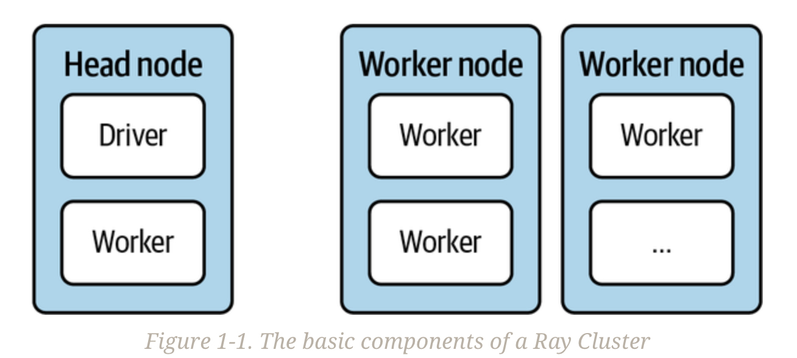
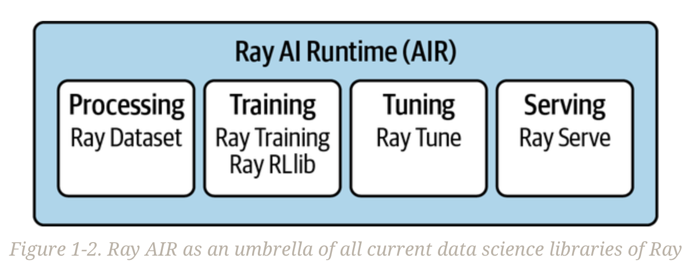

- 我们需要高效的分布式计算的原因之一是，我们以越来越快的速度收集着越来越多种类的数据。
	- 理念是为了让数据科学家能够专注于他们擅长的工作。作为数据科学从业者，您可能希望专注于训练复杂的机器学习模型、运行高效的超参数选择、构建全新的自定义模型或模拟，或者展示您的模型。
	- 将这些工作负载扩展到计算集群可能是不可避免的。为了做到这一点，您选择的分布式系统需要支持所有这些细粒度的“大型计算”任务，可能还需要专门的硬件。理想情况下，它还应该适用于您正在使用的大数据工具链，并且足够快以满足您的延迟要求。
		- 换句话说，分布式计算必须足够强大和灵活，以处理复杂的数据科学工作负载，而 Ray 可以帮助您实现这一点。
	- Python可能是当今最流行的数据科学语言；它肯定是我们日常工作中最有用的语言。
		- 丰富的PyData生态系统是数据科学家工具箱的重要组成部分。你如何确保在扩展工作负载的同时仍然利用你需要的工具？
		- 数据科学的分布式计算工具必须为现有的社区构建。
- 我们喜欢 Ray 的原因是它符合所有这些要求。它是为 Python 数据科学社区打造的灵活分布式计算框架。
	- Ray易于上手，保持简单事物的简单。其核心API尽可能精简，有助于有效推理您想要编写的分布式程序。
		- 您可以在笔记本电脑上高效并行化Python程序，并几乎不需要进行任何更改就可以在集群上运行您在本地测试过的代码。
		- 高级库易于配置，并且可以无缝地一起使用。
		- 虽然Ray的核心是用C++构建的，但自从诞生之日起就是以Python为先的框架，与许多重要的数据科学工具集成，并且可以依赖不断增长的生态系统。
	- **分布式Python并不是什么新鲜事物，Ray也不是这个领域中的第一个框架（也不会是最后一个），但它在提供的功能上是特别的。**
		- 当你结合Ray的几个模块并拥有自定义的、机器学习密集型的工作负载时，Ray表现特别出色，否则这些工作负载将很难实现。它使得分布式计算变得足够简单，可以灵活地运行你复杂的工作负载，同时利用你已经了解并想要使用的Python工具。
- 我们将讨论构成Ray的三个层次：
	- 核心引擎
	- 高级库
	- 生态系统
- ## What Led to Ray?
	- 编写分布式系统很困难。
		- 这需要特定的知识和经验，你可能没有。理想情况下，这样的系统会让你专注于工作，提供抽象化的方式。
		- 分布式计算通常被认为很难。但为什么会这样呢？难道不应该找到良好的抽象方法，在集群上运行代码而不必不断考虑个别机器及其相互操作吗？如果我们专注于人工智能工作负载会怎样呢？
	- 研究人员在加州大学伯克利分校的RISELab创建了Ray来解决这些问题
		- 他们所考虑的工作负载性质相当灵活，不适合当时可用的框架。RISELab还希望构建一个系统，负责工作的分发方式。在合理的默认行为下，研究人员应该能够专注于他们的工作，而不受计算集群的具体情况影响。
		- 理想情况下，他们应该能够在Python中使用所有他们喜欢的工具。
	- Ray的设计侧重于高性能和异构工作负载。
- ## Ray’s Design Principles
	- ### Simplicity and abstraction
		- Ray的API不仅依赖于简单性，而且很容易上手
			- 无论您想要使用笔记本电脑上的所有CPU核心，还是利用集群中的所有机器，都无关紧要。
			- 您可能需要更改一两行代码，但您使用的Ray代码基本保持不变。
			- 与任何良好的分布式系统一样，Ray在幕后管理任务分发和协调
		- Ray的API非常通用且符合Python风格，因此很容易与其他工具集成
			- 也适用于分布式工作负载的“胶水代码”，因为它的性能良好且灵活到足以在不同系统和框架之间进行通信
	- ### Flexibility and heterogeneity
		- 对于AI工作负载，特别是在处理强化学习等范式时，您需要一个灵活的编程模型。Ray的API旨在使编写灵活且可组合的代码变得容易。
			- **如果您可以用Python表达您的工作负载，那么您就可以使用Ray进行分发。**当然，您仍然需要确保有足够的资源可用，并且要注意您想要分发的内容。但Ray并不限制您可以使用它做什么。
		- Ray在处理计算的异构性时也非常灵活。
			- 假设你正在进行复杂的模拟。模拟通常可以分解为多个任务或步骤。其中一些步骤可能需要几个小时才能运行，而其他一些可能只需要几毫秒，但它们总是需要被快速地调度和执行。
			- 有时模拟中的单个任务可能需要很长时间，但其他较小的任务应该能够并行运行而不会阻塞它。此外，后续任务可能依赖于上游任务的结果
			- 你需要一个能够处理任务依赖关系的动态执行框架。Ray在运行这样的异构工作流时为你提供了完全的灵活性。
		- 您还需要确保您在资源使用方面具有灵活性，Ray支持异构硬件
			- 例如，一些任务可能需要在GPU上运行，而另一些任务最适合在几个CPU核心上运行
	- ### Speed and scalability
		- Ray的另一个设计原则是Ray执行任务的速度
			- 可以处理每秒数百万个任务，并且延迟非常低。以毫秒级的延迟执行任务。
		- 要使分布式系统运行快速，它还需要具备良好的可扩展性
			- Ray在计算集群中高效地分发和调度任务，并且以容错的方式进行
			- Ray集群支持自动扩展，以支持高度弹性的工作负载。Ray的自动缩放器尝试在您的集群中启动或停止机器，以匹配当前的需求。有助于最大程度地降低成本，并确保您的集群具备足够的资源来运行您的工作负载。
			- Ray 是为了快速从故障中恢复而构建的，这有助于提高其整体速度。
- ## Three Layers: Core, Libraries, and Ecosystem
	- Ray的三个层次
		- Python的低级分布式计算框架，具有简洁的核心API和用于集群部署的工具，称为Ray Core
		- 由Ray的创建者构建和维护的一组高级库
			- 包括所谓的Ray AIR，以在常见的机器学习工作负载中使用这些库的统一API
		- 一个不断壮大的生态系统，与其他知名项目进行整合和合作，涵盖了第一和第二层的许多方面
- # A Distributed Computing Framework
	- 在其核心，Ray是一个分布式计算框架
		- Ray建立并管理计算机集群，以便您可以在其上运行分布式任务
		- Ray集群由通过网络连接在一起的节点组成
			- 您编程针对所谓的驱动程序，即程序根，它位于主节点上
			- 驱动程序可以运行作业，即在集群中的节点上运行的任务集合
				- 作业的各个任务在工作节点上的工作进程上运行
			- {:height 213, :width 517}
				- Ray Cluster也可以是一个本地集群，即仅由您自己的计算机组成的集群。在这种情况下，只有一个节点，即头节点，它具有驱动程序和一些工作进程
	- ## 第一个 ray 的应用
		- 安装
			- ``` bash
			  pip install "ray[rllib, serve, tune]==2.2.0"
			  ```
		- 开启一个会话
			- ``` python
			  import ray
			  ray.init()
			  ```
			- `init` 函数是您将在第2章深入学习的六个基本API调用之一。Ray核心API非常易于访问和使用。但由于它也是一个相当低级的接口，因此需要时间来构建有趣的示例
			- 这个 `init` 调用通常被称为Ray客户端，用于与现有的Ray集群进行交互连接。如果您想在“真实”集群上运行Ray，您将不得不向 `init` 传递更多的参数
	- ## Ray 分布式的两个基础组件
		- ### Ray Cluster
			- 该组件负责分配资源、创建节点并确保其健康
			- [Ray Clusters Overview — Ray 2.9.0](https://docs.ray.io/en/latest/cluster/getting-started.html)
		- ### Ray Core
			- 一旦您的集群运行起来，您可以使用 Ray Core API 来对其进行编程
			- [What is Ray Core? — Ray 2.9.0](https://docs.ray.io/en/latest/ray-core/walkthrough.html)
- # 数据科学库套件
	- ## Ray AIR and the Data Science Workflow
		- 术语“数据科学”（DS）近年来发展迅速，对我们来说，数据科学是通过利用数据来获得洞见并构建现实世界应用的实践。这是一个围绕构建和理解事物的实际和应用领域的广泛定义.
		- 进行数据科学是一个迭代的过程，包括需求工程、数据收集和处理、构建模型和评估，以及部署解决方案
		- 这四个步骤对于成功开展使用机器学习的数据科学项目至关重要
			- ### *Data processing*
				- 为了训练机器学习模型，您需要以您的机器学习模型理解的格式准备数据。
				- 转换和选择应该输入模型的数据的过程通常被称为特征工程
			- ### *Model training*
				- 在机器学习中，您需要在上一步中处理过的数据上训练您的算法
			- ### *Hyperparameter tuning*
				- 机器学习模型具有在模型训练阶段调整的参数，大多数机器学习模型还有另一组称为超参数的参数，可以在训练之前进行修改
				- 这些参数可以严重影响最终机器学习模型的性能，需要适当调整。有一些很好的工具可以帮助自动化这个过程
			- ### *Model serving*
				- 训练好的模型需要部署。提供模型意味着通过任何必要的方式使其对需要访问的人员可用
		- 您不仅希望所有涉及的库能够无缝地互操作，而且如果您能在整个数据科学过程中使用一致的API，这也可能是一个决定性的优势。
			- 
			- Ray 的高级库，用于我们刚刚列出的四个机器学习特定步骤中的每一个，所有这些库都是按设计分布式的
				- 使用 Ray Datasets 处理数据
				- 使用 Ray Train 进行分布式模型训练
				- 使用 Ray RLlib 运行强化学习工作负载
				- 使用 Ray Tune 高效调整超参数
				- 使用 Ray Serve 提供模型服务
	- ## Data Processing with Ray Datasets
		- Ray 的第一个高级库是 Ray Datasets
			- 库包含一个名为 `Dataset` 的数据结构，多种用于从各种格式和系统加载数据的连接器，用于转换此类数据集的 API，以及使用它们构建数据处理流水线的方法，以及与其他数据处理框架的许多集成
			- `Dataset` 抽象构建在强大的 [Arrow](https://arrow.apache.org/) 框架之上
		- 要使用Ray Datasets
			- 您需要安装Python的Arrow，例如通过运行 `pip install pyarrow`
			- 以下简单示例从Python数据结构在本地Ray集群上创建一个分布式 `Dataset`
				- ``` python
				  import ray
				  
				  items = [{"name": str(i), "data": i} for i in range(10000)]
				  ds = ray.data.from_items(items)
				  ds.show(5) 
				  
				  ```
			- `Dataset` API 在函数式编程上下了重注，因为这种范式非常适合数据转换
				- ``` python
				  # ds 支持 map, filter, flat_map 等操作
				  squares = ds.map(lambda x: x["data"] ** 2)
				  
				  evens = squares.filter(lambda x: x % 2 == 0)
				  
				  # 一些 action 操作
				  evens.count()
				  
				  cubes = evens.flat_map(lambda x: [x, x**3])
				  sample = cubes.take(10)
				  print(sample)
				  ```
	- Model Training
		- RLLib
		- Hyperparameter Tuning
	- Model Serving
- A growing Ecosystem 生态系统
	- Ray 在高级 API 之上，还擅长和第三方的框架生态整合
		- [Spark on Ray](https://oreil.ly/J1D5I)
		- [Modin](https://oreil.ly/brGPJ) (Pandas on ray)