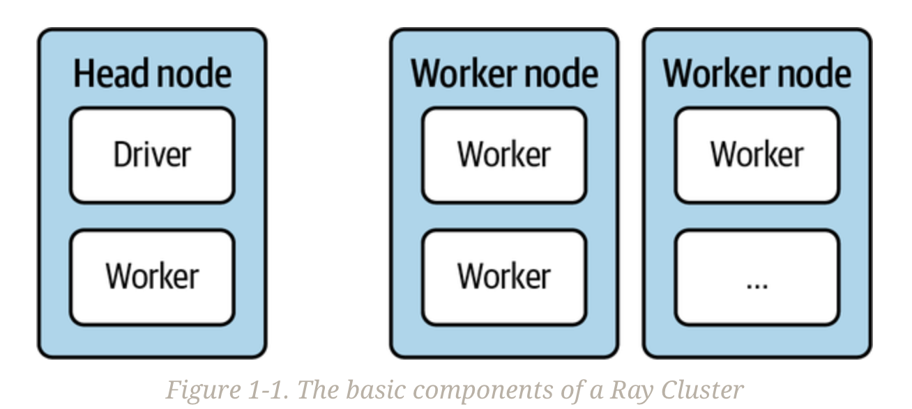

tags:: Ray, 读书笔记

- Learning Ray - Overview
	- 我们需要高效的分布式计算的原因之一是，我们以越来越快的速度收集着越来越多种类的数据。
		- 理念是为了让数据科学家能够专注于他们擅长的工作。作为数据科学从业者，您可能希望专注于训练复杂的机器学习模型、运行高效的超参数选择、构建全新的自定义模型或模拟，或者展示您的模型。
		- 将这些工作负载扩展到计算集群可能是不可避免的。为了做到这一点，您选择的分布式系统需要支持所有这些细粒度的“大型计算”任务，可能还需要专门的硬件。理想情况下，它还应该适用于您正在使用的大数据工具链，并且足够快以满足您的延迟要求。
			- 换句话说，分布式计算必须足够强大和灵活，以处理复杂的数据科学工作负载，而 Ray 可以帮助您实现这一点。
		- Python可能是当今最流行的数据科学语言；它肯定是我们日常工作中最有用的语言。
			- 丰富的PyData生态系统是数据科学家工具箱的重要组成部分。你如何确保在扩展工作负载的同时仍然利用你需要的工具？
			- 数据科学的分布式计算工具必须为现有的社区构建。
	- 我们喜欢 Ray 的原因是它符合所有这些要求。它是为 Python 数据科学社区打造的灵活分布式计算框架。
		- Ray易于上手，保持简单事物的简单。其核心API尽可能精简，有助于有效推理您想要编写的分布式程序。
			- 您可以在笔记本电脑上高效并行化Python程序，并几乎不需要进行任何更改就可以在集群上运行您在本地测试过的代码。
			- 高级库易于配置，并且可以无缝地一起使用。
			- 虽然Ray的核心是用C++构建的，但自从诞生之日起就是以Python为先的框架，与许多重要的数据科学工具集成，并且可以依赖不断增长的生态系统。
		- **分布式Python并不是什么新鲜事物，Ray也不是这个领域中的第一个框架（也不会是最后一个），但它在提供的功能上是特别的。**
			- 当你结合Ray的几个模块并拥有自定义的、机器学习密集型的工作负载时，Ray表现特别出色，否则这些工作负载将很难实现。它使得分布式计算变得足够简单，可以灵活地运行你复杂的工作负载，同时利用你已经了解并想要使用的Python工具。
	- 我们将讨论构成Ray的三个层次：
		- 核心引擎
		- 高级库
		- 生态系统
	- ## What Led to Ray?
		- 编写分布式系统很困难。
			- 这需要特定的知识和经验，你可能没有。理想情况下，这样的系统会让你专注于工作，提供抽象化的方式。
			- 分布式计算通常被认为很难。但为什么会这样呢？难道不应该找到良好的抽象方法，在集群上运行代码而不必不断考虑个别机器及其相互操作吗？如果我们专注于人工智能工作负载会怎样呢？
		- 研究人员在加州大学伯克利分校的RISELab创建了Ray来解决这些问题
			- 他们所考虑的工作负载性质相当灵活，不适合当时可用的框架。RISELab还希望构建一个系统，负责工作的分发方式。在合理的默认行为下，研究人员应该能够专注于他们的工作，而不受计算集群的具体情况影响。
			- 理想情况下，他们应该能够在Python中使用所有他们喜欢的工具。
		- Ray的设计侧重于高性能和异构工作负载。
	- ## Ray’s Design Principles
		- ### Simplicity and abstraction
			- Ray的API不仅依赖于简单性，而且很容易上手
				- 无论您想要使用笔记本电脑上的所有CPU核心，还是利用集群中的所有机器，都无关紧要。
				- 您可能需要更改一两行代码，但您使用的Ray代码基本保持不变。
				- 与任何良好的分布式系统一样，Ray在幕后管理任务分发和协调
			- Ray的API非常通用且符合Python风格，因此很容易与其他工具集成
				- 也适用于分布式工作负载的“胶水代码”，因为它的性能良好且灵活到足以在不同系统和框架之间进行通信
		- ### Flexibility and heterogeneity
			- 对于AI工作负载，特别是在处理强化学习等范式时，您需要一个灵活的编程模型。Ray的API旨在使编写灵活且可组合的代码变得容易。
				- **如果您可以用Python表达您的工作负载，那么您就可以使用Ray进行分发。**当然，您仍然需要确保有足够的资源可用，并且要注意您想要分发的内容。但Ray并不限制您可以使用它做什么。
			- Ray在处理计算的异构性时也非常灵活。
				- 假设你正在进行复杂的模拟。模拟通常可以分解为多个任务或步骤。其中一些步骤可能需要几个小时才能运行，而其他一些可能只需要几毫秒，但它们总是需要被快速地调度和执行。
				- 有时模拟中的单个任务可能需要很长时间，但其他较小的任务应该能够并行运行而不会阻塞它。此外，后续任务可能依赖于上游任务的结果
				- 你需要一个能够处理任务依赖关系的动态执行框架。Ray在运行这样的异构工作流时为你提供了完全的灵活性。
			- 您还需要确保您在资源使用方面具有灵活性，Ray支持异构硬件
				- 例如，一些任务可能需要在GPU上运行，而另一些任务最适合在几个CPU核心上运行
		- ### Speed and scalability
			- Ray的另一个设计原则是Ray执行任务的速度
				- 可以处理每秒数百万个任务，并且延迟非常低。以毫秒级的延迟执行任务。
			- 要使分布式系统运行快速，它还需要具备良好的可扩展性
				- Ray在计算集群中高效地分发和调度任务，并且以容错的方式进行
				- Ray集群支持自动扩展，以支持高度弹性的工作负载。Ray的自动缩放器尝试在您的集群中启动或停止机器，以匹配当前的需求。有助于最大程度地降低成本，并确保您的集群具备足够的资源来运行您的工作负载。
				- Ray 是为了快速从故障中恢复而构建的，这有助于提高其整体速度。
	- ## Three Layers: Core, Libraries, and Ecosystem
		- Ray的三个层次
			- Python的低级分布式计算框架，具有简洁的核心API和用于集群部署的工具，称为Ray Core
			- 由Ray的创建者构建和维护的一组高级库
				- 包括所谓的Ray AIR，以在常见的机器学习工作负载中使用这些库的统一API
			- 一个不断壮大的生态系统，与其他知名项目进行整合和合作，涵盖了第一和第二层的许多方面
	- # A Distributed Computing Framework
		- 在其核心，Ray是一个分布式计算框架
			- Ray建立并管理计算机集群，以便您可以在其上运行分布式任务
			- Ray集群由通过网络连接在一起的节点组成
				- 您编程针对所谓的驱动程序，即程序根，它位于主节点上
				- 驱动程序可以运行作业，即在集群中的节点上运行的任务集合
					- 作业的各个任务在工作节点上的工作进程上运行
				- 
			-