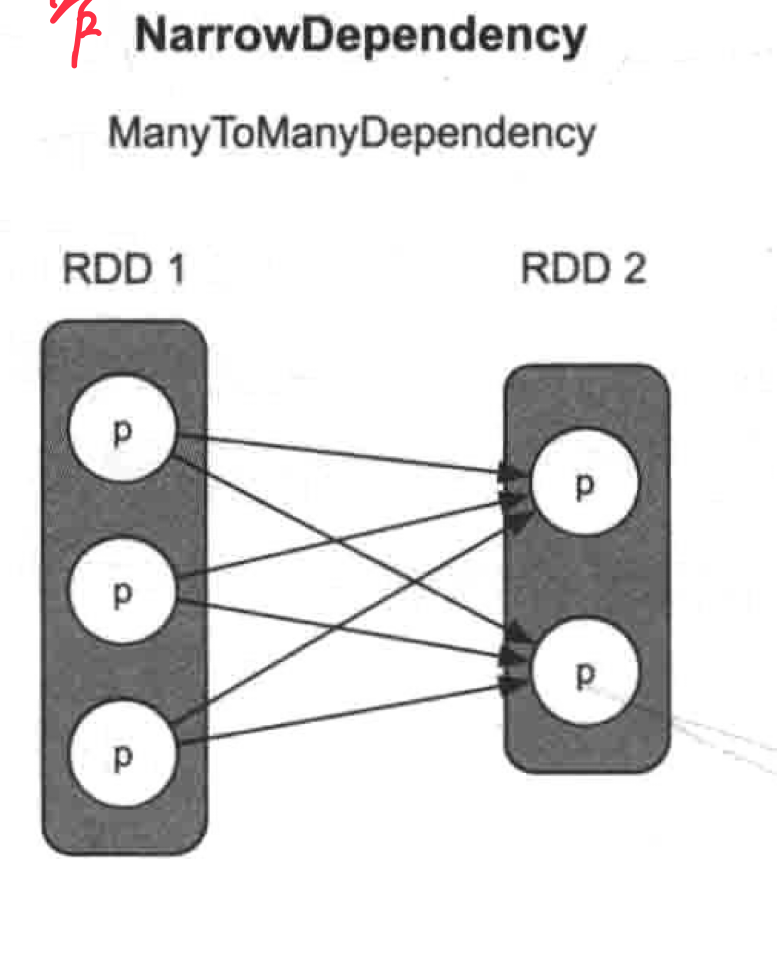

tags:: 窄依赖

- 多对多依赖: 表示 child RDD 中的一个分区依赖 parent RDD 中的多个分区，同时 parent RDD 中的一个分区被 child RDD 中的多个分区依赖
	- {:height 536, :width 367}
	  id:: 642ce69a-cc6d-4cc4-bf47-01016015a038
- 典型的 trasnformation 是 [[cartesian]]