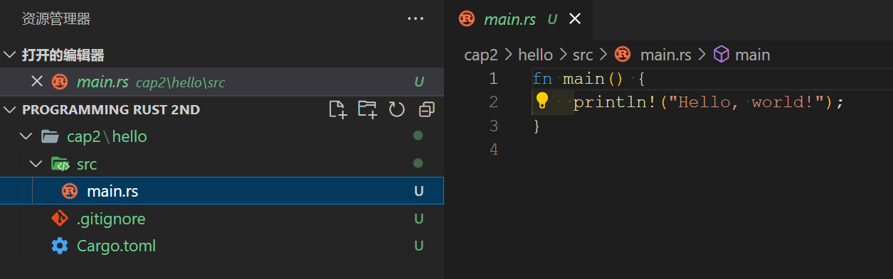
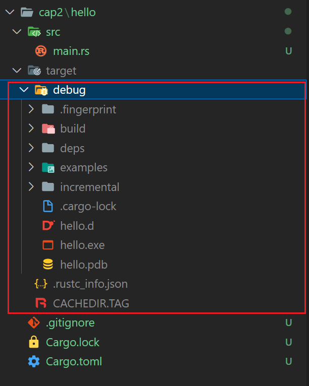

- Asserts
	- 
- Notes
	- # Chapter 1. Systems Programmers Can Have Nice Things
	  collapsed:: true
		- 从标题就能看出来，Rust 是一个系统编程语言，并且是一个干掉了那些繁复内容的语言。
		- C++ 的缺点
		  id:: 63cbff7c-8d7b-4528-8154-e562defb7b21
			- C++ 的风险演示 - undefined behavior
				- ((63cbfebe-4697-429c-aa0a-2b9c042e2b61))
					- a 为只包含一个元素的数组，进一步的当访问第四个元素的时候，并不会被拦截下来，可能会直接崩溃，或者访问到系统中的其他内存区域。
					- ((63cbff30-fb9f-4be1-92ff-8184591cff22))
				- C++ 中有很多的未定义行为
					- ((63cbff4e-e3d2-4bc0-97ca-24fddbe543f8))
				- 但编译器并不会帮你找到这些问题，直到运行时触发这些问题
			- 尽管 C++ 能够做到 "Pay for what you do", 但保持质量和安全性的各种任务都落到了开发者头上，且[从研究来看，即便是质量非常高的，非常致命的项目，仍然无法避免这些未定义行为的存在](((63cbfff9-be9f-4f73-9cf8-48aaf16d572a)))。
		- Rust 来帮你检测这些麻烦的未定义行为
		  id:: 63cc000e-5aae-40e4-bc6d-bc1e2fe12fcb
			- ((63cc004e-c940-4ebb-9242-75d10e8ffdc3))
				- ((63cc0058-1075-47ea-8eee-a848a246fa94))
				- ((63cc0068-dbc6-4eeb-8cbe-2e146cc957c3))
			- ((63cc009f-a300-465b-8ed2-ebc335d8cd0e))
		- Rust 支持并行
		  id:: 63cc00ba-2478-4cbf-be09-5ce79751ef04
			- ((63cc00ca-d929-4fd9-8efc-15108c02fcd0))
			- Rust 会保证内存的并发安全性
				- ((63cc0109-41f2-4b5b-b086-eca4288e7433))
				- ((63cc0113-93b3-4605-acf7-ed1f6f541759))
			- Rust 支持传统的并发控制工具
				- ((63cc0123-b092-4e4d-8448-c67227901942))
		- Rust 很快
		  id:: 63cc0125-0471-4921-adc7-0fa376e88d48
			- ((63cc01ce-cf06-4535-8db1-c5ca59c9fa05))
		- Rust 支持更好的协作
		  id:: 63cc0209-177e-4223-a8f9-e56c0f02ea2c
			- 优秀的包管理和构件工具 - Cargo
				- ((63cc022c-89f0-4dbe-9e28-72d4e0e03d8b))
			- 支持 traits 和泛型
				- ((63cc024d-541a-4dd2-ab41-6d5bd661c084))
	- # Chapter 2. A Tour of Rust
		- [[如何安装 Rust]]
		- 如何使用 Rust Cargo 创建项目
			- ``` powershell
			  cargo new hello
			  # then a project named hello will be created under work directory
			  ```
			- 默认生成的文件列表
			  collapsed:: true
				- 
				- `main.rs` 文件
					- 包含了一个默认的主函数
					- 默认内容
						- ``` rust
						  fn main() {
						      println!("Hello, world!");
						  }
						  ```
				- `.gitignore`
					- 会默认创建为一个 git 仓库
					- 默认内容
						- ``` gitignore
						  /target
						  ```
					- ((63cc0959-92f3-431f-9186-c1e269345338))
				- `Cargo.toml`
					- 当前项目 (或者说 package) 的 metadata
					- 默认内容
						- ``` toml
						  [package]
						  name = "hello"
						  version = "0.1.0"
						  edition = "2021"
						  
						  # See more keys and their definitions at https://doc.rust-lang.org/cargo/reference/manifest.html
						  
						  [dependencies]
						  ```
			- 运行生成的项目，使用 `cargo run`
			  collapsed:: true
				- ((63cc0a98-5ee9-4c83-89dd-e5578f68cda2))
				- ``` powershell
				  > cargo run  
				     Compiling hello v0.1.0 (C:\Users\minghu\OneDrive - Microsoft\Documents\rust\programming rust 2nd\cap2\hello)
				      Finished dev [unoptimized + debuginfo] target(s) in 1.04s
				       Running `target\debug\hello.exe`
				  Hello, world!
				  ```
				- ((63cc0aab-2224-451b-ac1e-5e64850bef7f))
					- {:height 395, :width 338}
					- 在 Windows 平台下，已经生成 hello.exe，直接运行也可以得到相同的结果。
				- ((63cc0ac4-6095-4e68-b284-b23a25e5333b))
					- ``` powershell
					  cargo clean
					  ```
		- ((63cdfb08-342d-40c0-932c-6d2f361864be))
			- gcd 函数实现
				- ``` rust
				  fn gcd(mut n: u64, mut m: u64) -> u64 {
				      assert!(n != 0 && m != 0);
				      while m != 0 {
				          if m < n {
				              let t = m;
				              m = n;
				              n = t;
				          }
				          m = m % n;
				      }
				      n
				  }
				  ```
				- 语法细节
					- 使用 `i64` 和 `u32` 来表达特定位数的整型和无符号整型
					- `mut` 表示是可以修改的变量，默认为 `let`，不可修改，避免无意修改不可修改的值。Rust 会自动检测声明为 mut 但没有修改的变量。
					- 11 行没有带上 `;`，表示返回该表达式的值，`return` 通常只用于快速返回
					- `if` 和 `while` 可以不带括号
					- `fn` 来定义函数，`->` 表示返回值
			- gcd 单元测试
				- ``` Rust
				  #[test]
				  fn test_gcd() {
				      assert_eq!(gcd(14, 15), 1);
				      assert_eq!(gcd(2 * 3 * 5 * 11 * 17, 3 * 7 * 11 * 13 * 19), 3 * 11);
				  }
				  ```
					- 可以使用 `cargo test` 命令，会找到当前项目中的所有的单元测试方法并执行
						- ((63cc17fb-f173-4b67-8d7d-f97469ff91b1))
				- 语法细节
					- `#[test]` 在方法上出现，表示接下来的方法是一个 test 方法，更本质的意思是，在正常编译的时候，不会被编译进去。
			- ((63cc02a1-52f1-427c-89c0-f187716d6546))
				-
			- ((63cc04c6-b190-41ef-88a8-e0fb2bb93831))
			- ((63cc04cf-21b0-4815-954e-856491a0e29f))
			- ((63cc04d7-758c-490e-87c4-319f96569c0f))
		-