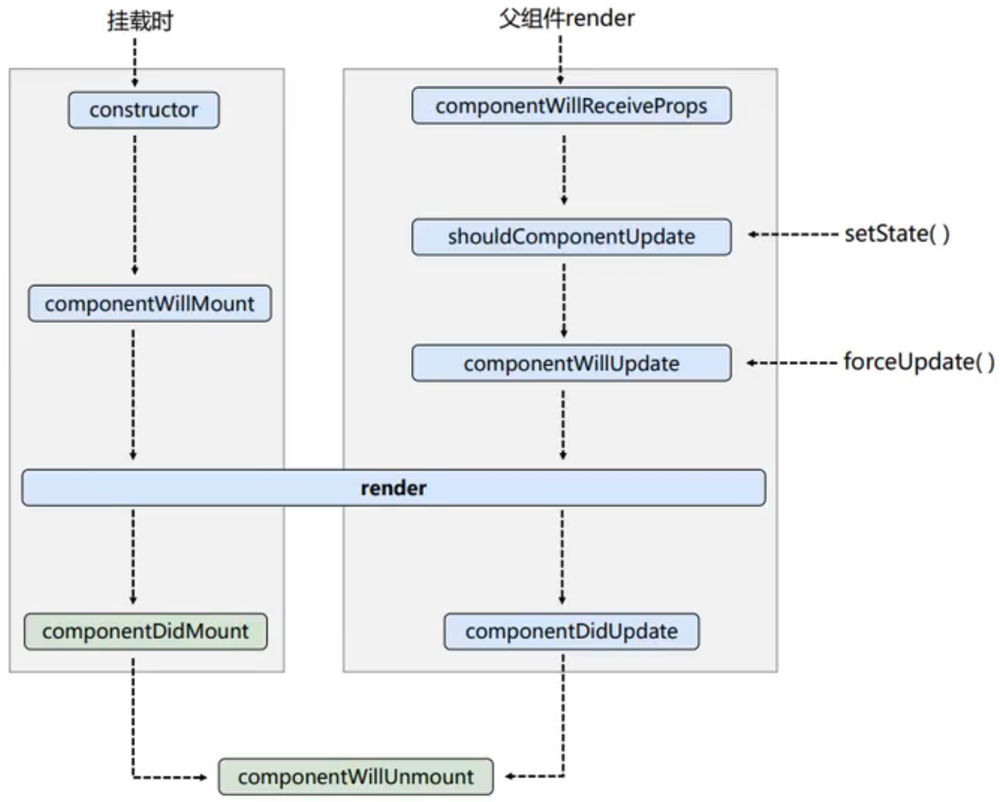
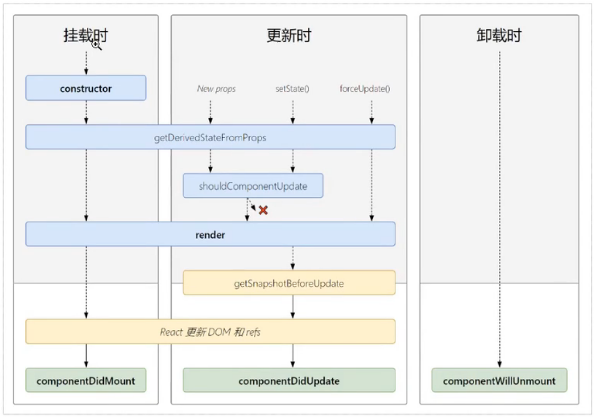

- Here are the lifecycle hooks of a React component:
	- `constructor()`: This is called when the component is first created. It is used to initialize the state and bind event handlers.
	- `render()`: This is called to render the component. It is a pure function that returns the JSX to be rendered.
	- `componentDidMount()`: This is called after the component is mounted in the DOM. It is used to fetch data from an API or initialize any third-party libraries.
	- `shouldComponentUpdate()`: This is called before the component is updated. It is used to optimize the rendering process by preventing unnecessary updates.
	- `componentWillUnmount()`: This is called just before the component is unmounted from the DOM. It is used to clean up any resources used by the component, such as event listeners or timers.
	- `getDerivedStateFromProps()`: This is called when the props of the component change. It is used to update the state of the component based on the new props.
	- `getSnapshotBeforeUpdate()`: This is called just before the component is updated. It is used to capture some information from the DOM, such as the scroll position, before it is updated.
	- `componentDidUpdate()`: This is called after the component is updated. It is used to update the DOM or fetch new data from an API.
- These lifecycle hooks allow you to control the behavior of your React components at different stages of their lifecycle.
- Graph
	- Old Version
		- {:height 582, :width 716}
		- `shouldComponentUpdate`
			- 默认返回 true
			- 如果返回 false，则后续所有的操作都不会发生
	- New Version
		- 
		- 一些旧生命周期的方法将要被移除，需要添加 `UNSAFE_` 来使用，具体可以参考日志中的警告信息
		- 新增加的了一些
			- `getSnapshotBeforeUpdate` 在变化之前执行，该方法的返回值会被作为 componentDidUpdate 的第三个参数传入
				- 场景用例：在顶部增加数据的 list 中记录滚动位置不变
					- ``` javascript
					  getSnapshotBeforeUpdate() {
					    console.log("getSnapshotBeforeUpdate");
					    let height = this.refs.list.scrollHeight
					    return height;
					  }
					  
					  componentDidUpdate(prevProps, prevState, height) {
					    console.log("componentDidUpdate");
					    let height2 = this.refs.list.scrollHeight
					    // hide all new generate content
					    // scrollTop 是滚动条相对于其顶部的偏移，也就是被隐藏的部分
					    // scrollHeight 是元素内容高度，包括被隐藏的部分
					    this.refs.list.scrollTop += height2 - height;
					  }
					  ```
-