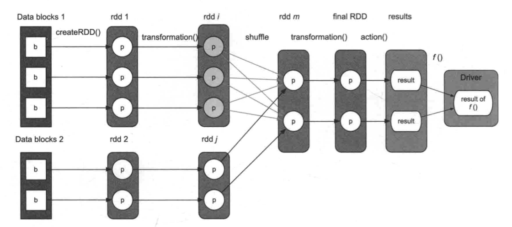

- TOC {{renderer :tocgen, [[]], 2, h}}
- # 什么是 Transformation
  id:: 642cd333-da61-467c-8d3a-f18b14c1a8ca
	- Transformation used to **create a new dataset from existing ones**. #定义
	- 隐含的意思是从已有的 RDD 中创建出新的 RDD，且是单向操作，Transformation 不会对已有 RDD 进行修改
	- 一直使用 Transformation 可以一直生成新的 RDD，但 RDD 的生成是惰性的，并不会真的立刻执行，只会在 RDD 中记录转换，必须在 [[Spark Action]] 中才会触发
	- 这些 RDD 之间存在的关系取决于使用的 Transformation 类型
- # 生成的 RDD 之间的关系
	- 一些 Transformation 从一个 RDD，生成一个新的 RDD，另外一些 Transformation 需要多个 RDD 输入来生成一个新的 RDD。
	- 对于新生成的 RDD 而言，在计算中需要能够从父 RDD 中寻找数据，而由于 RDD 事实上是分布式的，并不一定会在一个 task 中存放所有的分区数据，因此 RDD 中关联关系需要细化到当前 RDD 的各个分区依赖父 RDD 中的哪个分区。这时候会由于 Transformation 的语义不同，会产生不同的映射关系。
		- {:height 385, :width 845}
		- 例如在这里
			- rdd i 中的每个分区都依赖 rdd1 中的分区，此时是一对一关系
			- rdd m 依赖 rdd i 中的多个分区，且 rdd m 中的多个分区都依赖 rdd i 中的每个分区，因此此时是多对多关系
		- 除此之外还存在一对多关系和多对一关系
		- Spark 将 Trasnformation 产生的数据关系分为两大类，[[窄依赖]] 和 [[宽依赖]]
- # Transformation 有哪些种类
  id:: 642ce69a-00d6-4762-8ff3-12ff3349c8ea
	-
- # 参考资料
	- [RDD Programming Guide - Spark 3.3.2 Documentation (apache.org)](https://spark.apache.org/docs/3.3.2/rdd-programming-guide.html#transformations)