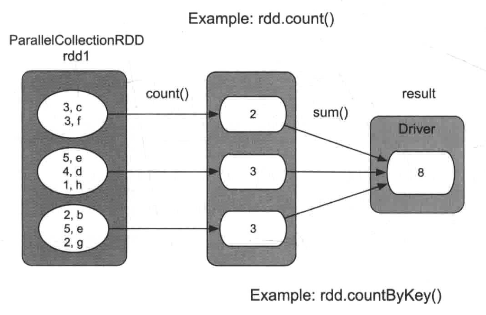
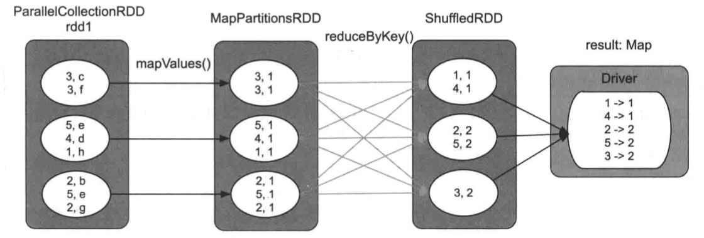

tags:: [[Spark Action]]

- # 常见的 Action
	- ## [[count]]，[[countByKey]] 和 [[countByValue]] 操作
		- `count(): long`
			- 语义: 统计`rdd1`中包含的 record 个数, 返回一个 `long` 类型
			- 用法: `val result = rdd1.count()`
			- {:height 446, :width 582}
				- `count()` 操作首先计算每个分区中 record 的数目,然后在 Driver 端进行累加操作, 得到最终结果
		- `countByKey(): Map[K, long]`
			- 语义: 统计 `rdd1` 中每个 `Key` 出现的次数 (`Key`可能有重复), 返回一个 `Map`, 要求 `rdd1` 是 `<K,V>` 类型
			- {:height 304, :width 916}
				- `countByKey` 操作只统计每个 `Key` 出现的次数
				- 首先利用 [[mapValues]] 操作将 `<K,V>` record的 `Value` 设置为 1
			-