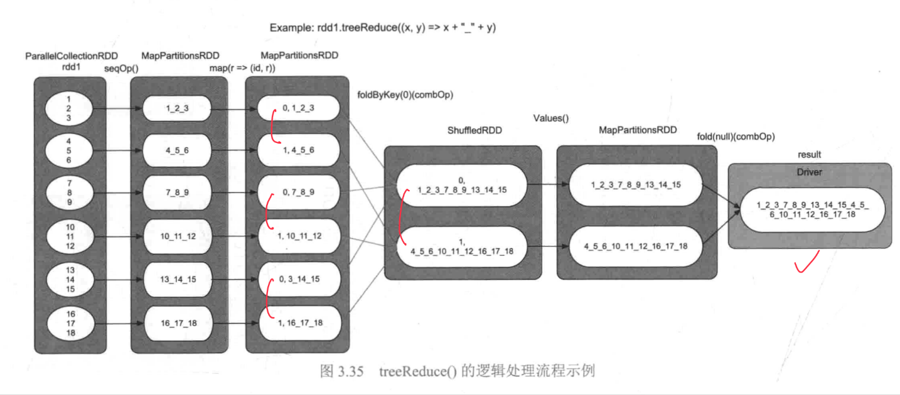

tags:: [[Spark Action]]

- # 常见的 Action
	- ## [[count]]，[[countByKey]] 和 [[countByValue]] 操作
	  collapsed:: true
		- `count(): long`
			- 语义: 统计`rdd1`中包含的 record 个数, 返回一个 `long` 类型
			- 用法: `val result = rdd1.count()`
			- {:height 446, :width 582}
				- `count()` 操作首先计算每个分区中 record 的数目,然后在 Driver 端进行累加操作, 得到最终结果
		- `countByKey(): Map[K, long]`
			- 语义: 统计 `rdd1` 中每个 `Key` 出现的次数 (`Key`可能有重复), 返回一个 `Map`, 要求 `rdd1` 是 `<K,V>` 类型
			- {:height 304, :width 916}
				- 首先利用 [[mapValues]] 操作将 `<K,V>` record 的 `Value` 设置为 1
				- 然后利用 [[reduceByKey]] 统计每个`Key` 出现的次数
		- `countByValue():Map[T, long]`
			- 语义:统计`rdd`中每个 record 出现的次数,返回一个`Map`, 最后汇总到 Driver 端,形成 `Map`
			- {:height 323, :width 921}
				- 先将 record 变为`<record, null>`类型
				- 使用 [[reduceByKey]] 得到每个 record 出现的次数
		-
	- ## [[collect]] 和 [[collectAsMap]] 操作
	  collapsed:: true
		- `collect(): Array[T]`
			- 用法: `val result = rdd1.collect()`
			- 语义: 将 `rdd1` 中的 record 收集到 Driver 端
		- `collectAsMap(): Map[K, V]`
			- 用法: `val result = rddl.collectAsMap()`
			- 语义: 将`rdd1`中的 `<K,V>` record收集到 Driver 端,得到 `<K,V> Map`
	- ## [[foreach]] 和 [[foreachPartition]]()
	  collapsed:: true
		- `foreach(func): Unit`
			- 语义:将`rdd1`中的每个分区中的数据按照 `func` 进行处理
		- `foreachPartition(func): Unit`
			- 语义: 将 `rdd1` 中的每个 record 按照`func`进行处理
			- [[foreach]] 和 [[foreachPartition]] 的关系类似于 [[map]] 和 [[mapPartitions]] 的关系
	- ## [[fold]]/[[reduce]]/ [[foldByKey]] 操作
	  collapsed:: true
		- `fold(zeroValue)(func): T`
			- 语义: 将 `rdd1` 中的 record 按照 `func` 进行聚合, `func` 语义与 [[foldByKey]](func) 中的`func`相同
			- {:height 370, :width 848}
		- `reduce (func): T`
			- 语义: 将`rdd1`中的 record 按照`func`进行聚合, `func`语义与[[reduceByKey]](func) 中的`func`相同
			- {:height 383, :width 862}
		- `aggregate(zeroValue)(seqOp, combOp): U`
			- 语义: 将`rdd1`中的 record 进行聚合, `segOp` 和 `combOp` 的语义与 [[aggregateByKey]] (zeroValue)(seqOp,combOp) 中的类似
			- {:height 365, :width 855}
		- 为什么已经有[[reduceByKey]]、[[aggregateByKey]]等操作, 还要定义[[aggregate]]、[[reduce]] 等操作呢?
			- 需要全局聚合，而不只是需要 RDD
		- 缺点
		  background-color:: red
			- 当需要 merge 的部分结果很大时, 数据传输量很大, 而且 Driver 是单点 merge, 存在效率和内存空间限制问题
			- Spark 对这些聚合操作进行了优化,提出了 [[treeAggregate]] 和 [[treeReduce]] 操作
	- ## [[treeAggregate]] 和 [[treeReduce]] 操作
	  collapsed:: true
		- `treeAggregate(zeroValue) (seqOp, combOp, depth):U`
			- 语义: 将 `rdd1` 中的 record 按照树形结构进行聚合, 树的高度(depth) 的默认值为 `2`
			- 逻辑处理过程
				- [[treeAggregate]](seqOp,combOp) 的语义与 [[aggregate]] (seqOp, combOp) 的语义相同, 区别是 [[treeAggregate]] 使用树形聚合方法来优化全局聚合阶段,从而减轻了 Driver 端聚合的压力(数据传输量和内存用量)
				- 本质上是避免了将所有结果在最终的 Driver 才开始聚合
					- `treeAggregate()` 首先对 `rdd1` 中的每个分区进行局部聚合
					- 不断利用 [[foldBvKey]] 进行树形聚合，类似归并过程
						- foldByKey 需要 `<K,V>` 类型的数据, `treeAggregate` 为每个 record 添加一个特殊的 `Key`, 使得 rdd 中的数据被均分到每个非根节点进行聚合
						- foldByKey 使用 [[ShuffleDependency]],但实际上每个分区中只存在一个 record
					- 
						- 此时 [[treeAggregate]] 与[[aggregate]] 的区别是, [[treeAggregate]] 中的 `zeroValue` 会被多次使用(由于调用了 [[fold]])函数)
		- `treeReduce(func, depth) :T`
			- 语义: 将 `rdd1` 中的 record 按树形结构进行聚合
			- `treeReduce` 实际上是调用 [[treeAggregate]], 唯一区别是没有初始值 `zeroValue`
			- {:height 513, :width 1148}
	- TODO [[reduceByKeyLocality]] 操作
	- TODO [[take]]/[[first]]/[[takeOrdered]]/[[top]] 操作
	- TODO [[max]] 和 [[min]] 操作
	- TODO [[isEmpty]] 操作
	- TODO [[lookup]] 操作
	- ## [[saveAsTextFile]]/[[saveAsObjectFile]]/[[saveAsHadoopFile]]/[[saveAsSequenceFile]] 操作
	  collapsed:: true
		- `saveAsTextFile(path): Unit`
			- 语义：将 rdd 保存为文本文件
		- `saveAsObjectFile(path): Unit`
			- 语义：将 rdd 保存为序列化对象形式的文件
		- `saveAsSequenceFile(path): Unit`
			- 语义：将 rdd 保存为 SequenceFile 形式的文件,  SequenceFile 用于存放序列化后的对象
		- `saveAsHadoopFile(path): Unit`
			- 语义：将 rdd 保存为 Hadoop HDFS 文件系统
-