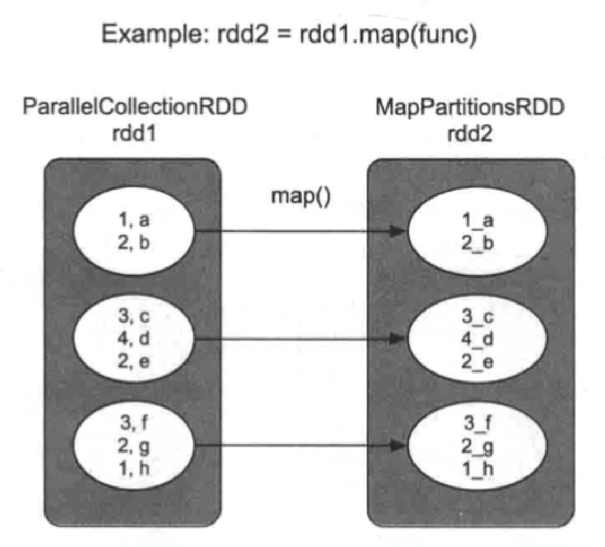
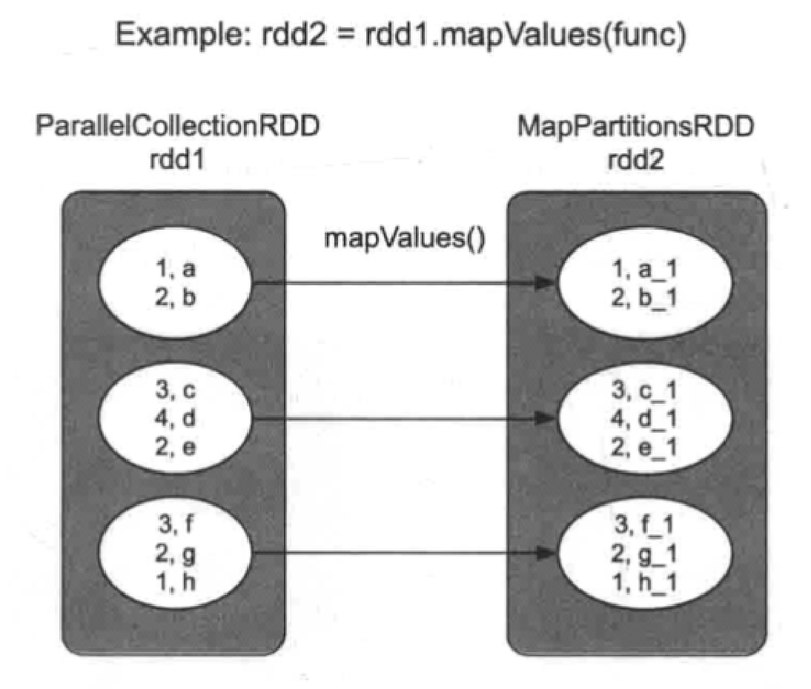
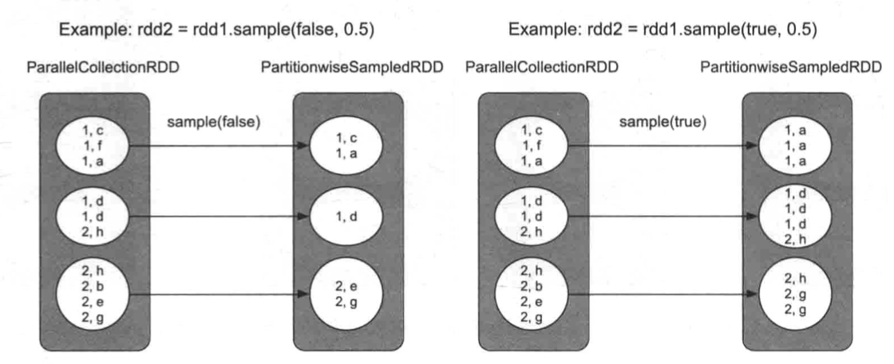
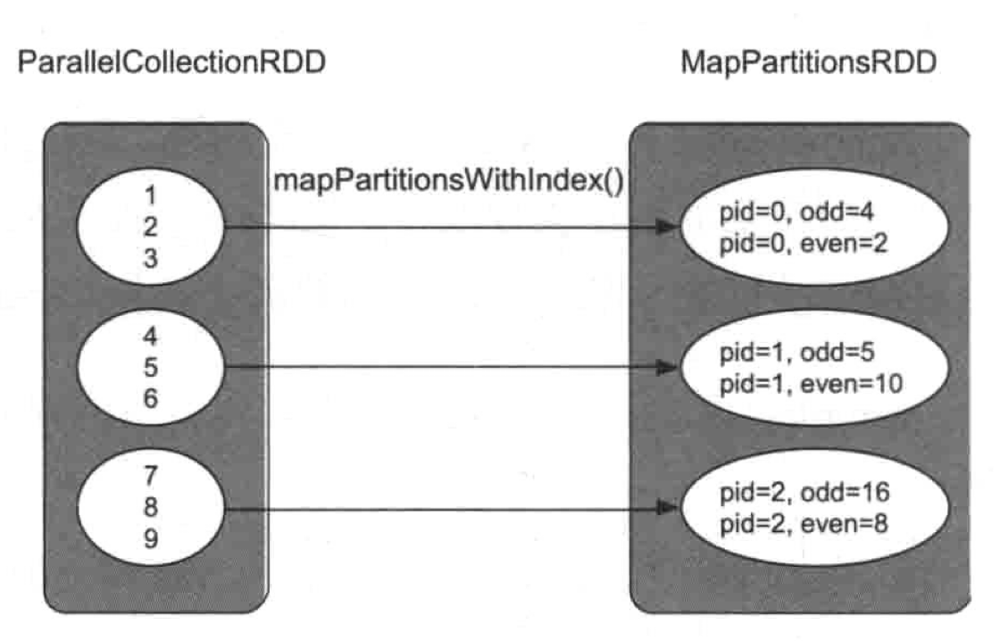
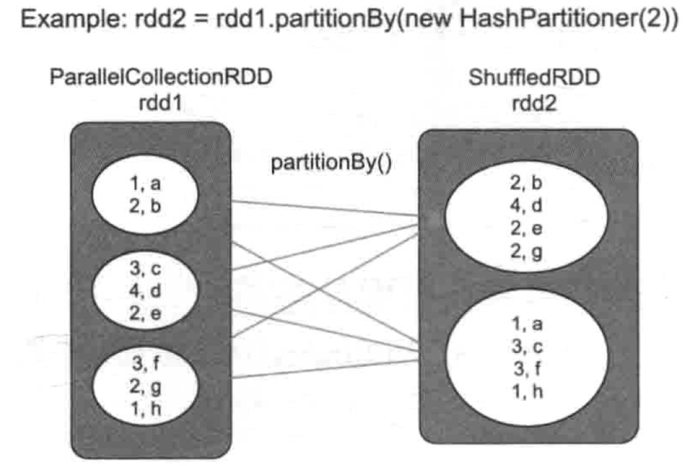
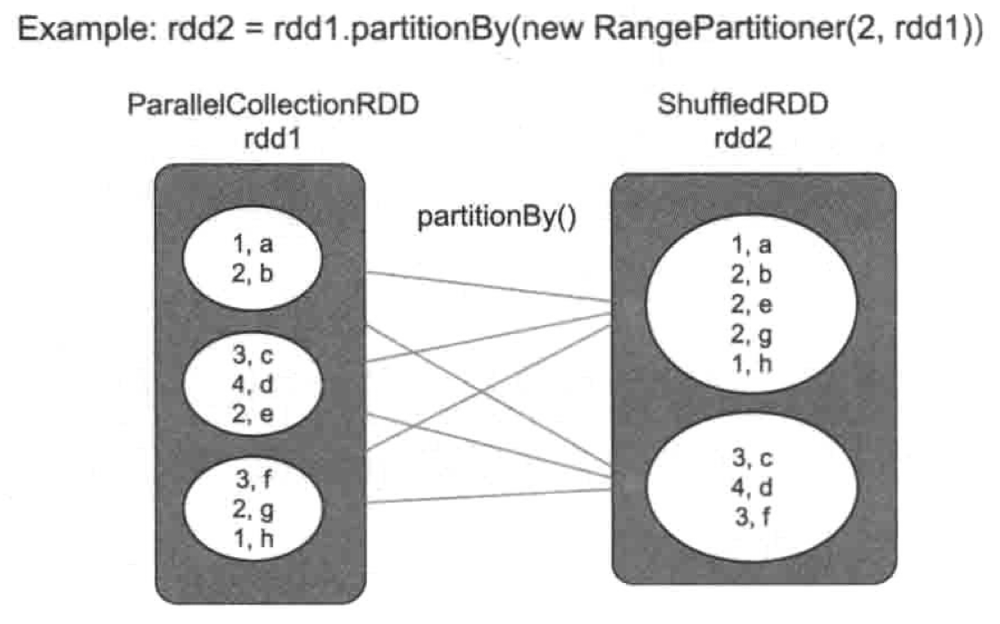
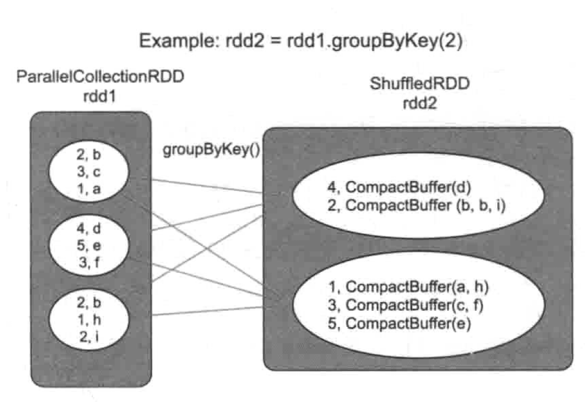
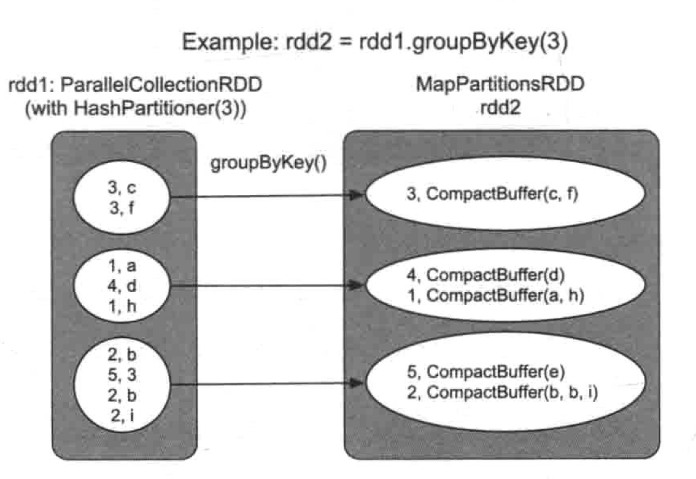
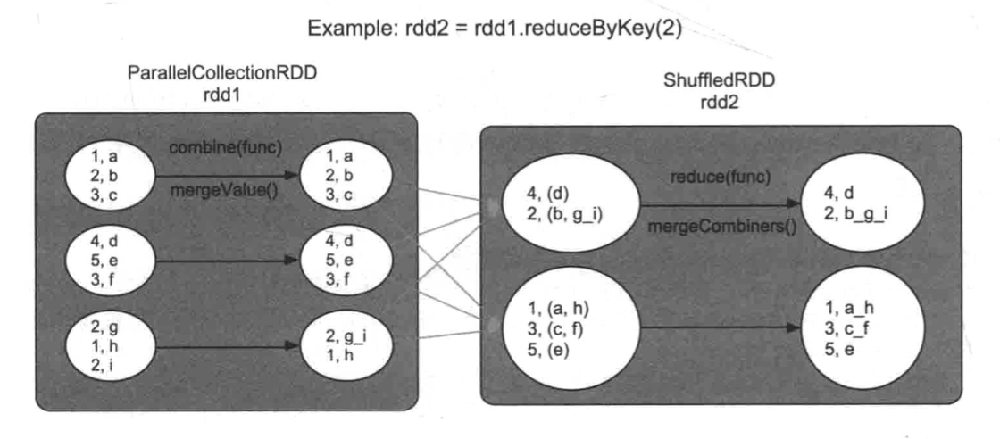

- {{renderer :tocgen}}
- # [[map]] 和[[mapValues]]
  collapsed:: true
	- `map(func)`
		- 用法 `rdd2 = rdd1.map(func)`
		- 语义：使用 `func` 对 `rdd1` 中的每个 record 进行处理，输出一个新的 record
		- {:height 427, :width 390}
	- `mapValues(func)`
		- 用法 `rdd2 = rdd1.mapValues(func)`
		- 语义：对于 `rdd1` 中每个 `<K,V>` record, 使用 `func` 对 value 进行处理,得到新的 record
		- {:height 406, :width 428}
	- 生成的 RDD
		- 类型 [[MapPartitionsRDD]]
		- 关系 [[OneToOneDependency]]
- # [[filter]] 和 [[filterByRange]]
	- `filter(func)`
		- 用法：`rdd2 = rdd1.filter(func)`
		- 语义：对 `rdd1` 中的每个record进行`func`操作, 如果结果为`true`,则保留这个record,所有保留的record将形成新的`rdd2`
	- `filterByRange(lower, upper)`
		- 用法：`rdd2 = rdd1.filterByRange(2,4)`
		- 语义：对`rdd1`中的数据进行过滤,只保留`[lower, upper]`之间的record
	- 生成的 RDD
		- 类型 [[MapPartitionsRDD]]
		- 关系 [[OneToOneDependency]]
- # [[flatMap]] 和 [[flatMapValues]]
	- `flatMap(func)`
		- 用法：`rdd2 = rdd1.flatMap(func)`
		- 语义：对`rdd1`中每个元素(如list)执行func操作,得到新元素。主要适用于rdd中每个元素都是一个集合的情况
	- `flatMapValues(func)`
		- 用法：`rdd2=rdd1.flatMapValues(func)`
		- 语义：与`flatMap()`相同,但只针对`rdd1` 中`<K,V>` record中的**Value**进行`flatMapValues()`操作
	- 生成的 RDD
		- 类型 [[MapPartitionsRDD]]
		- 关系 [[OneToOneDependency]]
- # [[sample]] 和 [[sampleByKey]]
	- `sample(withReplacement, fraction, seed)`
		- 用法：`rdd2 = rdd1.sample(true, 0.5,1.0)`
		- 语义：对`rdd1`中的数据进行抽样，取其中`fraction*100%`的数据
			- `withReplacementtrue`表示有放回的抽样，`seed`表示随机数种子
		- 生成 RDD
			- 类型
				- 无放回 [[PartitionwiseSampledRDD]]
				- 有放回 [[MapPartitionsRDD]]
			- 关系 [[OneToOneDependency]]
		- {:height 259, :width 620}
	- `sampleByKey(withReplacement, fractions: Map, seed)`
		- 用法：`rdd2 = rdd1.sample(true, 0.5, 1.0)`
		- 语义：对rdd1中的数据进行抽样,为每个 `Key` 设置抽样比例,如 `Key=1` 的抽样比例是 `30%` 等
		- 生成 RDD
			- 类型 [[MapPartitionsRDD]]
			- 关系 [[OneToOneDependency]]
- # [[mapPartitions]] 和 [[mapPartitionsWithlndex]] 操作
	- `mapPartitions(func)`
		- 用法：`rdd2 = rdd1.mapPartitions(func)`
		- 语义：对`rdd1`中每个分区进行`func` 操作,输出新的一组数据
	- `mapPartitionsWithIndex(func)`
		- 用法：`rdd2 = rdd1.mapPartitionsWithIndex(func)`
		- 语义：分区中的数据带有索引(表示record属于哪个分区)
		- {:height 318, :width 490}
		- 场景
			- 当程序计算出一个result RDD时,我们想知道这个RDD中包含多少个分区, 以及每个分区中包含了哪些record
				- ``` scala
				  resultRDD.mapPartitionsWithIndex((pid, iter) => {
				    iter.map (Value => "Pid: " + pid + ", Value: " + Value)
				  }).foreach(println)
				  ```
			- 批量写入数据库
				- 在`mapPartitions()`中先建立数据库连接
				- 然后将每一个新来的数据iternext)转化成数据表中的一行
				- 将其插入数据库中
	- 生成的 RDD
		- 类型 [[MapPartitionsRDD]]
		- 关系 [[OneToOneDependency]]
- # [[partitionBy]]操作
  collapsed:: true
	- `partitionBy(partitioner)`
		- 用法：`rdd2 = rdd1.partitionBy (partitioner)`
		- 语义：使用新的`partitioner`对`rdd1`进行重新分区，`partitioner`可以是`HashPartitioner` `RangePartitioner`等,要求`rdd1`是`<K,V>`类型
	- 场景
		- 使用 [[HashPartitioner]] 对 `rdd1` 进行重新分区
			- {:height 352, :width 500}
		- 使用[[RangePartitioner]]对`rdd1`进行重新分区的情景, `Key`值较小的record被分到`partition1`, `Key`值较大的record被分到`partition2`
			- {:height 313, :width 494}
			- **不保证 rdd2 中的分区内数据有序**
	- 生成的 RDD
		- 类型 [[ShuffledRDD]]
		- 关系 [[ShuffleDependency]]
- # [[groupByKey]] 操作
	- groupByKey([numPartitions])
		- 用法：`rdd2 = rdd1.groupByKey(numPartitions)`
		- 语义：将`rdd1`中的`<K,V>` record 按照 `Key` 聚合在一起形成 `<K,list()>` (实际是`<K,CompactBuffer(V)>`), `numPartitions` 表示生成的 `rdd2` 的分区个数
			- 如果没有指定分区数量，则默认使用 `rdd1` 的分区个数
		- 生成的 RDD 在不同的情况下可能不同，取决于 rdd1 的分区方式
			- 如果 `rdd1` 是 [[RangePartitioner]] 分区
				- 例如 `rdd1` 是水平划分且分区个数为`3`，rdd2 被声明为分区为 `2`
					- {:height 358, :width 509}
					- 会得到 [[ShuffledRDD]]，关系为 [[ShuffleDependency]]
			- 如果 `rdd1` 是 [[HashPartitioner]]，且分区数相同
				- 只需要直接聚合
					- {:height 394, :width 566}
					- 得到 [[MapPartitionsRDD]]，关系为 [[OneToOneDependency]]
			- 如果 rdd1 分区数不同，则同样会进行 shuffle，得到 [[ShuffledRDD]]
	- 缺点
	  background-color:: red
		- 如果 partition 方法不同或数量不对等，会导致 shuffle，会产生大量中间数据，占用内存较大，在大多数场景，会使用 [[reduceByKey]] 代替
- # [[reduceByKey]]()操作
	- `reduceByKey(func, [numPartitions])`
		- 用法：`rdd2 = rdd1.reduceByKey(func, 2)`
		- 语义：在聚合的过程中使用 `func` 对这些 record 的 `Value` 进行融合计算
		- `reduceByKey` 实际包括两步聚合 #.ol
			- 第1步,在 [[ShuffledRDD]] 之前对RDD中每个分区中的数据进行一个本地化的`combine()`聚合操作
				- 称为mini-reduce 或者map端`combine()`
				- 对[[ParallelCollectionsRDD]]中的每个分区进行`combine()`操作,将具有相同`Key`的`Value`聚合在一起,并利用`func`进行`reduce()` 聚合操作
				- Spark自动完成, 并不形成新的RDD
			- 第2步,`reduceByKey()`生成新的 [[ShuffledRDD]]
		- 
		- 注意
		  background-color:: yellow
			- `combine()`和`reduce()`的计算逻辑一样,采用同一个 `func`
			- `func` 需要满足交换律和结合律,因为Shuffle并不保证数据到达顺序
			- [[ShuffleDependency]]需要对`Key`进行Hash划分,所以,`Key`不能是特别复杂的类型
			- 在`reduceByKey()`中, `func`要求参与聚合的record和输出结果是同一个类型(类型`Value`),
		- 优点
		  background-color:: yellow
			- 相比[[groupByKey]], `reduceByKey` 可以在 Shuffle 之前使用 `func` 对数据进行聚合,减少了数据传输量和内存用量,效率比[[groupByKey]]的效率高
- # [[aggregateByKey]] 操作
	- `aggregateByKey(zeroValue)(seqOp, combOp, [numPartitions])`
		- 语义: `aggregateByKey()`是一个通用的聚合操作可以看作一个更一般的`reduceByKey()`
		- 为什么已经有了[[reduceByKey]]，还要定义`aggregateByKey`呢?
			- `reduceByKey` 的灵活性较低
				- `reduceByKey` 中的`combine` 计算逻辑与`reduce` 一样,都采用 `func`
				- 如在`combine()` 中想使用一个`sum()`函数,而在`reduce()`中想使用`max()`函数,那么`reduceByKey()` 就不满足要求了
			- `aggregateByKey()` 将 `combine()` 和 `reduce()` 两个函数的计算逻辑分开
				- `combine()` 使用`seqOp`将同一个分区中的`<K,V>`record聚合在一起,
				- `reduce()` 使用`combineOp`将经过`seqOp`聚合后的不同分区的`<K,V'>`record进一步聚合
					- `reduce(func)` 操作时需要一个**初始值,**而`reduceByKey(func)`没有初始值 `zeroValue`
					- `aggregateByKey()` 还提供了一个`zeroValue`参数,来为`seqOp`提供初始值`zeroValue`
						- 在`aggregateByKey()`中, `zeroValue`和`record`可以是不同类型
						- `seqOp`的输出结果与`zeroValue`是同一类型的
				- [[reduceByKey]] 可以看作特殊版的 `aggregateByKey`，可以看作`seqOp=combOp=func` 版本的 `aggregateByKey`
			-