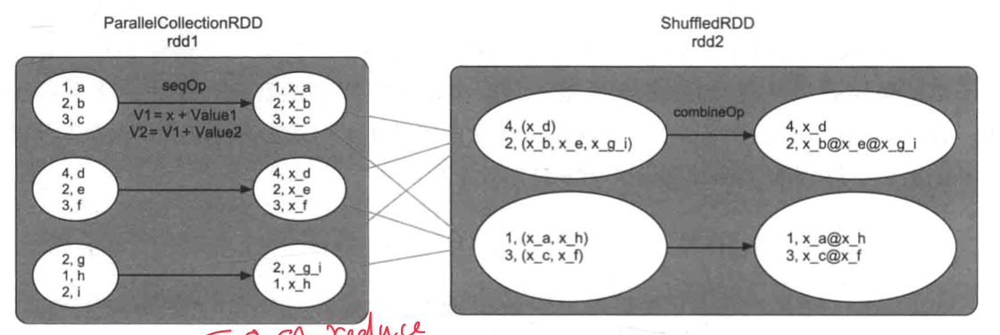
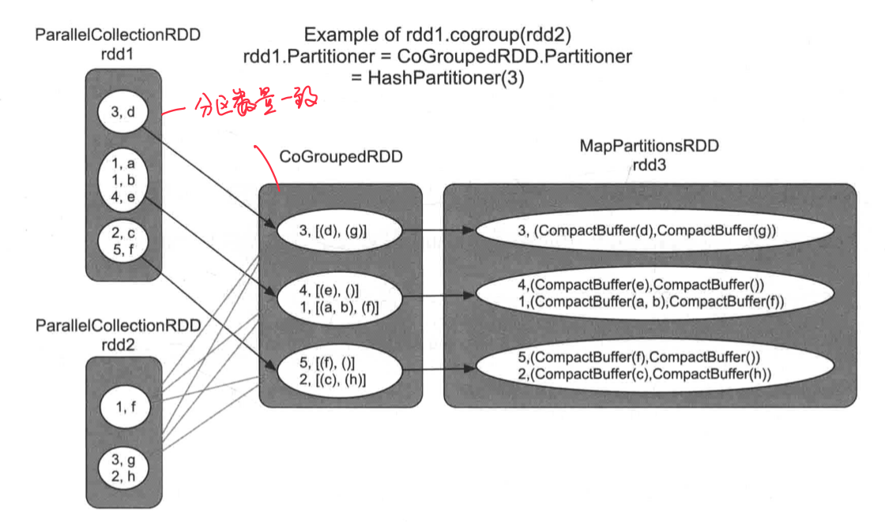
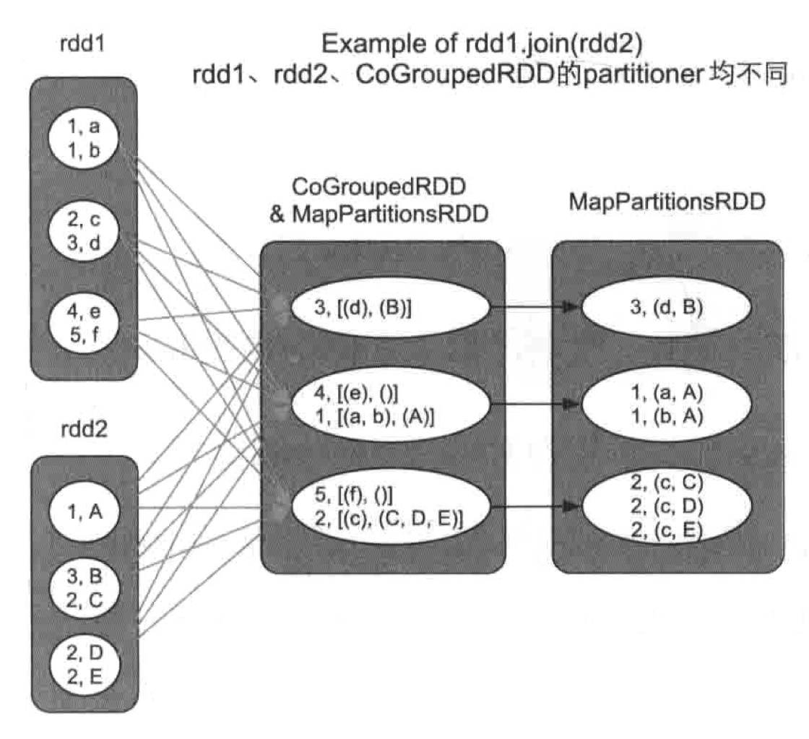
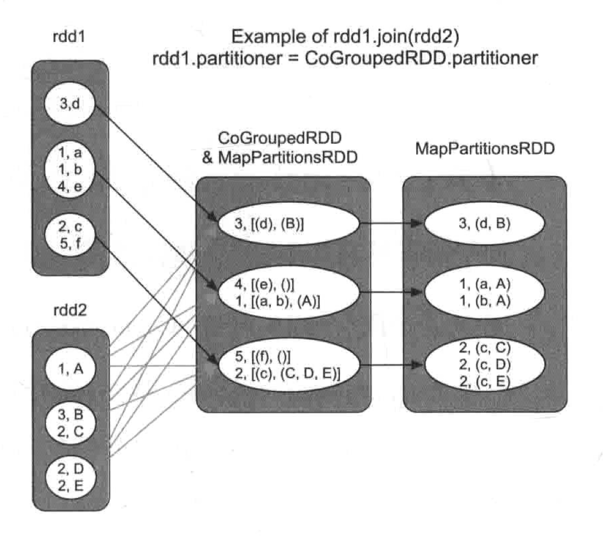
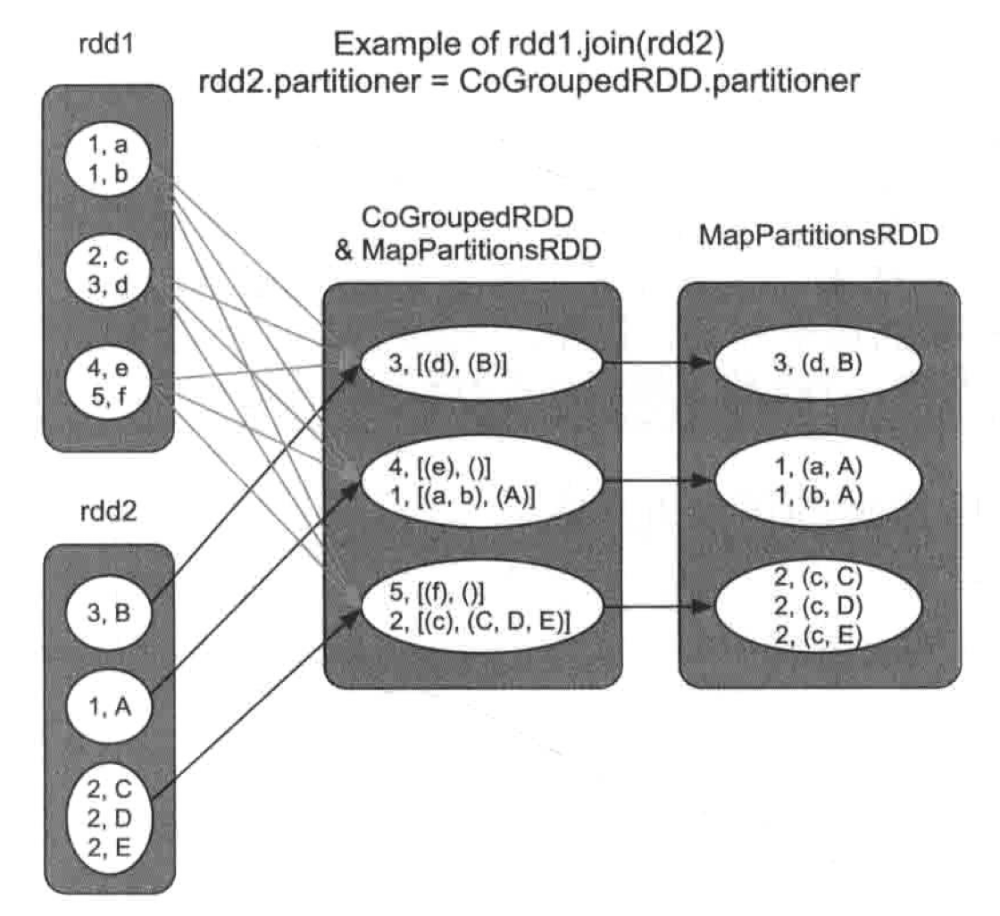
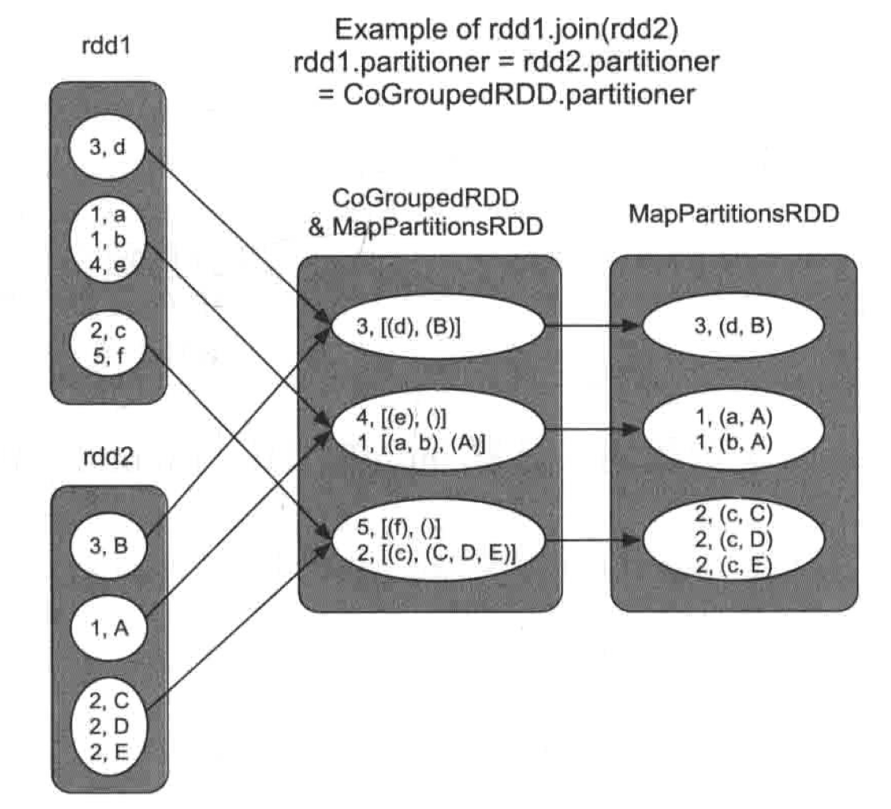
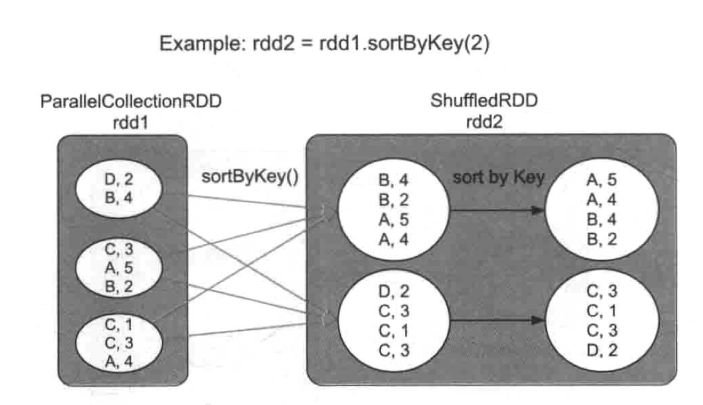

tags:: [[Spark Transformation]]

- TOC {{renderer :tocgen, [[]], 2, h}}
- # 常见的 Transformation
  id:: 642d4770-3dc8-4143-a6a5-afc35499de61
	- ## [[map]] 和[[mapValues]]
	  collapsed:: true
		- `map(func)`
			- 用法 `rdd2 = rdd1.map(func)`
			- 语义：使用 `func` 对 `rdd1` 中的每个 record 进行处理，输出一个新的 record
			- {:height 427, :width 390}
		- `mapValues(func)`
			- 用法 `rdd2 = rdd1.mapValues(func)`
			- 语义：对于 `rdd1` 中每个 `<K,V>` record, 使用 `func` 对 value 进行处理,得到新的 record
			- {:height 406, :width 428}
		- 生成的 RDD
			- 类型 [[MapPartitionsRDD]]
			- 关系 [[OneToOneDependency]]
	- ## [[filter]] 和 [[filterByRange]]
	  collapsed:: true
		- `filter(func)`
			- 用法：`rdd2 = rdd1.filter(func)`
			- 语义：对 `rdd1` 中的每个record进行`func`操作, 如果结果为`true`,则保留这个record,所有保留的record将形成新的`rdd2`
		- `filterByRange(lower, upper)`
			- 用法：`rdd2 = rdd1.filterByRange(2,4)`
			- 语义：对`rdd1`中的数据进行过滤,只保留`[lower, upper]`之间的record
		- 生成的 RDD
			- 类型 [[MapPartitionsRDD]]
			- 关系 [[OneToOneDependency]]
	- ## [[flatMap]] 和 [[flatMapValues]]
	  collapsed:: true
		- `flatMap(func)`
			- 用法：`rdd2 = rdd1.flatMap(func)`
			- 语义：对`rdd1`中每个元素(如list)执行func操作,得到新元素。主要适用于rdd中每个元素都是一个集合的情况
		- `flatMapValues(func)`
			- 用法：`rdd2=rdd1.flatMapValues(func)`
			- 语义：与`flatMap()`相同,但只针对`rdd1` 中`<K,V>` record中的**Value**进行`flatMapValues()`操作
		- 生成的 RDD
			- 类型 [[MapPartitionsRDD]]
			- 关系 [[OneToOneDependency]]
	- ## [[sample]] 和 [[sampleByKey]]
	  collapsed:: true
		- `sample(withReplacement, fraction, seed)`
			- 用法：`rdd2 = rdd1.sample(true, 0.5,1.0)`
			- 语义：对`rdd1`中的数据进行抽样，取其中`fraction*100%`的数据
				- `withReplacementtrue`表示有放回的抽样，`seed`表示随机数种子
			- 生成 RDD
				- 类型
					- 无放回 [[PartitionwiseSampledRDD]]
					- 有放回 [[MapPartitionsRDD]]
				- 关系 [[OneToOneDependency]]
			- {:height 259, :width 620}
		- `sampleByKey(withReplacement, fractions: Map, seed)`
			- 用法：`rdd2 = rdd1.sample(true, 0.5, 1.0)`
			- 语义：对rdd1中的数据进行抽样,为每个 `Key` 设置抽样比例,如 `Key=1` 的抽样比例是 `30%` 等
			- 生成 RDD
				- 类型 [[MapPartitionsRDD]]
				- 关系 [[OneToOneDependency]]
	- ## [[mapPartitions]] 和 [[mapPartitionsWithlndex]] 操作
	  collapsed:: true
		- `mapPartitions(func)`
			- 用法：`rdd2 = rdd1.mapPartitions(func)`
			- 语义：对`rdd1`中每个分区进行`func` 操作,输出新的一组数据
		- `mapPartitionsWithIndex(func)`
			- 用法：`rdd2 = rdd1.mapPartitionsWithIndex(func)`
			- 语义：分区中的数据带有索引(表示record属于哪个分区)
			- {:height 318, :width 490}
			- 场景
				- 当程序计算出一个result RDD时,我们想知道这个RDD中包含多少个分区, 以及每个分区中包含了哪些record
					- ``` scala
					  resultRDD.mapPartitionsWithIndex((pid, iter) => {
					    iter.map (Value => "Pid: " + pid + ", Value: " + Value)
					  }).foreach(println)
					  ```
				- 批量写入数据库
					- 在`mapPartitions()`中先建立数据库连接
					- 然后将每一个新来的数据iternext)转化成数据表中的一行
					- 将其插入数据库中
		- 生成的 RDD
			- 类型 [[MapPartitionsRDD]]
			- 关系 [[OneToOneDependency]]
	- ## [[partitionBy]]操作
	  collapsed:: true
		- `partitionBy(partitioner)`
			- 用法：`rdd2 = rdd1.partitionBy (partitioner)`
			- 语义：使用新的`partitioner`对`rdd1`进行重新分区，`partitioner`可以是`HashPartitioner` `RangePartitioner`等,要求`rdd1`是`<K,V>`类型
		- 场景
			- 使用 [[HashPartitioner]] 对 `rdd1` 进行重新分区
				- {:height 352, :width 500}
			- 使用[[RangePartitioner]]对`rdd1`进行重新分区的情景, `Key`值较小的record被分到`partition1`, `Key`值较大的record被分到`partition2`
				- {:height 313, :width 494}
				- **不保证 rdd2 中的分区内数据有序**
		- 生成的 RDD
			- 类型 [[ShuffledRDD]]
			- 关系 [[ShuffleDependency]]
	- ## [[groupByKey]] 操作
	  collapsed:: true
		- groupByKey([numPartitions])
			- 用法：`rdd2 = rdd1.groupByKey(numPartitions)`
			- 语义：将`rdd1`中的`<K,V>` record 按照 `Key` 聚合在一起形成 `<K,list()>` (实际是`<K,CompactBuffer(V)>`), `numPartitions` 表示生成的 `rdd2` 的分区个数
				- 如果没有指定分区数量，则默认使用 `rdd1` 的分区个数
			- 生成的 RDD 在不同的情况下可能不同，取决于 rdd1 的分区方式
				- 如果 `rdd1` 是 [[RangePartitioner]] 分区
					- 例如 `rdd1` 是水平划分且分区个数为`3`，rdd2 被声明为分区为 `2`
						- {:height 358, :width 509}
						- 会得到 [[ShuffledRDD]]，关系为 [[ShuffleDependency]]
				- 如果 `rdd1` 是 [[HashPartitioner]]，且分区数相同
					- 只需要直接聚合
						- {:height 394, :width 566}
						- 得到 [[MapPartitionsRDD]]，关系为 [[OneToOneDependency]]
				- 如果 rdd1 分区数不同，则同样会进行 shuffle，得到 [[ShuffledRDD]]
		- 缺点
		  background-color:: red
			- 如果 partition 方法不同或数量不对等，会导致 shuffle，会产生大量中间数据，占用内存较大，在大多数场景，会使用 [[reduceByKey]] 代替
	- ## [[reduceByKey]] 操作
	  collapsed:: true
		- `reduceByKey(func, [numPartitions])`
			- 用法：`rdd2 = rdd1.reduceByKey(func, 2)`
			- 语义：在聚合的过程中使用 `func` 对这些 record 的 `Value` 进行融合计算
			- `reduceByKey` 实际包括两步聚合 #.ol
				- 第1步,在 [[ShuffledRDD]] 之前对RDD中每个分区中的数据进行一个本地化的`combine()`聚合操作
					- 称为mini-reduce 或者map端`combine()`
					- 对[[ParallelCollectionsRDD]]中的每个分区进行`combine()`操作,将具有相同`Key`的`Value`聚合在一起,并利用`func`进行`reduce()` 聚合操作
					- Spark自动完成, 并不形成新的RDD
				- 第2步,`reduceByKey()`生成新的 [[ShuffledRDD]]
			- 
			- 注意
			  background-color:: yellow
				- `combine()`和`reduce()`的计算逻辑一样,采用同一个 `func`
				- `func` 需要满足交换律和结合律,因为Shuffle并不保证数据到达顺序
				- [[ShuffleDependency]]需要对`Key`进行Hash划分,所以,`Key`不能是特别复杂的类型
				- 在`reduceByKey()`中, `func`要求参与聚合的record和输出结果是同一个类型(类型`Value`),
			- 优点
			  background-color:: yellow
				- 相比[[groupByKey]], `reduceByKey` 可以在 Shuffle 之前使用 `func` 对数据进行聚合,减少了数据传输量和内存用量,效率比[[groupByKey]]的效率高
	- ## [[aggregateByKey]] 操作
	  collapsed:: true
		- `aggregateByKey(zeroValue)(seqOp, combOp, [numPartitions])`
			- 语义: `aggregateByKey()`是一个通用的聚合操作可以看作一个更一般的`reduceByKey()`
			- 为什么已经有了[[reduceByKey]]，还要定义`aggregateByKey`呢?
				- `reduceByKey` 的灵活性较低
					- `reduceByKey` 中的`combine` 计算逻辑与`reduce` 一样,都采用 `func`
					- 如在`combine()` 中想使用一个`sum()`函数,而在`reduce()`中想使用`max()`函数,那么`reduceByKey()` 就不满足要求了
				- `aggregateByKey()` 将 `combine()` 和 `reduce()` 两个函数的计算逻辑分开
					- `combine()` 使用`seqOp`将同一个分区中的`<K,V>`record聚合在一起,
					- `reduce()` 使用`combineOp`将经过`seqOp`聚合后的不同分区的`<K,V'>`record进一步聚合
						- `reduce(func)` 操作时需要一个**初始值,**而`reduceByKey(func)`没有初始值 `zeroValue`
						- `aggregateByKey()` 还提供了一个`zeroValue`参数,来为`seqOp`提供初始值`zeroValue`
							- 在`aggregateByKey()`中, `zeroValue`和`record`可以是不同类型
							- `seqOp`的输出结果与`zeroValue`是同一类型的
					- [[reduceByKey]] 可以看作特殊版的 `aggregateByKey`，可以看作`seqOp=combOp=func` 版本的 `aggregateByKey`
			- 例如 `rdd2 =rdd1.aggregateByKey(zeroValue, 2)(seqOp, combOp)`
				- 
	- LATER [[combinByKey]]
	- ## [[foldByKey]]操作
	  collapsed:: true
		- `foldByKey(zeroValue, numPartitions,func)`
			- 语义：`foldByKey` 是一个简化的 `aggregateByKey`, `segOp` 和 `combineOp`共用一个`func`
				- 介于 [[reduceByKey]] 和 [[aggregateByKey]] 之间，比 [[reduceByKey]]多一个 `zeroValue`
	- ## [[cogroup]]/[[groupWith]] 操作
	  collapsed:: true
		- `cogroup(otherDataset, [numPartitions])`
			- 用法：`rdd3 =rdd1.cogroup(rdd2, 2)`
			- 语义：将多个 RDD 中具有相同 `Key` 的 `Value` 聚合在一起
			- 例如
				- ``` scala
				  var inputRDD1 = sc.parallelize(Array[(Int, Char)]((1, 'a'), (1, 'b'), (2, 'c'), (3, 'd'), (4, 'e'), (5, 'f')), 3)
				  var inputRDD2 = sc.parallelize(Array[(Int, Char)]((1, 'f'), (3, 'g'), (2, 'h'), 2)
				  val resultRDD = inputRDD1.cogroup(inputRDD2, 3)
				  ```
			- `cogroup` 与 [[groupByKey]] 的不同
			  id:: 642d3701-2e56-4476-8ec5-baa02eb1c740
				- `cogroup` 可以将多个 RDD 聚合为一个RDD，最多支持 4 个 RDD 进行 `cogroup`，如 `rdd5 = rdd1.cogroup(rdd2,rdd3,rdd4)`
				- 其生成的 RDD 与多个 parent RDD 存在依赖关系
			- 生成的 RDD 为 [[CoGroupedRDD]] -> [[MapPartitionsRDD]]
				- [[CoGroupedRDD]] 将数据聚合在一起
				- [[MapPartitionsRDD]] 将数据类型转变为[[CompactBufer]](类似于Java的ArayList)
			- RDD 关系
				- 通常为 [[ShuffleDependency]]
				- 特殊情况关系为 [[OneToOneDependency]]
					- 如果child RDD 和parent RDD使用的partitioner相同且分区个数也相同，那么使用[[OneToOneDependency]]即可
				- 更特殊的情况可能对一部分 RDD 采用 [[OneToOneDependency]]，另外一部分采用 [[ShuffleDependency]]，
					- {:height 452, :width 748}
			- 也称为 `groupWith`
	- ## [[join]] 操作
	  collapsed:: true
		- `join(otherDataset, [numPartitions])`
			- 用法: `rdd3 = rdd2.join(rdd1)`
			- 语义: 将两个 RDD 中的数据关联在一起,与SQL中的 `join()` 类似
			- 实现
				- [[join]] 操作实际上建立在 [[cogroup]] 之上
					- ,首先利用[[CoGroupedRDD]]将具有相同 `Key` 的 `Value` 聚合在一起，形成 `<K,[Iist(V), list(W)]>`, 生成 [[MapPartitionsRDD]]
					- 然后对 `[Iist(V), list(W)]` 进行笛卡儿积计算并输出结果 `<K, (V, W)>`，生成 [[MapPartitionsRDD]]
			- 生成的 RDD
				- 类型 [[CoGroupedRDD]] -> [[MapPartitionsRDD]] -> [[MapPartitionsRDD]]
			- 生成的 RDD 关系
				- [[ShuffleDependency]]: 当 rdd1, rdd2, CoGroupedRDD 的 partitioner 均不同
				  collapsed:: true
					- {:height 453, :width 556}
				- 部分 [[OneToOneDependency]]，部分 [[ShuffleDependency]]: 当 rdd1 或 rdd2 与 CoGroupedRDD 的 partitioner 相同
				  collapsed:: true
					- {:height 579, :width 566}
					- {:height 603, :width 564}
				- [[OneToOneDependency]]: 当 rdd1, rdd2和 CoGroupedRDD partitioner 完全相同
				  collapsed:: true
					- {:height 623, :width 558}
	- ## [[sortByKey]] 操作
	  collapsed:: true
		- `sortByKey([ascending],[numPartitions])`
			- 用法：`rdd2 = rdd1.sortByKey(true, 2)`
			- 语义：对 `rdd1` 中 `<K,V>` record 进行排序, 注意只按照 `Key` 进行排序, 在相同 `Key` 的情况下, 并不对 `value` 进行排序
			- 例如：
				- 对 inputRDD 中的数据按照 Key 升序排列
					- ```scala
					  var inputRDD = sc.parallelize(Array[(Char, Int)](('D', 2), ('B', 4), ('C', 3), ('A', 5), ('B', 2), ('C', 3), ('A', 4)), 3)
					  val sortedRDD = inputRDD.sortByKey(true, 2)
					  ```
					- {:height 461, :width 789}
			- 实现
				- 首先将 rddl 中不同 Key 的 record 分发到 [[ShuffledRDD]] 中的不同分区中
					- 与[[reduceByKey]] 等操作使用Hash划分来分发数据不同, [[sortByKey]] 为了保证生成的 RDD 中的数据是全局有序 (按照`Key`排序)的,采用 [[RangePartitioner]] 来分发数据
				- ,然后在 [[ShuffledRDD]] 的每个分区中,按照 `Key` 对record 进行排序
			- 生成的 RDD
				- 类型 [[ShuffledRDD]]
				- 关系 [[ShuffleDependency]]
	- TODO [[zipPartitions]] 操作
	- TODO [[coalesce]] 操作
	- TODO [[repartition]] 操作
	- TODO [[intersection]] 操作
	- TODO [[distinct]] 操作
	- TODO [[union]] 操作
	- TODO [[zip]]操作
	- TODO [[zipPafitions]] 操作
	- TODO [[zipWithIndex]] 和 [[zipWithUniqueId]] 操作
	- TODO [[subtractByKey]] 操作
	- TODO [[subtract]]操作
	- TODO [[sortBy]] 操作
	- TODO [[glom]] 操作
- # 参考资料
	- [[大数据处理框架 Apache Spark 设计与实现@Book]]
	- [RDD Programming Guide - Spark 3.3.2 Documentation (apache.org)](https://spark.apache.org/docs/3.3.2/rdd-programming-guide.html#transformations)