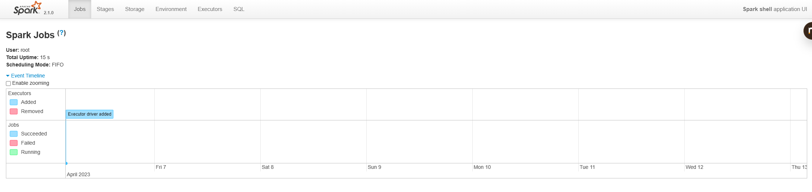

tags:: Docker, [[Spark-Shell]], [[5mins]]

-
- 直接在 Docker 中运行 Spark-Shell 是最快体验 Spark 的方式，下面是一些最简单的命令，仅供测试使用
- # 启动 Spark-Shell
	- ``` bash
	  docker run -it epahomov/docker-spark /spark/bin/spark-shell
	  ```
- # 启动 Spark-Shell 并带上配置
	- ``` bash
	  docker run -it epahomov/docker-spark /spark/bin/spark-shell --master local --conf spark.executor.memory=1g
	  ```
- # 启动 Spark-Shell 并显示 SparkUI
	- ``` bash
	  docker run -ti -p 4040:4040 epahomov/docker-spark /spark/bin/spark-shell
	  ```
	- 可以在 [本地 4040](http://localhost:4040/jobs/) 访问 Spark UI
		- 
- # 启动 Spark-Shell 并映射路径
	- ``` bash
	  docker run -ti -v /data:/data epahomov/docker-spark /spark/bin/spark-shell --master local --packages com.databricks:spark-csv_2.11:1.5.0
	  ```
	-