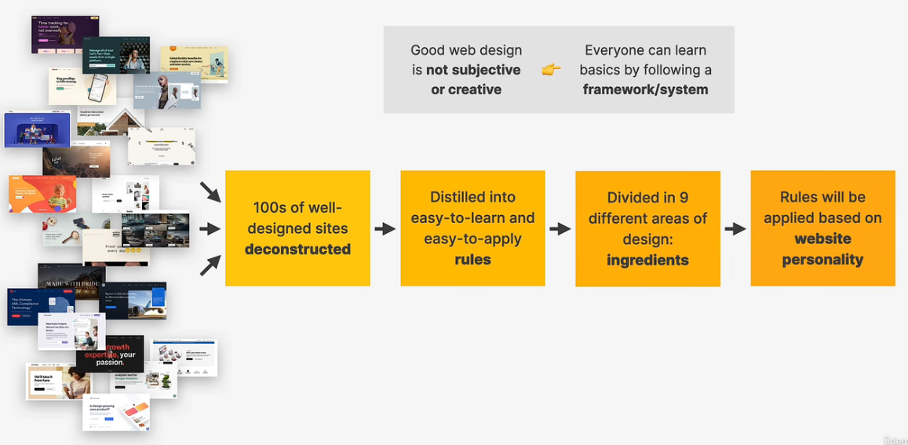
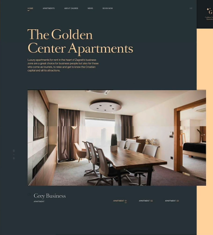
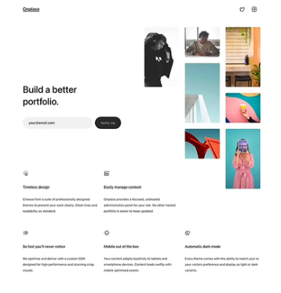
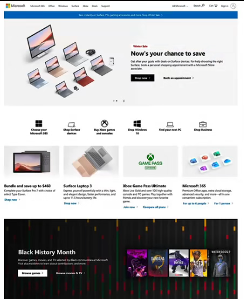
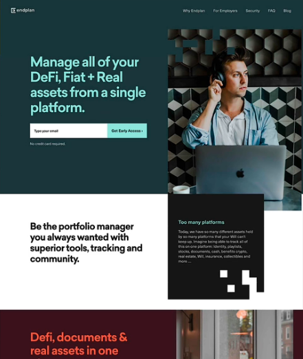
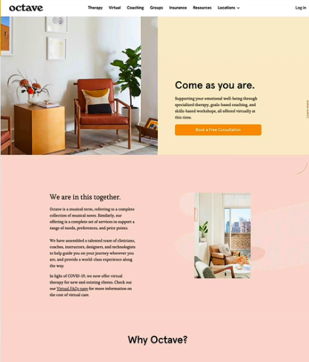
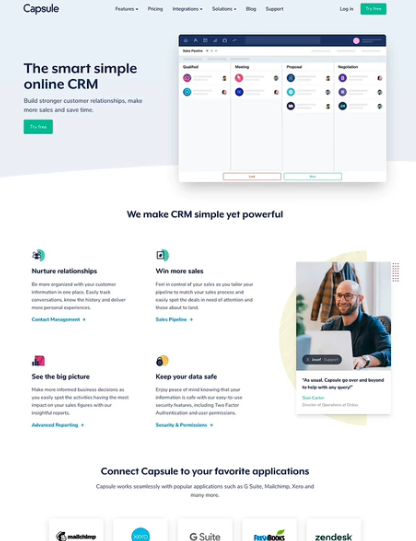
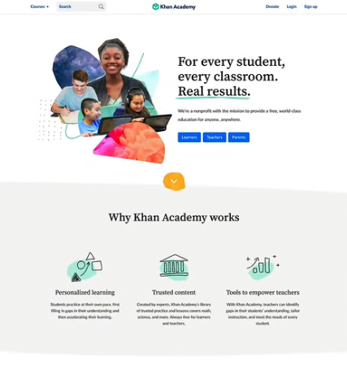
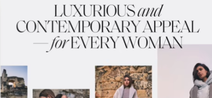
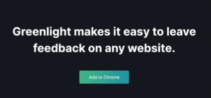

tags:: Website Design

- 成为一个动代码和设计的开发人员并不是一件难的事情，通常有一整套的框架来帮助你完成一个较好的设计（尽管不能让你成为设计专家）
	- 
- Overview
	- 常见核心元素
	  collapsed:: true
		- 排版 Typography
		- 颜色
		- 图片
		- 图标
		- 阴影
		- 圆角
		- 空白
		- 视觉层次
		- 用户体验
		- 组件布局
	- 常见设计风格
	  collapsed:: true
		- 严肃/优雅
			- 
			- For luxury and elegance, based on thin serif typefaces, golden or pastel colors, and big high-quality images
		- 简约
			- 
			- Focusses on the essential text content,using small or medium-sized sans-serif black text, lines,and few images and icons
		- 朴素
			- 
			- Design that gets out of the way by using neutral and small typefaces,and a very structured layout.Common in big corporations
		- 粗体/大胆
			-
			- 
			- Makes an impact, by featuring big and bold typography paired with confident use of big and bright colored blocks
		- 平静/和谐
			- 
			- For products and services that care,transmitted by calming pastel colors, soft serif headings,and matching images/illustrations
		- 创业/乐观
			- 
			- Widely used in startups,featuring medium-sized sans- serif typefaces,light-grey text and backgrounds,and rounded elements
		- 俏皮有趣
			- 
			- Colorful and round designs,fueled by creative elements like hand-drawn icons or illustrations,animations,and fun language
		-
- 排版
	- 字体
		- 衬线字体
			- 有小细节、小尾巴
			- 传达可靠
				- 
			- 推荐
				- Merriweather
				- Aleo
				- Playfair Display
				- Cormorant
				- Cardo
				- Lora
		- 无衬线字体
			- 干净、简洁
			- 提供线代的外观
				- 
			- 适合初学者
			- 推荐
				- Inter
				- Open Sans
				- Roboto
				- Montserrat
				- Work Sans
				- Lato
			-