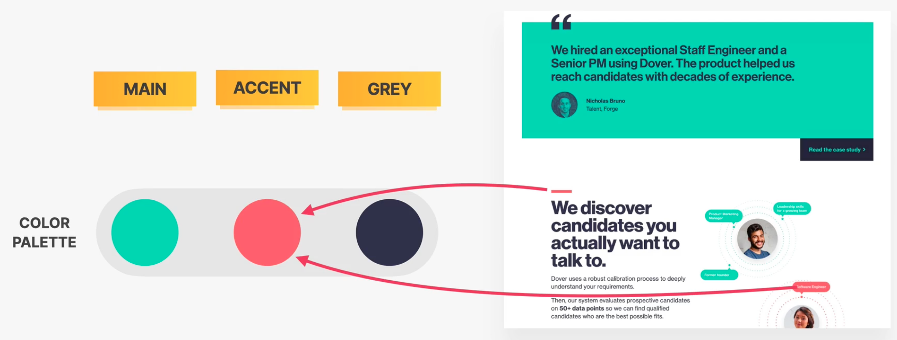
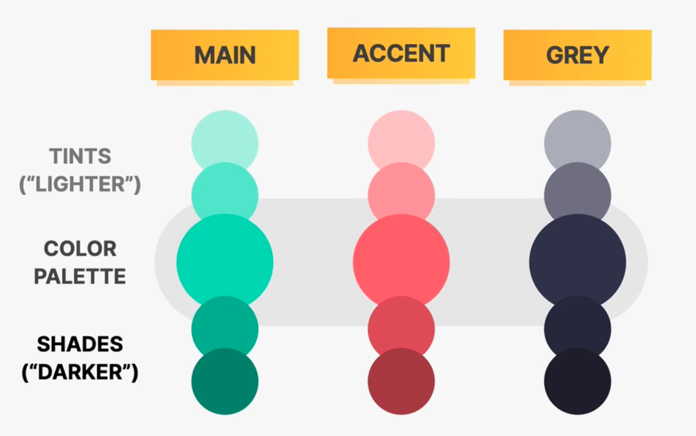
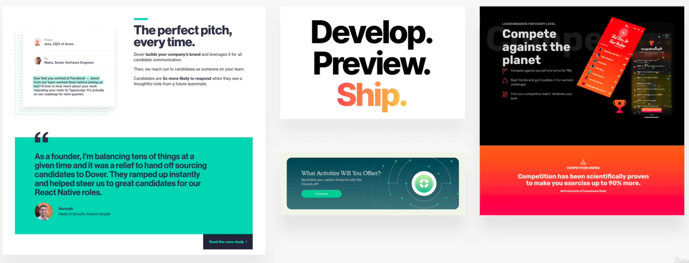

- 使用 [Google Font](https://fonts.google.com/) 来选择字体
- 使用 [Typescale](http://type-scale.com/) 来选择合适的文本大小
- 颜色
	- 选择颜色
		- 颜色需要和你的网站的风格相适应
		- 工具
			- [Open color](https://yeun.github.io/open-color/) 用于选择常见的色号
			- [Palettes | Flat UI Colors 🎨 280 handpicked colors ready for COPY & PASTE](https://flatuicolors.com/?ref=evernote.design) 用于选择颜色搭配
		- 至少需要两种颜色
			- 主色
			- 灰色，不一定是“灰色”只是一种较暗的颜色
		- 或者增加一个 强调色，应该和主色之间有关系
			- 
		- 通常需要准备更重或者更轻的颜色版本
		  id:: 646baa5d-c8cf-48df-8ef4-bf836ca7f5fa
			- 
			- 可以使用 [Tint & Shade Generator](https://maketintsandshades.com/) 生成颜色
			- 使用 [Paletton - The Color Scheme Designer](https://paletton.com/#uid=1000u0kllllaFw0g0qFqFg0w0aF) 或者 [Coolors - The super fast color palettes generator!](https://coolors.co/)生成调色板
	- 使用颜色
		- 使用主色来描述页面中需要强调的内容
		- 可以用颜色来增加一些其他的部分（边缘，背景等）
			- 
			- 
			- 
		- 可以使用和图片中的颜色相衬的颜色，能够让人感觉一致
			- 
		- 深色背景上用浅色文字
		-