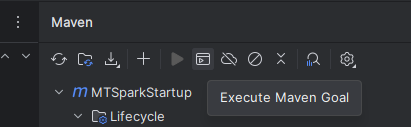
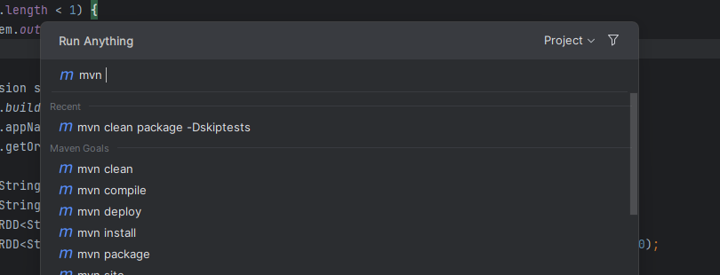
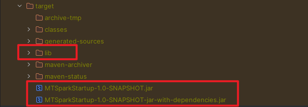
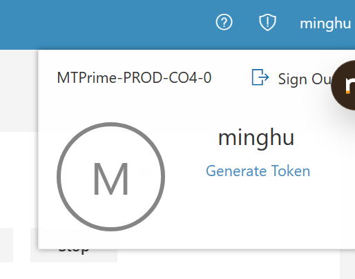
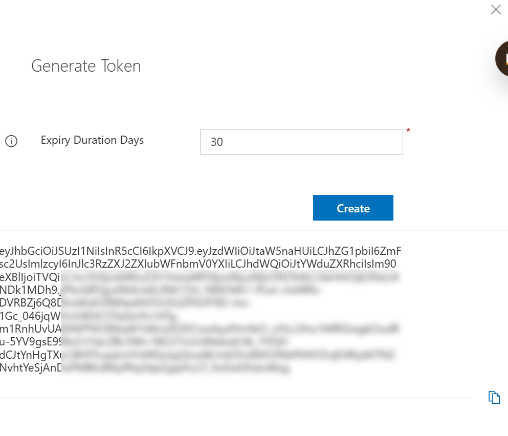
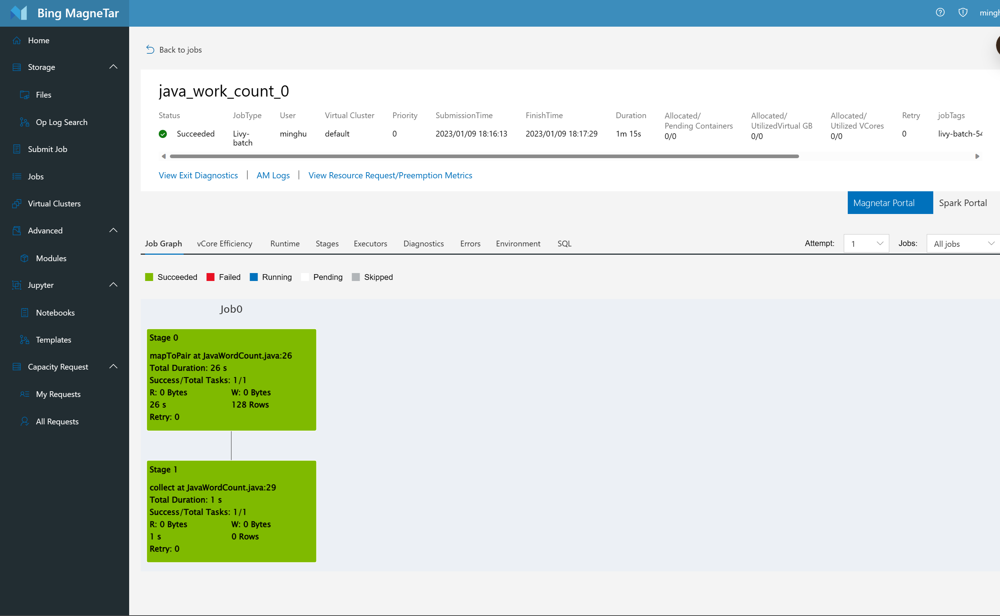

tags:: Spark, MT Spark, QuickStart, 5min

- TOC {{renderer :tocgen, [[]], 2, h}}
- # Overivew
	- 为了能够快速的熟悉 Spark 和 MT Spark Job 的 API，该篇文章包含如下内容：
		- 1. 配置 MT Spark 依赖和 maven 验证
		- 2. 构造一个简单的 Spark Job word count 项目
		- 3. 通过 livy 提交至 MT Spark 执行
		- 4. 通过 MT Spark UI 查看 MT Spark Job 执行结果
- # 前置
	- 1. Java 1.8
	- 2. 安装 [IDEA](https://www.jetbrains.com/idea/download/#section=windows)
	- 3. 安装 [Maven](https://maven.apache.org/download.cgi)
	- 4. 创建一个 maven 项目
- # 配置 MT Spark 依赖和验证
	- Maven 是 Java 相关的项目的主要依赖管理工具，通常不需要做额外的配置。然而 MT 相关的包都发布在 MT 的 ADO Artifacts。因此需要在 Maven 中配置好 PAT，并在 `pom. xml` 中添加仓库。
	- ## pom.xml 文件
		- ### 添加 maven 仓库
		  collapsed:: true
			- 在 pom.xml 中添加如下的
			- ``` xml
			  <repositories>
			  	<repository>
			  <id>msasg-visualstudio-com-msasg-multitenancy-test3</id>
			  <url>https://msasg.pkgs.visualstudio.com/_packaging/MultiTenancy-Test3/maven/v1</url>
			  <releases>
			  	<enabled>true</enabled>
			  </releases>
			  <snapshots>
			  	<enabled>true</enabled>
			  </snapshots>
			  	</repository>
			  
			  	<repository>
			  <id>central</id>
			  <!-- This should be at top, it makes maven try the central repo first and then others and hence faster dep resolution -->
			  <name>Maven Repository</name>
			  <url>https://repo.maven.apache.org/maven2</url>
			  <releases>
			  	<enabled>true</enabled>
			  </releases>
			  <snapshots>
			  	<enabled>false</enabled>
			  </snapshots>
			  	</repository>
			  </repositories>
			  ```
		- ### 配置 PAT 在 maven 的配置
		  collapsed:: true
			- PAT 可以从 ADO 上创建，具体可以从 [MultiTenancy-Test3 - Azure Artifacts (visualstudio.com)](https://msasg.visualstudio.com/Bing_and_IPG/_artifacts/feed/MultiTenancy-Test3/connect/maven) 查看。
			  简单来说，配置在 `~/.m2/settings.xml` 文件中，填入包含 PAT 的设置，保存后即生效。
			- ```xml
			  <server>
			  <id>MultiTenancy-Test3</id>
			  <username>msasg</username>
			  <password>[PERSONAL_ACCESS_TOKEN]</password>
			  </server>
			  ```
		- ### 添加 mt spark 和 scala 版本
		  collapsed:: true
			- ```xml
			  <properties>
			  	<maven.compiler.source>8</maven.compiler.source>
			  	<maven.compiler.target>8</maven.compiler.target>
			  	<project.build.sourceEncoding>UTF-8</project.build.sourceEncoding>
			  	<scala.binary.version>2.12</scala.binary.version>
			  	<mt.spark.version>3.2.2</mt.spark.version>
			  </properties>
			  ```
		- ### 添加依赖
			- ``` xml
			  <dependencies>
			    <dependency>
			      <groupId>org.spark-project.spark</groupId>
			      <artifactId>unused</artifactId>
			      <version>1.0.0</version>
			      <scope>provided</scope>
			    </dependency>
			  
			    <dependency>
			      <groupId>org.apache.spark</groupId>
			      <artifactId>spark-core_${scala.binary.version}</artifactId>
			      <version>${mt.spark.version}</version>
			      <scope>provided</scope>
			    </dependency>
			    
			    <dependency>
			      <groupId>org.apache.spark</groupId>
			      <artifactId>spark-sql_${scala.binary.version}</artifactId>
			      <version>${mt.spark.version}</version>
			      <scope>provided</scope>
			    </dependency>
			  </dependencies>
			  ```
		- ### 添加编译插件
			- 这些编译插件作为一个参考，其中包含了： #.ol
				- `maven-compiler-plugin` 用于编译和版本的指定
				- `maven-dependency-plugin` 把相关的依赖拷贝到 target/lib 目录下，方便后续上传 MT HDFS 用于启动 Spark，用于共享依赖
				- `maven-assembly-plugin` 把相关的依赖全都打包到同一个 jar 中，后缀为 `-jar-with-dependencies`，这样能够直接上传，不需要再依赖其他的 jar
			- ```xml
			  <build>
			  	<plugins>
			  <plugin>
			  	<groupId>org.apache.maven.plugins</groupId>
			  	<artifactId>maven-compiler-plugin</artifactId>
			  	<version>3.7.0</version>
			  	<configuration>
			  		<encoding>utf8</encoding>
			  		<source>1.8</source>
			  		<target>1.8</target>
			  	</configuration>
			  </plugin>
			  
			  <plugin>
			  	<groupId>org.apache.maven.plugins</groupId>
			  	<artifactId>maven-dependency-plugin</artifactId>
			  	<version>3.4.0</version>
			  	<executions>
			  		<execution>
			  			<id>copy-dependencies</id>
			  			<phase>package</phase>
			  			<goals>
			  				<goal>copy-dependencies</goal>
			  			</goals>
			  			<configuration>
			  				<outputDirectory>${project.build.directory}/lib</outputDirectory>
			  				<overWriteReleases>false</overWriteReleases>
			  				<overWriteSnapshots>false</overWriteSnapshots>
			  				<overWriteIfNewer>true</overWriteIfNewer>
			  			</configuration>
			  		</execution>
			  	</executions>
			  </plugin>
			  <plugin>
			  	<groupId>org.apache.maven.plugins</groupId>
			  	<artifactId>maven-assembly-plugin</artifactId>
			  	<version>3.4.2</version>
			  	<configuration>
			  		<archive>
			  			<manifest>
			  			    <!-- 填写启动类 -->
			  				<mainClass>org.example.JavaWordCount</mainClass>
			  			</manifest>
			  		</archive>
			  		<descriptorRefs>
			  			<descriptorRef>jar-with-dependencies</descriptorRef>
			  		</descriptorRefs>
			  	</configuration>
			  	<executions>
			  		<execution>
			  			<id>make-assembly</id> <!-- this is used for inheritance merges -->
			  			<phase>package</phase> <!-- 指定在打包节点执行jar包合并操作 -->
			  			<goals>
			  				<goal>single</goal>
			  			</goals>
			  		</execution>
			  	</executions>
			  </plugin>
			  	</plugins>
			  </build>
			  ```
		- ### 同步配置并下载依赖
			- 配置完成后，点击 maven 工具栏中的 refresh 来同步配置并下载依赖。
				- 
- # 编写一个简单的 work count 项目
	- ```java
	  package org.example;
	  
	  import org.apache.spark.api.java.JavaPairRDD;
	  import org.apache.spark.api.java.JavaRDD;
	  import org.apache.spark.sql.SparkSession;
	  import scala.Tuple2;
	  
	  import java.util.Arrays;
	  import java.util.List;
	  import java.util.regex.Pattern;
	  
	  public class JavaWordCount {
	    private static final Pattern SPACE = Pattern.compile("\\s+");
	    public static void main(String[] args) {
	        if (args.length < 1) {
	            System.out.println("Usage JavaWordCount <file>");
	        }
	  
	        SparkSession spark = SparkSession
	                .builder()
	                .appName("JavaWordCount")
	                .getOrCreate();
	  
	        JavaRDD<String> lines = spark.read().textFile(args[0]).javaRDD();
	        JavaRDD<String> words = lines.flatMap(s -> Arrays.asList(SPACE.split(s)).iterator());
	        JavaPairRDD<String, Integer> ones = words.mapToPair(s -> new Tuple2<>(s, 1));
	        JavaPairRDD<String, Integer> counts = ones.reduceByKey((i1, i2) -> i1 + i2).filter(wt -> wt._2 > 10);
	  
	        List<Tuple2<String, Integer>> output = counts.collect();
	        for (Tuple2<?, ?> tuple : output) {
	            System.out.println(tuple._1() + ": " + tuple._2);
	        }
	  
	        System.out.println(counts.toDebugString());
	        spark.stop();
	    }
	  }
	  ```
- # 编译
	- 编译后找到 maven 工具栏中的 Execute Maven Goal 工具
		- 
	- 执行如下命令进行编译：
		- ``` bash
		  mvn clean package -Dskiptests
		  ```
			- 
	- 编译完成后在 target 路径下获得如下输出：
		- 
- # 提交 MT Spark 运行
	- ## 上传至 MT HDFS
		- ### 获取 MT Token
			- 访问 [MT Protal](https://magnetar/job-detail.html?jobName=OutboardDUWebAPI&subCluster=MTPrime-PROD-MWHE01-1#)，在右上角找到 alias，并点击 `Generate Token`。
				- {:height 294, :width 295}
			- 输入日期，并生成 token，此时的 token 并不会被 MT 存储，因此可以没有限制的生成，生成也不会导致过去的 token 失效。
				- {:height 654, :width 702}
	- ## 构造 Livy 请求
		- MT Spark 有多种方式启动 Spark Job，此处演示使用 [Apache Livy](https://livy.apache.org/) 来提交。
		  在 MT Spark Livy 中，使用了比官方更多的参数，在此处需要构造如下的请求体：
		- ```json
		  {
		    "className": "org.example.JavaWordCount", // class name
		    "args": [
		        "/user/minghu/spark101/JavaWordCount/text.txt" // args
		    ],
		    "file": "hdfs://MTPrime-CO4-4/user/minghu/spark101/JavaWordCount/MTSparkStartup-1.0-SNAPSHOT-jar-with-dependencies.jar", // jars
		    "jars": [
		    ],
		    "name": "java_work_count_0", // job name, 同一个名字只能使用一次
		    "proxyUser": "minghu" // alias
		  }
		  ```
	- ## 提交 MT Spark
		- 使用 Postman 或者其他工具，设置 Bearar Token, 使用 HTTP Post，向 `` 提交上述请求体，会得到如下响应。
			- ``` json
			  {
			    "id": 542614,
			    "name": "java_work_count_0",
			    "state": "starting",
			    "appId": null,
			    "appInfo": {
			        "driverLogUrl": null,
			        "sparkUiUrl": null
			    },
			    "log": [],
			    "exceptions": []
			  }
			  ```
	- ## 查看 MT Spark 状态和日志
		- 使用 HTTP Get，向发送请求，获得 id 的状态，一段时间后会得到如下响应：
			- ``` json
			  {
			    "id": 542614,
			    "name": "java_work_count_0",
			    "state": "success",
			    "appId": "application_1673091872908_3053",
			    "appInfo": {
			        "driverLogUrl": "https://api.magnetar.binginternal.com:4432/driverlog/application_1673091872908_3053?subcluster=MTPrime-PROD-CO4-4",
			        "sparkUiUrl": "https://magnetar/tracking/MTPrime-PROD-CO4-4/proxy/application_1673091872908_3053/SPARK/java_work_count_0"
			    },
			    "log": [
			        "\t start time: 1673259373811",
			        "\t final status: UNDEFINED",
			        "\t tracking URL: https://magnetar/tracking/MTPrime-PROD-CO4-4/proxy/application_1673091872908_3053/SPARK/java_work_count_0",
			        "\t user: minghu",
			        "2023-01-09T02:16:14,261 INFO [shutdown-hook-0] util.ShutdownHookManager: Shutdown hook called",
			        "2023-01-09T02:16:14,261 INFO [shutdown-hook-0] util.ShutdownHookManager: Deleting directory D:\\data\\Temp\\Livy\\spark-65dc488a-16e0-4026-875e-11badbe653b6",
			        "2023-01-09T02:16:14,261 INFO [shutdown-hook-0] util.ShutdownHookManager: Deleting directory D:\\data\\Temp\\Livy\\spark-8ea3b4a4-454c-4e8e-8990-d53f8fa5f06a",
			        "Picked up JAVA_TOOL_OPTIONS: -Dhadoop.root.logger.level=INFO -Dhadoop.root.logger.dest=console -Djava.security.krb5.conf=D:\\data\\java.latest\\krb5.conf",
			        "\nstderr: ",
			        "\nYARN Diagnostics: "
			    ],
			    "exceptions": []
			  }
			  ```
			- 打开 `sparkUiUrl` 指向的页面，在 MT Portal 中查看执行状态。
			- 