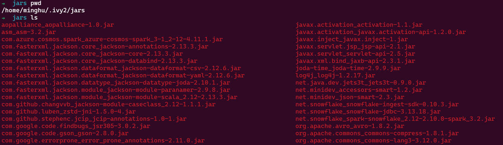

tags:: ivy, sbt

- Docs
	- [sbt Reference Manual — Library Management (scala-sbt.org)](https://www.scala-sbt.org/1.x/docs/Library-Management.html)
- sbt 可以手动管理依赖，参考 [  (scala-sbt.org)](https://www.scala-sbt.org/1.x/docs/Library-Management.html#Manual+Dependency+Management)
- 在自动管理的情况下，sbt 自 1.3 开始使用 [[Coursier]] 和 [[Apache lvy]] 一起实现
	- 开关
		- ``` sbt
		  ThisBuild / useCoursier := false
		  ```
	- 存储位置
		- `~/.ivy2/jars`
		- 