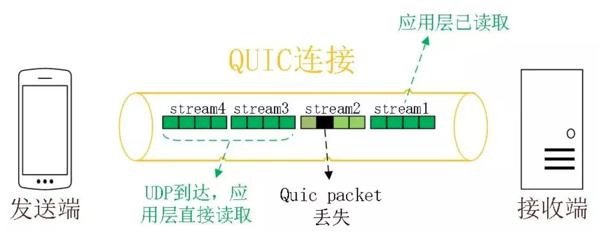

- 
- 在 HTTP2 中也包括 stream 的能力，但由于 TCP 的规则限制，如果 stream2 的包丢了，同样会阻塞 stream3/stream4 应用层的察觉。
- 在 QUIC 协议上，如果 stream 是完整接受到了，那么就意味着在上述图中只有 stream2 被阻塞，可以极大的保证轻丢包环境下的吞吐量，且同样能对 HTTP 协议保持相同的稳定传输能力。
- 在跨 region 情况下，若有 1% 的概率丢包，就可能不断阻塞传输，但在 QUIC 上便真的只阻塞这 1% 的出现问题的 stream。
- TODO 那么同一个 HTTP3 请求一定在一个 stream 中么？