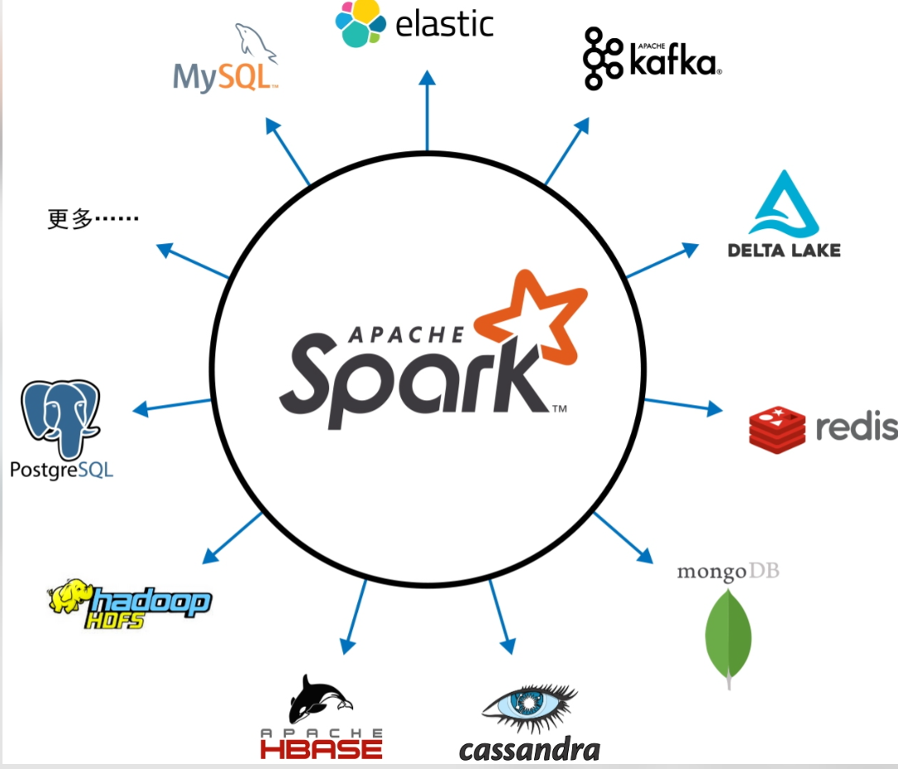
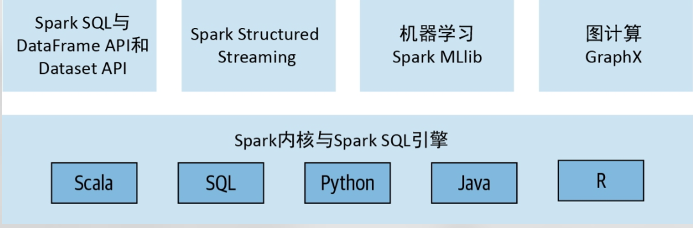

tags:: 读书笔记, [[Learning Spark 2nd@Book]] 
src:: [[Learning Spark 2nd@Book]]

- {{renderer :tocgen, [[]], 2, h}}
- # 前言
  collapsed:: true
	- #+BEGIN_QUOTE
	  This new edition has been updated to reflect Apache Spark’s evolution through Spark 2.x and Spark 3.0, including its expanded ecosystem of built-in and external data sources, machine learning, and streaming technologies with which Spark is tightly integrated
	  #+END_QUOTE
	- #+BEGIN_QUOTE
	  Our intent is to capture and curate this evolution for readers, showing not only how you can use Spark but how it fits into the new era of big data and machine learning.
	  #+END_QUOTE
- # Apache Spark 简介：一站式分析引擎
	- ## 谷歌的大数据和分布式计算
	  collapsed:: true
		- #+BEGIN_QUOTE
		  不论是关系数据库管理系统（relational database managementsystem，RDBMS）这种传统的存储系统，还是传统的命令式编程，都没有能力满足谷歌构建和搜索全网索引文档的超大规模需求。于是，这种对新方法的需求最终孕育出了谷歌文件系统（Google File System，GFS）、[[MapReduce]]（MR）编程框架，以及 Bigtable 数据存储
		  #+END_QUOTE
		- #+BEGIN_QUOTE
		  从本质上说，MR 应用程序与 MR 系统交互，将用于计算的代码逻辑（映射函数和归约函数）发送到存储数据的地方来执行，从而实现在本机或集群同一机架内处理数据，而不是让应用程序远程拉取数据。
		  #+END_QUOTE
	- ## 雅虎的 Hadoop
	  collapsed:: true
		- #+BEGIN_QUOTE
		  谷歌的 GFS 论文所描述的计算挑战及解决方案为 [[Hadoop]] 文件系统（[[Hadoop File System]]，HDFS）和 MR 分布式计算框架提供了雏形...并逐渐演变为Apache Hadoop 框架中的几个模块：Hadoop Common、MapReduce、HDFS，以及 Apache Hadoop YARN
		  #+END_QUOTE
		- #+BEGIN_QUOTE
		  基于 HDFS 的 MR 框架仍然存在不容忽视的缺点
		  #+END_QUOTE #.ol
			- #+BEGIN_QUOTE
			  第一，管理 Hadoop 集群很难，操作也比较烦琐
			  #+END_QUOTE #.ol
			- #+BEGIN_QUOTE
			  第二，Hadoop的通用批处理 MR API 非常啰唆，需要大段的样板代码配置，而且容错性很差
			  #+END_QUOTE
			- #+BEGIN_QUOTE
			  第三，对于需要多组映射和归约的复杂数据作业来说，各组MapReduce 间的计算结果要写入硬盘供后续阶段的操作使用
			  #+END_QUOTE
			- #+BEGIN_QUOTE
			  最后，虽然 Hadoop MR 对于大规模的通用批处理作业来说还可以，但结合机器学习、流处理，或者交互式 SQL 查询等其他工作场景的话，难免力不从心
			  #+END_QUOTE
		- #+BEGIN_QUOTE
		  为了应对这些新的场景，工程师开发了一些定制化的系统，例如Apache Hive、Apache Storm、Apache Impala、Apache Giraph、Apache Drill、Apache Mahout，等等。这些项目都有自己的 API 和集群配置选项，因而进一步增加了 Hadoop 集群的运维复杂度，也使得Hadoop 开发的学习曲线更加陡峭
		  #+END_QUOTE
		- #+BEGIN_QUOTE
		  有没有办法让 Hadoop 和 MR 更简单且速度更快？#[[Why Spark]]
		  #+END_QUOTE
	- ## Spark 崭露头角
	  collapsed:: true
		- #+BEGIN_QUOTE
		  早期的 Spark 论文显示，对于某些作业，Spark 比 Hadoop MR 快10～20 倍。现如今，Spark 已经快了好几个数量级
		  #+END_QUOTE
		- id:: 635c9b93-899b-4b6c-b880-281f5cdb18ec
		  #+BEGIN_QUOTE
		  Spark 项目的中心思想是，**借鉴 Hadoop MR 的思想并增强系统，加上高容错性和高并发，支持将迭代式或交互式映射和归约计算的中间结果存储在内存中，并向用户提供支持多种语言、简单、易组合的 API 作为编程模型**，==一站式支持各种使用场景==
		  #+END_QUOTE
	- ## 什么是 Spark
	  collapsed:: true
		- ### 四大特性
			- 快速
				- 通过多种手段追求速度 #.ol
					- 硬件行业答复提高了 CPU 和内存的性能并降低了价格，能够让 Spark 针对这些特点优化出了能够充分发挥多线程和并行处理能力的程序
					- Spark 将计算构建为 DAG，然后基于 DAG 调度器和查询优化器构建出高效的计算图
					- #+BEGIN_QUOTE
					  Spark 的物理执行引擎 Tungsten 使用全局代码生成功能，以生成紧凑的代码用于执行
					  #+END_QUOTE
			- 易用
				- Spark 使用 RDD （弹性分布式数据集）的简单逻辑数据结构作为基本的单元，再次基础上构造了高级结构数据抽象，如 [[DataFrame]] 和 [[Dataset]]
				- Spark 提供了 RDD 的转化操作和行动操作，能够基于高级语义轻松和熟悉的编程语言来构造大数据应用
			- 模块化
				- Spark 操作可以使用 [[Scala]], [[Java]], [[SQL]] 和 R 等任何受支持的编程语言实现
				- #+BEGIN_QUOTE
				  Spark 以核心组件的形式一站式地提供了带有详细文档的各种库，其中包括 SparkSQL、Spark Structured Streaming、Spark MLlib，以及 GraphX 等模块。这些模块将不同场景的工作负载整合到一起，从而在同一个引擎上执行
				  #+END_QUOTE
			- 可扩展
				- Spark 的重点在于分布式计算框架，而非存储。好在 Spark 能够解耦计算和存储，因而可以使用各种数据源 (Apache Hadoop、ApacheCassandra、Apache HBase、MongoDB、Apache Hive、RDBMS等) 中的数据
				- 还可以扩展 Spark 的 DataFrameReader 和 DataFrameWriter 来支持更多的数据源，如 [[Kafka]]， [[Azure]]，[[S3]]，并以同样以 DataFrame 作为抽象进行操作
				- 形成了丰富的生态，包括各种外部数据源、连接器和性能监控工具
					- {:height 304, :width 430}
	- ## 一站式数据分析
		- #+BEGIN_QUOTE
		  美国计算机学会（Association forComputing Machinery，ACM）认可了 Spark，并将久负盛名的 ACM奖授予了 Spark 的原创者所写的论文。这篇论文将 Spark 描述为“一站式大数据处理引擎”。该论文指出，Spark 组件所组成的一站式软件栈替代了 Storm、Impala、Dremel、Pregel 等各种批处理、图计算、流处理、SQL 查询引擎，用单一的快速分布式引擎处理各种场景的工作负载
		  #+END_QUOTE
		- Spark 提供了 4 个组件
		  id:: 635ca069-6442-4b24-a893-4ad860ae969d
		  {:height 138, :width 804} #.ol
			- [[Spark SQL]]
			- [[Spark Structured Streaming]]
			- Spark MLib
			- GraphX
		- 这些组件都是独立于 Spark 的内核引擎，Spark 会将你的任务转换为 DAG，然后交给这些引擎执行。
		-
		-