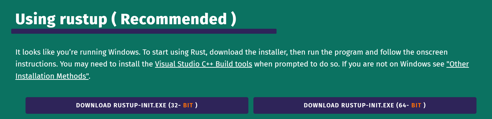
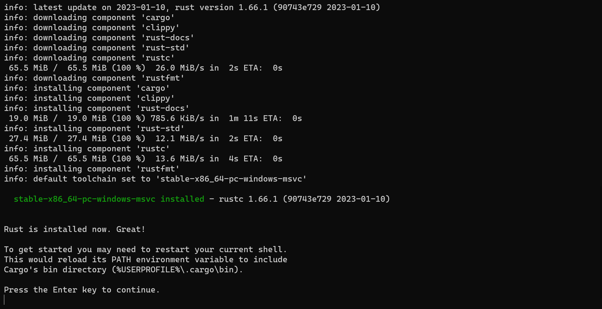
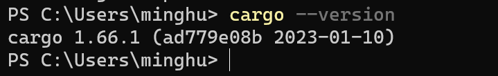

tags:: Rust, HowTo, Install

- Rust 安装可前往官方安装页 [Install Rust - Rust Programming Language (rust-lang.org)](https://www.rust-lang.org/tools/install)
	- 使用的是 [rustup](https://rustup.rs)
		- rustup 提供了 `rustup update` 命令来一键升级 rust 版本
- 以 Windows 为例
	- 
		- 选择特定的版本，点击后即可下载
	- 下载完成后打开，会后初始化，回车安装
	- 安装中会输出日志，并最终告诉你安装完成，按任意键退出
		- 
	- 重新启动终端，输入 `cargo --version` 将显示安装的版本
		- 