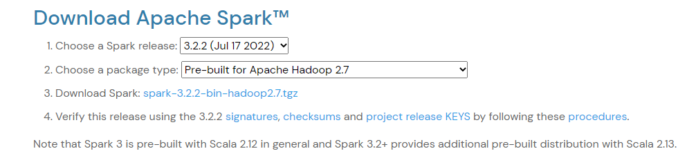

tags:: [[setup]], [[Spark]]

- Steps
	- Go to [[Spark]] download page [Downloads | Apache Spark](https://spark.apache.org/downloads.html)
	- Select Spark version and Hadoop version
		- 
	- Download
		- ``` 
		  axel https://dlcdn.apache.org/spark/spark-3.2.2/spark-3.2.2-bin-hadoop2.7.tgz -n 10
		  ```
	- 解压缩
		- ``` bash 
		  tar -zxvf spark-3.2.2-bin-hadoop2.7.tgz
		  ```
	-