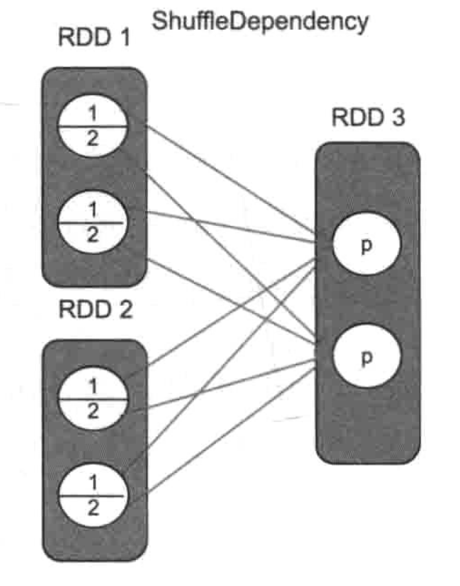

alias:: ShuffleDependency
tags:: Spark, RDD

- # 什么是宽依赖
	- 宽依赖表示新生成的 child RDD 中的分区依赖 parent RDD 中的**每个分区的一部分** #定义
- # 宽依赖和窄依赖 [[ManyToManyDependency]] 的差别
	- ManyToManyDependency 也是类似的多对多的关系，然而这两者有很大的不同
	- 在窄依赖中，一个分区的所有数据都会直接流入 child 的一个分区或者多个分区
		- {{embed ((642ce69a-cc6d-4cc4-bf47-01016015a038))}}
	- 在宽依赖中，分区中的一部分数据会溜去 child RDD 的某一个分区，另外一部分会流入 Child RDD 另外的分区
		- {:height 539, :width 400}