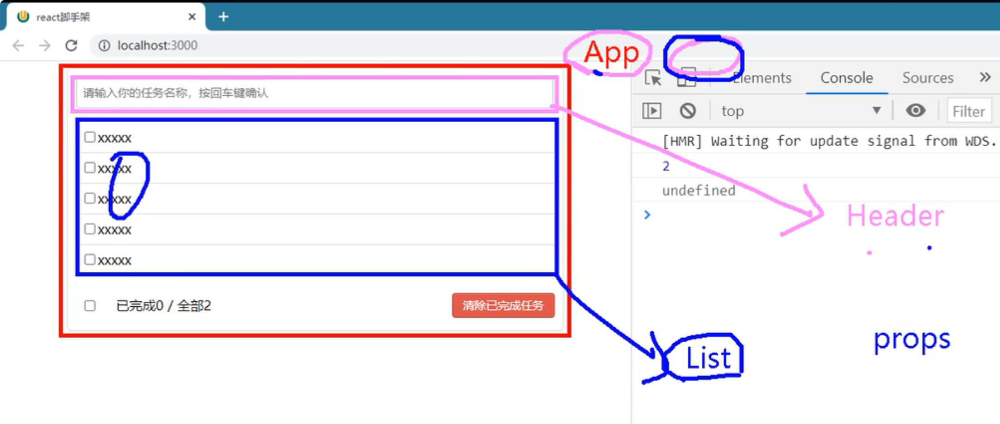

tags:: React

- 主题
	- 如何在兄弟组件之间传递数据
		- 通过父组件
			- 让子组件操作父组件数据
			- 由父组件传递状态给另外一个子组件
			- 
			- 本质是上是父组件提供回调函数，子组件从 ((6443d85b-69c6-403c-943a-49c65ac07476)) 执行回调来通知回数据
	- 如何设置 checkbox 默认状态
		- 设置给 `defaultChecked`，而不能设置给 `checked`，否则就不能修改
		- 但 `defaultChecked` 在设置一次之后规则就失效
		- 通常需要修改的状态仍然需要使用 `checked` + `onChange` 来实现