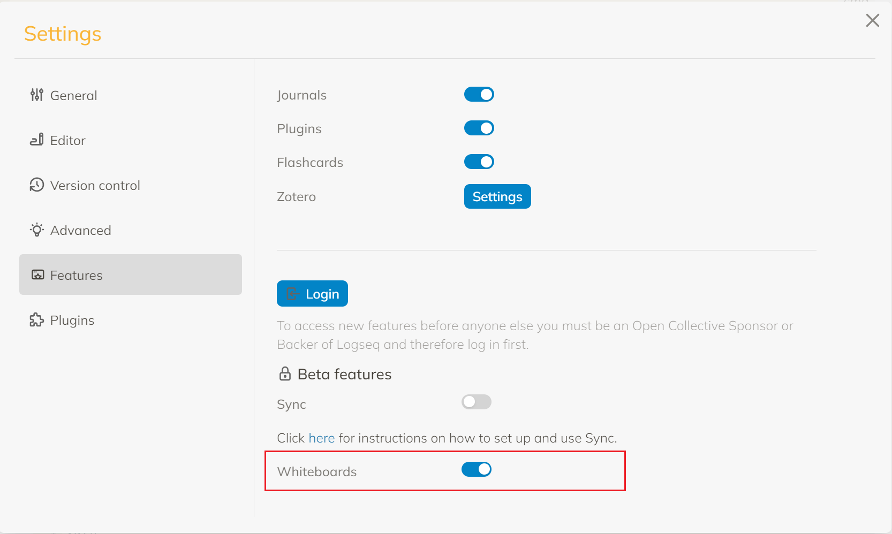

- Logseq 在当下 [[Jan 20th, 2023]] 还并未向所有的用户开放白板功能，如果没有赞助成为 alpha/beta 用户是无法开启白板功能的。
- 那么 Logseq 本身作为一个开源软件，理论上我们可以做到修改代码，去除用户类型的限制，并重新编译发布安装使用。
- 我在 Issue 当中搜索是否有人这么做过，发现确实[有人在最近一个月尝试过](https://github.com/logseq/logseq/discussions/8044#discussioncomment-4714927)，然而顺着官方的教程，在 **Windows** 上，我并不能顺利的完成这一切。折腾了一天之后终于成功，并记录如下。
	- 当然你也可以直接下载我编译的版本，如果你对此有顾虑，可以从官方仓库自己完成。
- # 环境准备
	- 克隆仓库: `https://github.com/logseq/logseq.git`
		- 或者 fork 一份到自己的账户下再克隆
	- 安装 nodejs
	- 安装 yarn
	- 安装 clojure
		- 对于 Mac 和 Linux 而言，并不困难，但对于 Windows 来说需要额外参考 [[在 Windows 上安装 Clojure]]，官方的安装并不完全适用于当下的编译
	- 进入 logseq 的文件夹执行
	  id:: 63ca0acd-e1ce-4d90-9f6c-14a26530cb59
		- ``` cmd
		  yarn
		  yarn release-electron
		  ```
	- 理论上来说所有的问题都应该在该步骤会暴露出来
- # 修改位置
	- 按照 [When does whiteboard release? · Discussion #8044 · logseq/logseq (github.com)](https://github.com/logseq/logseq/discussions/8044#discussioncomment-4714927) 的后续更新说法，官方仓库已经增加了对测试版本编译的支持，然而我有两点顾虑
		- 我试了一下，生成的版本在 Windows 仍然无法打开白板，但 Linux 上可以
		- 因为我对该套技术栈不熟悉，也没有通读代码，因此不确定 dev-release 会不会有性能问题
	- 如果尝试官方的配置后仍然无法开启，可以尝试如下修改
		- ## 移除白板功能对用户类型的判断 #.ol
			- `user.cljs` 中搜索 `feature-available?` 修改为
				- ``` clojure
				  (defn feature-available?
				    [feature] true)
				  ```
			- `state.cljs` 中搜索 `enable-whiteboards?`
				- ``` clojure
				  (defn enable-whiteboards?
				    ([]
				     (enable-whiteboards? (get-current-repo)))
				    ([repo]
				      (:feature/enable-whiteboards? (sub-config repo))))
				  ```
- # 编译
	- 如果你按照 [When does whiteboard release? · Discussion #8044 · logseq/logseq (github.com)](https://github.com/logseq/logseq/discussions/8044#discussioncomment-4714927) 的修改，请执行
		- ``` cmd
		  yarn
		  yarn dev-release-electron
		  ```
	- 如果你按照我的修改，请执行
		- {{embed ((63ca0acd-e1ce-4d90-9f6c-14a26530cb59))}}
- # 安装
	- 在编译完成后，可以进入 `static/out/make/` 路径下找到编译后的安装包，双击安装即可，无需删除之前安装好的 Logseq。
- # 开启
	- 进入设置菜单中打开白板。
		- 