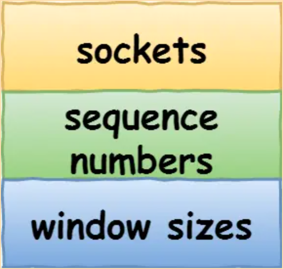

- 相比于每次 tcp 请求完成就关闭的短连接，长连接的目的在于，每次建立连接之后，可以长期维持，并发送多条消息。
- 而连接本质是
	- > Connections: The reliability and flow control mechanisms described above require that TCPs initialize and maintain certain status information for each data stream. The combination of this information, including sockets, sequence numbers, and window sizes, is called a connection
	- 也就是一组状态的集合
		- 
	- 长连接就意味着在更长的一段时间里在双方持有这些信息以进行消息传输。
	- 在一段时间没有任何传输消息的情况下，就断开连接。